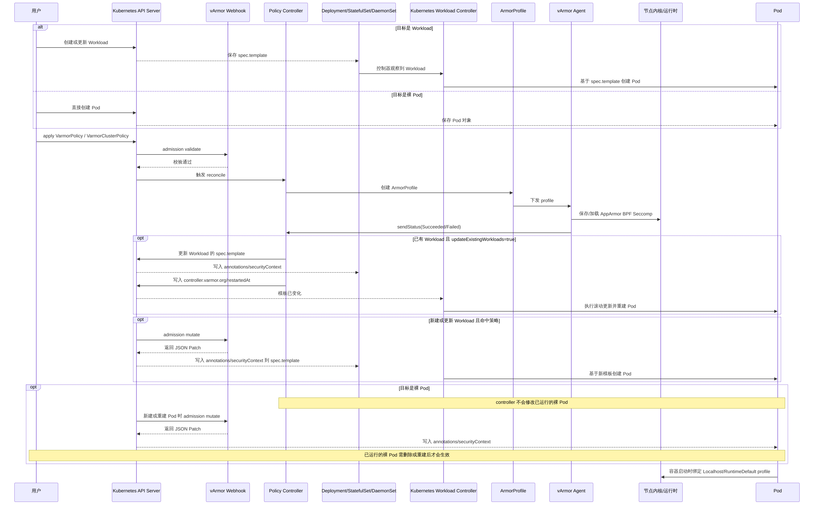

# 自动下发策略给 Pod 时序图

下图说明了 vArmor 将策略自动下发到 Pod 或 Workload 的完整链路。

## 图中参与方说明

- 用户
	- 发起两类操作：一类是创建或更新 Workload/Pod，另一类是创建 `VarmorPolicy` 或 `VarmorClusterPolicy`。
- Kubernetes API Server
	- 所有资源创建、更新请求的统一入口。
	- 负责调用 admission webhook，并在 webhook 返回后决定是否保存对象。
- vArmor Webhook
	- 负责两类 admission 处理：
	- `admission validate`：校验策略对象是否合法。
	- `admission mutate`：在对象写入前返回 JSON Patch，向目标对象注入注解和 `securityContext`。
- Policy Controller
	- 监听 `VarmorPolicy`、`VarmorClusterPolicy`。
	- 根据策略目标生成 `ArmorProfile`，并在需要时修改已有 Workload 的模板以触发滚动更新。
- Deployment/StatefulSet/DaemonSet
	- 这里统一表示由 Kubernetes 控制器管理的 Workload。
	- 它们有 `spec.template`，因此可以通过修改模板的方式影响后续创建出来的 Pod。
- Kubernetes Workload Controller
	- 指 Deployment controller、StatefulSet controller、DaemonSet controller 这类原生控制器。
	- 负责观察 `spec.template` 变化，并按各自策略创建或替换 Pod。
- ArmorProfile
	- vArmor 在控制面生成的内部资源。
	- 它不是最终运行的 Pod 配置本身，而是 agent 在节点侧落地 AppArmor、BPF、Seccomp profile 的直接输入。
- vArmor Agent
	- 运行在节点上，负责把 `ArmorProfile` 对应的底层安全配置真正写到节点并装载。
- 节点内核/运行时
	- 最终承载 AppArmor、BPF、Seccomp profile 的位置。
	- kubelet 和容器运行时会在容器启动时使用这些配置。
- Pod
	- 最终被保护的运行单元。
	- 它身上的 annotations、`securityContext` 和节点上已落地的 profile，共同决定策略是否真正生效。

## 图中关键术语说明

- `spec.template`
	- Workload 的 Pod 模板，位于 `Deployment`、`StatefulSet`、`DaemonSet` 等对象里。
	- 只要模板发生变化，Kubernetes 控制器就会认为目标 Pod 规格变了，进而创建新 Pod 或执行滚动更新。
- `admission validate`
	- Kubernetes 准入阶段的校验流程。
	- vArmor 在这里检查策略对象是否满足要求，例如 `target`、`mode`、`enforcer` 是否合法。
- `admission mutate`
	- Kubernetes 准入阶段的修改流程。
	- vArmor 在这里返回 JSON Patch，把策略相关内容写入对象。
- `JSON Patch`
	- API Server 支持的一种补丁格式。
	- webhook 不直接改内存中的对象，而是返回一组补丁操作，让 API Server 在保存前应用这些改动。
- `annotations`
	- 写在对象元数据中的附加信息。
	- 在 vArmor 场景里，常用来记录 BPF/AppArmor/Seccomp 相关标记，以及 `webhook.varmor.org/mutatedAt` 之类的时间戳。
- `securityContext`
	- Pod 或容器级别的安全配置字段。
	- vArmor 会在这里写入 `seccompProfile`、`appArmorProfile` 等字段。
- `controller.varmor.org/restartedAt`
	- vArmor controller 写入 Workload 模板上的时间戳注解。
	- 主要作用不是传业务数据，而是人为制造一次模板变更，触发 Kubernetes 滚动更新。
- `ArmorProfile`
	- controller 生成的中间资源，用于承载策略解析后的结果和节点侧加载状态。
- `Localhost` profile
	- 表示容器启动时使用节点本地已有的 profile 文件。
	- 常见于 seccomp 和 AppArmor 的本地 profile 引用。
- `RuntimeDefault`
	- 表示直接使用容器运行时提供的默认安全配置，而不是 vArmor 下发的本地文件。
- `sendStatus(Succeeded/Failed)`
	- agent 节点侧处理完成后，把成功或失败状态回传给 manager/controller，用于最终汇总 ready 状态。

## 流程说明

1. 管理员创建 `VarmorPolicy` 或 `VarmorClusterPolicy`。
2. API Server 先进入 webhook 校验流程，策略通过校验后由 controller 开始 reconcile。
3. controller 根据策略目标生成并创建对应的 `ArmorProfile`。
4. `varmor-agent` 在节点上保存或加载 AppArmor、BPF、Seccomp profile，并向 manager 回传处理状态。
5. 如果目标是已有 Workload，且开启了 `updateExistingWorkloads: true`，controller 会修改 `spec.template`，写入注解和 `securityContext`，并通过 `controller.varmor.org/restartedAt` 触发 Kubernetes 滚动更新。
6. 如果目标是新建或更新的 Workload，webhook 会在 admission mutate 阶段返回 JSON Patch，把策略相关注解和 `securityContext` 写入 `spec.template`。
7. 如果目标是裸 Pod，webhook 只会在 Pod 新建或重建时注入配置；controller 不会直接修改已经运行的裸 Pod。
8. Pod 在容器启动时绑定 `Localhost` 或 `RuntimeDefault` profile，最终由 kubelet 和容器运行时把安全配置作用到容器进程上。

## 按时序图分段解读

### 1. 顶部 `alt` 分支：目标是 Workload 还是裸 Pod

- 左上角的 `alt` 表示这里有两条互斥路径。
- 如果目标是 Workload：
	- 用户先创建或更新 `Deployment`、`StatefulSet`、`DaemonSet`。
	- API Server 保存它的 `spec.template`。
	- 对应的 Kubernetes Workload Controller 观察到这个对象后，根据模板创建 Pod。
- 如果目标是裸 Pod：
	- 用户直接创建 `Pod`。
	- API Server 直接保存 Pod 对象，不存在 `spec.template` 和后续控制器滚动更新这一步。

这也是后面为什么 Workload 能靠“改模板”自动补策略，而裸 Pod 不行的根本原因。

### 2. 中间主链路：策略从创建到节点落地

- 用户执行 `apply VarmorPolicy / VarmorClusterPolicy`。
- API Server 调用 vArmor webhook 做 `admission validate`。
- 校验通过后，API Server 接受该策略对象，并触发 controller reconcile。
- controller 根据 `.spec.target`、`.spec.policy` 计算目标和 profile 名，创建 `ArmorProfile`。
- agent 收到 `ArmorProfile` 后，在节点侧执行具体操作：
	- 保存 AppArmor profile。
	- 保存或加载 seccomp profile。
	- 保存并应用 BPF profile。
- agent 再把结果通过 `sendStatus(Succeeded/Failed)` 回传。

这一段说明的是“控制面和节点面如何准备好策略本体”。它解决的是 profile 有没有生成、有没有真正下发到节点的问题。

### 3. 第一个 `opt`：已有 Workload 且 `updateExistingWorkloads=true`

- `opt` 表示可选分支，只在满足条件时发生。
- 当策略命中的是一个已经存在的 Workload，并且策略打开了 `updateExistingWorkloads: true`，controller 会主动更新该 Workload 的 `spec.template`。
- 更新内容通常包括：
	- 写入 annotations。
	- 写入容器级 `securityContext`。
	- 再写入 `controller.varmor.org/restartedAt`，确保模板一定发生变化。
- Kubernetes Workload Controller 看到模板变化后，会执行滚动更新，重建 Pod。

这里要特别区分：

- 触发滚动更新的是 Kubernetes 原生控制器。
- vArmor 的作用是修改模板，借此触发 Kubernetes 的滚动更新机制。

### 4. 第二个 `opt`：新建或更新 Workload 且命中策略

- 这一段描述的是 webhook 在对象准入阶段直接注入的路径。
- 当一个新的 Workload 被创建，或者现有 Workload 被更新，并且它命中了策略目标时：
	- API Server 会调用 webhook 的 `admission mutate`。
	- webhook 返回 JSON Patch。
	- API Server 把 patch 应用到对象上，再保存到 `spec.template`。
	- Kubernetes Workload Controller 用这个已经被改写过的模板来创建新 Pod。

也就是说，这条路径不是“先创建 Pod，再去改 Pod”，而是在对象入库前就把模板改好了，因此新 Pod 天然带着这些安全配置出生。

### 5. 第三个 `opt`：目标是裸 Pod

- 图中黄色说明强调了一点：controller 不会修改已经运行的裸 Pod。
- 原因很简单：裸 Pod 没有上层控制器，也没有 `spec.template` 给 controller 去改。
- 因此裸 Pod 只能依赖 webhook 在“新建或重建 Pod 时”走 `admission mutate`：
	- webhook 返回 JSON Patch。
	- API Server 把 annotations 和 `securityContext` 写入 Pod 对象。

这就是图中另一条黄色说明的含义：已经运行的裸 Pod 需删除或重建后才会生效。

### 6. 最后一跳：容器启动时真正绑定 profile

- 即使对象上已经写入 annotations 和 `securityContext`，也不代表安全策略已经在内核层面生效。
- 真正的生效发生在容器启动时：
	- kubelet 读取 Pod 规格。
	- 容器运行时根据 `Localhost` 或 `RuntimeDefault` 绑定对应 profile。
	- 节点内核/运行时实际执行 AppArmor、BPF、Seccomp 相关限制。

因此，自动下发是两个层面同时成立才算完成：

- Kubernetes 对象层面已经写入正确字段。
- 节点运行时层面已经存在并加载正确的 profile。

## 结论

- Workload 场景依赖 `spec.template` 变更与 Kubernetes 滚动更新来让新 Pod 继承策略。
- 裸 Pod 不具备模板和滚动更新能力，通常需要删除或重建后才会生效。
- 自动下发是否成功，既取决于 webhook 是否完成注入，也取决于节点上的 agent 是否真正完成 profile 落地和加载。

## 结合图片的阅读顺序建议

- 先看最上方 `alt`，理解 Workload 和裸 Pod 的两条入口路径。
- 再看中间主链路，理解 Policy 如何变成 `ArmorProfile`，再由 agent 落到节点。
- 然后看三个 `opt`，分别理解：
	- 已有 Workload 如何补策略。
	- 新 Workload 如何在准入阶段直接带策略。
	- 裸 Pod 为什么必须重建。
- 最后看最底部一行，理解 profile 真正生效是在容器启动阶段，而不是 YAML 被改写的那一刻。