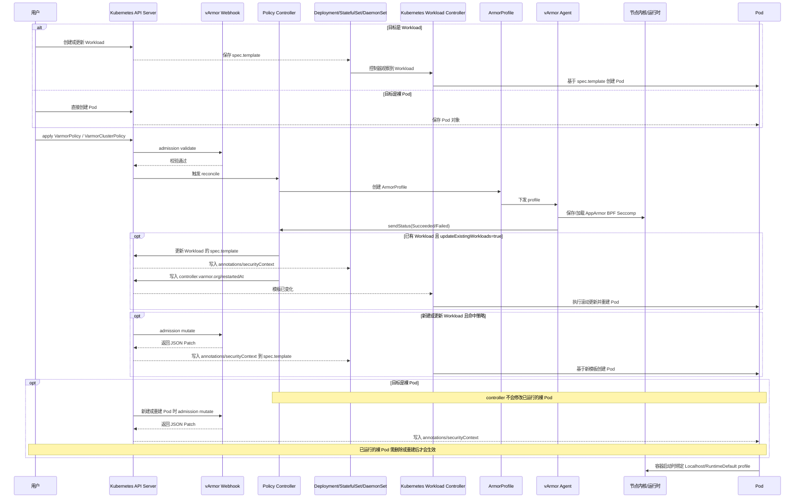

# 自动下发策略给 Pod

本文专门说明一个问题：在 vArmor 中，策略不是“手工写到每个 Pod 里”，而是通过 Policy CR、Webhook、Controller、Agent 这一整条链路，自动下发到目标 Pod 或目标 Workload 的容器上。

如果你要回答“怎么自动下发策略给 Pod”，最准确的表述不是“把 YAML 发到 Pod”，而是下面这条链路：

1. 管理员创建 VarmorPolicy 或 VarmorClusterPolicy。
2. vArmor controller 根据 `.spec.target` 计算目标 Workload。
3. vArmor 生成对应的 ArmorProfile/ProfileName。
4. webhook 在目标 Workload 或 Pod 创建、更新时自动注入注解和 `securityContext`。
5. varmor-agent 在节点上加载 AppArmor / BPF / Seccomp Profile。
6. kubelet 和容器运行时在容器启动时把这些安全配置真正作用到容器进程上。

这篇文档会把这条路径完整展开，并配上可以直接执行的 YAML、命令和排查方法。

## 源码阅读入口

如果你希望边看文档边对照实现，建议先看下面几处源码：

- `internal/profile/profile.go`
  - `GenerateArmorProfileName()` 负责生成统一的 profile 名。
- `internal/webhooks/validation.go`
  - Policy 创建和更新的 admission 校验入口。
- `internal/webhooks/mutation.go`
  - Workload / Pod 被命中后，真正构造 JSON Patch 并注入 annotations 与 `securityContext` 的地方。
- `internal/policy/policy_controller.go`
  - 命名空间级 `VarmorPolicy` 的创建、更新、删除主流程。
- `internal/policy/clusterpolicy_controller.go`
  - 集群级 `VarmorClusterPolicy` 的创建、更新、删除主流程。
- `internal/agent/agent.go`
  - 节点侧保存 / 加载 AppArmor、BPF、Seccomp profile，并向 manager 回传状态。

从实现角度看，自动下发链路就是：

Policy admission 校验 -> controller 创建 `ArmorProfile` -> webhook 给目标对象注入 patch -> agent 在节点落地 profile -> status manager 汇总 ready 状态。

### 源码定位表

| 阶段 | 关键函数 | 作用 |
| --- | --- | --- |
| 生成统一 profile 名 | [GenerateArmorProfileName](../../internal/profile/profile.go#L46) | 生成 `varmor-{namespace}-{name}` 或 `varmor-cluster-{namespace}-{name}` |
| Policy 创建校验 | [ValidateAddPolicy](../../internal/policy/validate.go#L39) | 校验 target、mode、长度限制、建模开关 |
| Policy 更新校验 | [ValidateUpdatePolicy](../../internal/policy/validate.go#L116) | 限制修改 target、限制建模中切换 mode / enforcer |
| 命名空间级策略创建 | [handleAddVarmorPolicy](../../internal/policy/policy_controller.go#L198) | 创建 `ArmorProfile`、更新状态、按需触发滚动更新 |
| 集群级策略创建 | [handleAddVarmorClusterPolicy](../../internal/policy/clusterpolicy_controller.go#L193) | 创建集群级 `ArmorProfile`、更新状态、按需触发滚动更新 |
| 生成 mutation patch | [buildPatch](../../internal/webhooks/mutation.go#L128) | 根据 target 命中结果为对象构造 JSON Patch |
| 注入 BPF 配置 | [buildBpfPatch](../../internal/webhooks/mutation.go#L393) | 写 BPF 注解，必要时设置 AppArmor `Unconfined` |
| 注入 AppArmor 配置 | [buildAppArmorPatch](../../internal/webhooks/mutation.go#L434) | 写 AppArmor 注解与 `appArmorProfile` |
| 注入 Seccomp 配置 | [buildSeccompPatch](../../internal/webhooks/mutation.go#L468) | 写 seccomp 注解与 `seccompProfile` |
| 节点加载 profile | [handleCreateOrUpdateArmorProfile](../../internal/agent/agent.go#L404) | 在节点保存 / 加载 AppArmor、BPF、Seccomp profile |
| 节点回传状态 | [sendStatus](../../internal/agent/agent.go#L368) | 向 manager 汇报 `Succeeded` / `Failed` |
| 汇总最终状态 | [syncStatus](../../internal/status/apis/v1/status.go#L176) | 汇总各节点处理结果，推进 ready 状态 |

### 时序图



## 1. 先理解自动下发的核心机制

  #### `controller.varmor.org/restartedAt` 是什么

  - 含义：`controller.varmor.org/restartedAt` 是 vArmor controller 写入到 Workload 模板（`spec.template.metadata.annotations`）的时间戳注解，用来强制修改模板从而触发 Kubernetes 的滚动更新（rolling update）。
  - 写入时机：当 controller 在创建/下发 `ArmorProfile` 并且 `spec.updateExistingWorkloads=true` 时，会更新目标 Workload 的 `spec.template` 并写入此注解（通常为 ISO8601 时间字符串），以促使控制器重建 Pod 以继承新策略。
  - 位置示例：`spec.template.metadata.annotations["controller.varmor.org/restartedAt"]`。
  - 注意：该注解仅用于触发控制器层面的重建，值本身无业务语义；已运行的裸 Pod 不受此注解影响（需删除或重建）。


**裸 Pod 与 Workload 的核心区别（与 vArmor 相关）**

- 裸 Pod：用户直接创建的 `Pod` 对象，没有控制器模板（`spec.template`）。对已运行的裸 Pod，controller 不会批量修改或触发滚动更新，必须删除或重建才能让准入时的变更生效。
- Workload：由 `Deployment`/`StatefulSet`/`DaemonSet` 等控制器管理，包含 `spec.template`，修改模板会触发控制器执行滚动更新，进而让新创建的 Pod 继承注入的注解与 `securityContext`。

在 vArmor 的流程中：

- webhook 在准入（admission mutate）阶段对新建或更新的对象注入注解与 `securityContext`；如果对象是 Workload，则这些变更写入 `spec.template` 并由控制器创建/重建 Pod，从而实现自动继承；如果对象是裸 Pod，则变更写入该 Pod 的 `metadata`/`spec`，只有该 Pod 本身受影响（已运行的裸 Pod 需删/重建才能生效）。
- 因此，生产环境推荐使用 Workload（例如 `Deployment`），并在模板上包含 webhook 匹配标签（如 `sandbox.varmor.org/enable: "true"`），以保证策略能被稳定下发和继承。

在 vArmor 中，自动下发策略依赖四类组件共同完成：

### 1.1 Policy CR

用户操作的入口是下面两个 CR：

- `VarmorPolicy`：命名空间级别策略。
- `VarmorClusterPolicy`：集群级别策略，优先级高于 `VarmorPolicy`。

策略本身描述两件事：

- 保护谁：`spec.target`
- 用什么保护：`spec.policy`

### 1.2 Webhook

vArmor webhook 负责在目标 Workload 或 Pod 创建、更新时自动改写对象。

源码上，这个动作对应 `internal/webhooks/mutation.go`：

- webhook 先从 PolicyCache 中拿到 `target`、`enforcer`、`mode`。
- 然后调用 `GenerateArmorProfileName()` 生成 profile 名。
- 如果当前资源满足 `target.Name` 或 `target.Selector`，就调用 `buildPatch()`。
- `buildPatch()` 会继续分发到 `buildBpfPatch()`、`buildAppArmorPatch()`、`buildSeccompPatch()`，最终把 patch 返回给 API Server。

所以“自动下发”并不是 controller 主动修改 Deployment，而是 admission webhook 在对象准入阶段返回 JSON Patch，让 Kubernetes 在写对象时把策略相关字段带进去。

#### 什么是 `admission mutate`

`admission mutate` 指的是 Kubernetes 的 Mutating Admission Webhook 阶段（`MutatingAdmissionWebhook`），发生在 API Server 将对象写入 etcd 之前，允许外部 webhook 返回 JSON Patch 来修改请求中的对象。主要要点：

- 定义：在准入（admission）链路中，mutate 阶段可以修改资源内容（例如写入 `metadata.annotations`、容器 `securityContext` 等），再由 API Server 把修改后的对象保存。
- 与 validate 的区别：validate 只决定是否允许或拒绝请求；mutate 则可以在允许的同时修改对象内容。
- vArmor 的使用：vArmor webhook 在此阶段通过 `buildPatch()`（参见 [internal/webhooks/mutation.go](../../internal/webhooks/mutation.go#L128)）返回 JSON Patch，把 profile 相关的注解（如 `webhook.varmor.org/mutatedAt`、BPF/AppArmor 注解）和容器级的 `securityContext`（如 `seccompProfile` 或 `appArmorProfile`）写入 Workload 的 `spec.template` 或裸 Pod 的 `metadata/spec`。因为这是准入时的变更，只有新建或重建/滚动更新的 Pod 会带上这些变更；已运行的裸 Pod 不会被 controller 修改，需删除或重建才会生效。

示意 JSON Patch：

[
  {"op":"add","path":"/metadata/annotations/webhook.varmor.org~1mutatedAt","value":"2026-04-10T..."},
  {"op":"add","path":"/spec/containers/0/securityContext/seccompProfile","value":{"type":"Localhost","localhostProfile":"varmor-demo-policy"}}
]


根据仓库当前实现，只有带有特定标签的对象才会进入自动注入链路。默认标签是：

```yaml
sandbox.varmor.org/enable: "true"
```

这个默认值也和安装参数一致：

```bash
--set "manager.args={--webhookMatchLabel=sandbox.varmor.org/enable=true}"
```

如果对象没有这个标签，哪怕 Policy 的 selector 匹配，也不会自动完成 webhook 注入。

### 1.3 Controller

controller 负责：

- 监听 `VarmorPolicy` / `VarmorClusterPolicy`
- 计算命中的 Workload
- 创建内部使用的 `ArmorProfile`
- 维护策略状态
- 在需要时触发已有 Workload 的滚动更新

源码对应：

- `internal/policy/policy_controller.go`
- `internal/policy/clusterpolicy_controller.go`

以 `handleAddVarmorPolicy()` 为例，它会先校验策略，再调用 `NewArmorProfile()` 生成内部对象，更新 Policy 状态为 `Pending`，然后创建 `ArmorProfile`。如果开启了 `updateExistingWorkloads`，还会异步触发已有 Workload 的滚动更新。

### 1.4 Agent

agent 运行在节点上，负责把最终生成的安全配置真正写入节点。

例如：

- AppArmor：加载或卸载 AppArmor profile
- Seccomp：把 seccomp profile 保存到节点目录
- BPF：向内核加载 BPF profile

从仓库实现可以看到，agent 会保存 seccomp profile，并在删除策略时清理它们。

源码对应 `internal/agent/agent.go` 的 `handleCreateOrUpdateArmorProfile()`：

- AppArmor：`SaveAppArmorProfile()`、`LoadAppArmorProfile()`、`UpdateAppArmorProfile()`
- BPF：`SaveAndApplyBpfProfile()`
- Seccomp：`SaveSeccompProfile()`
- 最后用 `sendStatus()` 回传节点处理结果

因此，对 Pod 来说，注解和 `securityContext` 只是控制面的一半，节点上的 profile 是否真的已经保存并加载，是另一半。

## 2. 自动下发前的必要条件

要让策略自动下发成功，至少需要满足下面这些条件。

### 2.1 vArmor 组件已经安装

最基础的检查命令：

```bash
kubectl get pods -n varmor
kubectl get crd | grep varmor
```

通常你应该能看到：

- manager / controller
- agent
- CRD：`varmorpolicies`、`varmorclusterpolicies`、`armorprofiles`、`armorprofilemodels`

### 2.2 目标节点支持相应 Enforcer

不同策略依赖不同底层能力：

- AppArmor：需要节点支持 AppArmor LSM
- BPF：需要节点支持 BPF LSM，并安装 BPF Enforcer
- Seccomp：需要容器运行时支持 seccomp

如果你要启用行为建模，还需要在安装时显式开启：

```bash
helm upgrade --install varmor chart/varmor \
  --namespace varmor \
  --create-namespace \
  --set behaviorModeling.enabled=true
```

如果要启用 BPF Enforcer：

```bash
helm upgrade --install varmor chart/varmor \
  --namespace varmor \
  --create-namespace \
  --set bpfLsmEnforcer.enabled=true
```

如果你想让 BPF 策略下发时自动把默认 AppArmor 置为 `unconfined`，还可以开启独占模式：

```bash
helm upgrade --install varmor chart/varmor \
  --namespace varmor \
  --create-namespace \
  --set bpfExclusiveMode.enabled=true
```

### 2.3 目标 Workload 带有 webhook 匹配标签

这是最容易漏掉的一步。

你的 Deployment、StatefulSet、DaemonSet、Pod 需要包含：

```yaml
metadata:
  labels:
    sandbox.varmor.org/enable: "true"
```

对于 Deployment / StatefulSet / DaemonSet，通常模板和对象本身都建议带上，最稳妥的写法是：

```yaml
apiVersion: apps/v1
kind: Deployment
metadata:
  name: demo-nginx
  namespace: demo
  labels:
    app: demo-nginx
    sandbox.varmor.org/enable: "true"
spec:
  replicas: 2
  selector:
    matchLabels:
      app: demo-nginx
  template:
    metadata:
      labels:
        app: demo-nginx
        sandbox.varmor.org/enable: "true"
    spec:
      containers:
      - name: nginx
        image: nginx:1.27
        ports:
        - containerPort: 80
```

### 2.4 Policy 的 target 能真正命中 Workload

vArmor 支持四种目标类型：

- Deployment
- StatefulSet
- DaemonSet
- Pod

匹配方式有两种，二选一：

- `name`
- `selector`

注意：`name` 和 `selector` 互斥，不能同时用。

## 3. 自动下发的完整链路

下面按事件顺序，说明策略从创建到 Pod 真正受保护的全过程。

### 3.1 创建 Workload

先创建一个带有 `sandbox.varmor.org/enable="true"` 标签的 Workload。

例如：

```yaml
apiVersion: apps/v1
kind: Deployment
metadata:
  name: web-demo
  namespace: demo
  labels:
    app: web-demo
    sandbox.varmor.org/enable: "true"
spec:
  replicas: 1
  selector:
    matchLabels:
      app: web-demo
  template:
    metadata:
      labels:
        app: web-demo
        sandbox.varmor.org/enable: "true"
    spec:
      containers:
      - name: web
        image: nginx:1.27
        command: ["/bin/sh", "-c", "nginx -g 'daemon off;'"]
```

应用：

```bash
kubectl apply -f web-demo.yaml
```

### 示例：直接创建裸 Pod 与通过 Workload 创建 Pod

下面给出两个可直接运行的 YAML 示例：一个是裸 Pod（`Pod`），另一个是由 `Deployment` 管理的 Workload。两个示例都包含 webhook 匹配标签 `sandbox.varmor.org/enable: "true"`，方便与 vArmor 联动。

example-pod.yaml

```yaml
apiVersion: v1
kind: Pod
metadata:
  name: demo-pod
  namespace: demo
  labels:
    app: demo-pod
    sandbox.varmor.org/enable: "true"
spec:
  containers:
  - name: nginx
    image: nginx:1.27
    command: ["/bin/sh", "-c", "nginx -g 'daemon off;'"]
```

命令：

```bash
kubectl apply -f example-pod.yaml
kubectl get pod demo-pod -n demo -o yaml
```

example-deploy.yaml

```yaml
apiVersion: apps/v1
kind: Deployment
metadata:
  name: demo-deploy
  namespace: demo
  labels:
    app: demo-deploy
spec:
  replicas: 2
  selector:
    matchLabels:
      app: demo-deploy
  template:
    metadata:
      labels:
        app: demo-deploy
        sandbox.varmor.org/enable: "true"
    spec:
      containers:
      - name: nginx
        image: nginx:1.27
        command: ["/bin/sh", "-c", "nginx -g 'daemon off;'"]
```

命令：

```bash
kubectl apply -f example-deploy.yaml
kubectl get deploy demo-deploy -n demo -o yaml
kubectl get pods -l app=demo-deploy -n demo
```

说明：

- 裸 Pod：vArmor webhook 在准入时可修改该 Pod（写入 `metadata.annotations`、`spec.containers[*].securityContext`），但已存在的裸 Pod 需要删除/重建才能应用新的注入配置。
- Workload：vArmor webhook/Controller 会把变更写入 `spec.template`，控制器会根据模板创建/重建 Pod，保证新建或滚动更新的 Pod 自动继承注入的注解与 `securityContext`。


### 3.2 创建 Policy

然后创建一个策略对象，告诉 vArmor：“凡是命中这个 selector 的 Deployment，都要自动挂上指定安全策略”。

下面是一个可直接运行的 AppArmor 示例，内容和仓库 `test/examples/1-apparmor/vpol-apparmor-enhance.yaml` 的写法一致：

```yaml
apiVersion: crd.varmor.org/v1beta1
kind: VarmorPolicy
metadata:
  name: web-demo-policy
  namespace: demo
spec:
  updateExistingWorkloads: true
  target:
    kind: Deployment
    selector:
      matchLabels:
        app: web-demo
  policy:
    enforcer: AppArmor
    mode: EnhanceProtect
    enhanceProtect:
      auditViolations: true
      hardeningRules:
      - disable-cap-net-raw
      attackProtectionRules:
      - rules:
        - mitigate-sa-leak
      - rules:
        - disable-write-etc
        targets:
        - "/bin/bash"
        - "/usr/bin/bash"
      appArmorRawRules:
      - rules: |
          audit deny /etc/shadow r,
          audit deny /etc/hostname r,
```

应用：

```bash
kubectl apply -f web-demo-policy.yaml
```

这里还要结合源码理解一次：Policy 并不是直接写入 etcd 就算完成。

- `internal/webhooks/validation.go` 会在 admission 阶段调用 `ValidateAddPolicy()`。
- `internal/policy/validate.go` 会检查：
  - `target.kind` 是否只允许 Deployment / StatefulSet / DaemonSet / Pod
  - `target.name` 和 `target.selector` 是否满足二选一
  - `EnhanceProtect`、`BehaviorModeling` 是否携带必需字段
  - 最终生成的 profile 名是否超长

所以“创建 Policy”这一步，实际已经包含了源码中的第一层质量门禁。

### 3.3 Controller 计算 profileName

策略创建后，controller 会为它生成 profile 名称。

根据接口文档，命名空间级策略生成的 profile 名一般形如：

```text
varmor-{namespace}-{policyName}
```

比如：

```text
varmor-demo-web-demo-policy
```

这在源码里不是散落的字符串拼接，而是统一由 `internal/profile/profile.go` 中的 `GenerateArmorProfileName()` 生成：

- 命名空间级：`varmor-{namespace}-{name}`
- 集群级：`varmor-cluster-{namespace}-{name}`

后续 webhook 注解、节点本地 profile 名、agent 状态上报，都会复用这个名字，因此它本质上是整条链路里的统一主键。

你可以这样验证：

```bash
kubectl get varmorpolicy -n demo web-demo-policy -o yaml
```

重点看这些字段：

```yaml
status:
  profileName: varmor-demo-web-demo-policy
  ready: true
  phase: Protecting
```

### 3.4 Controller 创建 ArmorProfile

`VarmorPolicy` 不是 agent 直接消费的对象。

controller 会进一步创建 `ArmorProfile`，由 agent 去处理。你可以这样查：

```bash
kubectl get armorprofile -n demo
kubectl get armorprofile -n demo varmor-demo-web-demo-policy -o yaml
```

这一步很关键，因为策略“有没有被生成”和“有没有被 agent 在节点加载”是两个不同阶段。

### 3.5 Webhook 自动注入 Workload 模板

这一步才是“自动下发到 Pod”的关键。

根据仓库 `internal/webhooks/mutation.go` 的逻辑，webhook 会在对象创建或更新时自动给目标容器加上：

- AppArmor 注解或 `appArmorProfile`
- Seccomp 注解和 `securityContext.seccompProfile`
- BPF 注解
- `webhook.varmor.org/mutatedAt` 时间戳注解

源码里三类 patch 的职责也非常明确：

- `buildBpfPatch()`
  - 写入 `container.bpf.security.beta.varmor.org/<container>`
  - 如果启用 BPF 独占模式，还会把 AppArmor 置成 `Unconfined`
- `buildAppArmorPatch()`
  - 兼容旧版注解和新版本 `appArmorProfile` 字段
- `buildSeccompPatch()`
  - 写 seccomp 注解
  - 再根据 mode 写 `RuntimeDefault` 或 `Localhost`

另外，`buildPatch()` 最后还会统一补一个 `webhook.varmor.org/mutatedAt` 时间戳。这就是为什么排障时只要看到这个字段，基本可以确认对象确实走过 vArmor 的 mutation 流程。

如果是 Deployment，改动发生在：

- `spec.template.metadata.annotations`
- `spec.template.spec.containers[*].securityContext`

如果是裸 Pod，改动发生在：

- `metadata.annotations`
- `spec.containers[*].securityContext`

#### `Localhost` / `RuntimeDefault` profile 是什么

- `RuntimeDefault`：使用容器运行时提供的默认 seccomp 配置，不需要节点上额外文件，行为取决于运行时的默认策略。
- `Localhost`：指向节点本地的 seccomp 配置文件，需在 kubelet 的 seccomp 根路径下存在对应文件（例如 `/var/lib/kubelet/seccomp/<name>`），`localhostProfile` 字段指定名称。

示例：

```yaml
securityContext:
  seccompProfile:
    type: Localhost
    localhostProfile: "varmor-demo-web-demo-policy"
```

在 vArmor 流程中，webhook 常把 `Localhost` + `localhostProfile` 写入 `securityContext`，而 `agent` 会在节点上把生成的 seccomp profile 保存到 kubelet 可读路径，保证 kubelet 在启动容器时能加载该 profile。

### 3.6 新 Pod 启动时自动继承策略

Workload 模板被改写后，新创建的 Pod 会自动继承这些注解和安全上下文。

因此，自动下发真正依赖的是：

- Workload 模板被 webhook 改写
- 新 Pod 根据改写后的模板被创建

### 3.7 Agent 在节点完成底层加载

对于 AppArmor / BPF / Seccomp，不是仅仅在 Pod YAML 里写几个字段就结束了。

agent 还需要在节点侧做真正的落地：

- 加载 AppArmor profile 到内核
- 保存 seccomp profile 到本地目录
- 把 BPF 程序或 BPF profile 装载到内核

所以自动下发是“两段式”的：

1. K8s 资源对象被自动修改
2. 节点上的安全配置被自动加载

这一步和最终 `ready` 状态也是联动的：

- `internal/agent/agent.go` 处理完成后，会调用 `sendStatus()` 回传 `Succeeded` 或 `Failed`
- `internal/status/apis/v1/status.go` 的 `syncStatus()` 会把各节点结果汇总起来

所以用户看到的 `ready: true`，并不是 controller 单方面写出来的，而是 manager 在收到节点侧成功状态后汇总得出的结论。

## 4. 一个完整可运行的自动下发示例

这里给一个从零到验证的完整流程。

### 4.1 创建命名空间

```bash
kubectl create namespace demo
```

### 4.2 创建被保护的 Deployment

```yaml
apiVersion: apps/v1
kind: Deployment
metadata:
  name: demo-1
  namespace: demo
  labels:
    app: demo-1
    sandbox.varmor.org/enable: "true"
spec:
  replicas: 1
  selector:
    matchLabels:
      app: demo-1
  template:
    metadata:
      labels:
        app: demo-1
        sandbox.varmor.org/enable: "true"
    spec:
      containers:
      - name: c1
        image: ubuntu:22.04
        command: ["/bin/sh", "-c", "sleep infinity"]
```

```bash
kubectl apply -f demo-deploy.yaml
```

### 4.3 创建 Policy

```yaml
apiVersion: crd.varmor.org/v1beta1
kind: VarmorPolicy
metadata:
  name: demo-1
  namespace: demo
spec:
  updateExistingWorkloads: true
  target:
    kind: Deployment
    selector:
      matchLabels:
        app: demo-1
  policy:
    enforcer: AppArmorSeccomp
    mode: EnhanceProtect
    enhanceProtect:
      auditViolations: true
      hardeningRules:
      - disable-cap-net-raw
      attackProtectionRules:
      - rules:
        - mitigate-sa-leak
        - disable-write-etc
      syscallRawRules:
      - names:
        - unshare
        action: SCMP_ACT_LOG
      appArmorRawRules:
      - rules: |
          audit deny /etc/shadow r,
```

```bash
kubectl apply -f demo-policy.yaml
```

### 4.4 查看策略是否进入 Protecting 阶段

```bash
kubectl get varmorpolicy -n demo
kubectl get varmorpolicy -n demo demo-1 -o yaml
```

你至少应该关注：

```yaml
status:
  phase: Protecting
  ready: true
  profileName: varmor-demo-demo-1
```

### 4.5 查看 Deployment 模板是否被自动改写

```bash
kubectl get deploy demo-1 -n demo -o yaml
```

当 AppArmor 走旧版注解模式时，你会看到类似：

```yaml
spec:
  template:
    metadata:
      annotations:
        container.apparmor.security.beta.kubernetes.io/c1: localhost/varmor-demo-demo-1
        container.seccomp.security.beta.varmor.org/c1: localhost/varmor-demo-demo-1
        webhook.varmor.org/mutatedAt: "2026-04-08T10:00:00Z"
```

同时容器的 `securityContext` 会被自动写入：

```yaml
spec:
  template:
    spec:
      containers:
      - name: c1
        securityContext:
          seccompProfile:
            type: Localhost
            localhostProfile: varmor-demo-demo-1
```

在 Kubernetes v1.30 及以上，AppArmor 还可能走 GA 字段：

```yaml
spec:
  template:
    metadata:
      annotations:
        container.apparmor.security.beta.varmor.org/c1: localhost/varmor-demo-demo-1
    spec:
      containers:
      - name: c1
        securityContext:
          appArmorProfile:
            type: Localhost
            localhostProfile: varmor-demo-demo-1
```

### 4.6 查看 Pod 是否最终带上这些配置

```bash
kubectl get pods -n demo -l app=demo-1
kubectl get pod -n demo <pod-name> -o yaml
```

如果 Pod 中没有这些注解和 `securityContext`，说明自动下发链路没有完整跑通。

## 5. 三种常见自动下发方式

### 5.1 通过标签 selector 自动下发

这是最推荐的方式。

优点：

- 新增副本自动继承
- Deployment 滚动升级时自动继承
- 不需要在策略里写死资源名

示例：

```yaml
spec:
  target:
    kind: Deployment
    selector:
      matchLabels:
        app: demo-2
```

### 5.2 通过 name 精确下发

适合只保护一个确定对象。

```yaml
spec:
  target:
    kind: Deployment
    name: demo-2
```

这种方式非常适合生产环境中“只对一个关键服务下发策略”的场景。

### 5.3 通过 ClusterPolicy 跨命名空间下发

如果你要跨命名空间统一治理，用 `VarmorClusterPolicy`。

例如：

```yaml
apiVersion: crd.varmor.org/v1beta1
kind: VarmorClusterPolicy
metadata:
  name: global-nginx-policy
spec:
  target:
    kind: Deployment
    selector:
      matchLabels:
        app: nginx
  policy:
    enforcer: BPF
    mode: EnhanceProtect
    enhanceProtect:
      auditViolations: true
      hardeningRules:
      - disable-cap-privileged
      attackProtectionRules:
      - rules:
        - block-access-to-kube-apiserver
```

应用后，所有满足 selector 且满足 webhook 标签条件的 Deployment 都会进入自动下发链路。

## 6. 不同 Enforcer 自动下发时到底写了什么

### 6.1 AppArmor

AppArmor 的自动下发取决于 Kubernetes 版本。

#### 旧模式

低版本 Kubernetes 主要靠注解：

```yaml
container.apparmor.security.beta.kubernetes.io/<container-name>: localhost/<profile-name>
```

#### GA 模式

较新版本会同时使用：

```yaml
container.apparmor.security.beta.varmor.org/<container-name>: localhost/<profile-name>
```

以及：

```yaml
securityContext:
  appArmorProfile:
    type: Localhost
    localhostProfile: <profile-name>
```

### 6.2 Seccomp

Seccomp 自动下发会同时写：

```yaml
container.seccomp.security.beta.varmor.org/<container-name>: localhost/<profile-name>
```

以及：

```yaml
securityContext:
  seccompProfile:
    type: Localhost
    localhostProfile: <profile-name>
```

如果策略模式是 `RuntimeDefault`，则会改成：

```yaml
securityContext:
  seccompProfile:
    type: RuntimeDefault
```

### 6.3 BPF

BPF 自动下发主要依赖注解：

```yaml
container.bpf.security.beta.varmor.org/<container-name>: localhost/<profile-name>
```

如果启用了 BPF 独占模式，webhook 还会主动把对应 AppArmor 设置成 `Unconfined`，避免默认 AppArmor 配置干扰 BPF 策略。

## 7. 已存在 Workload 如何自动补下发

如果策略创建时目标 Workload 已经存在，要看 `updateExistingWorkloads`。

### 7.1 打开 `updateExistingWorkloads`

推荐开启：

```yaml
spec:
  updateExistingWorkloads: true
```

这样 vArmor 会对已有的 Deployment / StatefulSet / DaemonSet 执行滚动更新，让新 Pod 自动带上策略。

### 7.2 关闭 `updateExistingWorkloads`

如果关闭：

- 新创建的 Pod 会受保护
- 已经运行的 Pod 通常不会自动获得新 profile

这时需要你手动触发：

```bash
kubectl rollout restart deployment/demo-1 -n demo
```

如果目标是裸 Pod，则需要直接重建 Pod。

## 8. 可直接复用的 BPF 自动下发示例

下面这个示例和仓库 `test/examples/2-bpf/vpol-bpf-enhance.yaml` 思路一致，适合展示“BPF 策略自动下发到 Pod”的完整写法：

```yaml
apiVersion: crd.varmor.org/v1beta1
kind: VarmorPolicy
metadata:
  name: demo-bpf
  namespace: demo
spec:
  updateExistingWorkloads: true
  target:
    kind: Deployment
    selector:
      matchLabels:
        app: demo-bpf
  policy:
    enforcer: BPF
    mode: EnhanceProtect
    enhanceProtect:
      auditViolations: true
      hardeningRules:
      - disable-cap-privileged
      - disallow-access-procfs-root
      attackProtectionRules:
      - rules:
        - disable-write-etc
        - mitigate-sa-leak
        - block-access-to-kube-apiserver
      vulMitigationRules:
      - ingress-nightmare-mitigation
      bpfRawRules:
        processes:
        - qualifiers:
          - audit
          - deny
          pattern: "**ping"
          permissions:
          - exec
        network:
          sockets:
          - qualifiers:
            - audit
            protocols:
            - udp
          egress:
            toDestinations:
            - qualifiers:
              - audit
              cidr: 192.168.1.1/24
              ports:
              - port: 80
                endPort: 8080
```

这个 Policy 一旦命中目标 Deployment，新的 Pod 模板会自动带上 BPF 注解，节点 agent 会负责装载对应的 BPF profile。

## 9. 如何验证“已经自动下发到 Pod”

建议按照下面五层检查。

### 9.1 看 Policy

```bash
kubectl get varmorpolicy -n demo
kubectl describe varmorpolicy -n demo demo-1
```

重点看：

- `status.phase`
- `status.ready`
- `status.profileName`
- `conditions`

### 9.2 看 ArmorProfile

```bash
kubectl get armorprofile -n demo
kubectl describe armorprofile -n demo varmor-demo-demo-1
```

重点看：

- `desiredNumberLoaded`
- `currentNumberLoaded`
- `conditions`

### 9.3 看 Workload 模板

```bash
kubectl get deploy demo-1 -n demo -o yaml
```

重点看：

- 模板 annotations
- 容器 `securityContext`
- `webhook.varmor.org/mutatedAt`

### 9.4 看 Pod 实例

```bash
kubectl get pod -n demo <pod-name> -o yaml
```

重点看：

- Pod annotations
- Pod 容器安全上下文
- 是否和模板一致

### 9.5 看 manager / agent 日志

```bash
kubectl logs -n varmor deploy/varmor-manager
kubectl logs -n varmor daemonset/varmor-agent
```

如果是 Seccomp，还可以进一步检查节点上是否保存了 seccomp profile。

## 10. 推荐的自动下发实践

### 10.1 优先用 selector，不要为每个 Pod 单独写策略

正确思路是：

- Policy 管 Workload 集
- Workload 模板自动生成 Pod
- Pod 自动继承策略

而不是：

- 每个 Pod 写一份策略

### 10.2 强制统一 webhook 标签

建议团队统一规范：

```yaml
sandbox.varmor.org/enable: "true"
```

这样任何新服务接入 vArmor 的门槛最低。

### 10.3 创建策略时开启滚动更新

```yaml
updateExistingWorkloads: true
```

这能显著减少“策略创建了但老 Pod 不生效”的误判。

### 10.4 先审计再阻断

推荐先用：

```yaml
auditViolations: true
allowViolations: true
```

先观察业务行为，再收紧为阻断模式。

## 11. 常见失败场景

### 11.1 Policy 已创建，但 Pod 没变

排查顺序：

1. Workload 是否有 `sandbox.varmor.org/enable="true"`
2. `spec.target` 是否真的命中
3. 是否是老 Pod，且没触发滚动更新
4. webhook 是否工作正常

### 11.2 Workload 变了，但节点上没有真正生效

这种情况通常说明：

- agent 没有把 profile 加载成功
- 节点不支持对应 enforcer
- profile 语法有误

要看：

```bash
kubectl describe armorprofile -n demo <profile-name>
kubectl logs -n varmor daemonset/varmor-agent
```

### 11.3 只有新 Pod 生效，老 Pod 不生效

这通常不是 bug，而是预期行为。

因为 AppArmor / Seccomp 大多数情况下在容器启动时才真正绑定，老 Pod 不会自动替换运行时安全配置。

解决办法：

```bash
kubectl rollout restart deployment/<name> -n <namespace>
```

### 11.4 Pod 指定了 `Unconfined`

如果容器本身或 Pod 级别已经显式指定了 `Unconfined`，webhook 在某些分支中会跳过注入。

这类对象需要先清理掉已有 `Unconfined` 配置，再让 vArmor 接管。

## 12. 最小可用操作手册

如果你只想记住最短流程，可以直接照下面做：

### 步骤一：给 Workload 打标签

```yaml
sandbox.varmor.org/enable: "true"
```

### 步骤二：创建策略

```yaml
spec:
  updateExistingWorkloads: true
  target:
    kind: Deployment
    selector:
      matchLabels:
        app: your-app
  policy:
    enforcer: AppArmorSeccomp
    mode: EnhanceProtect
```

### 步骤三：检查状态

```bash
kubectl get varmorpolicy -n <ns>
kubectl get armorprofile -n <ns>
kubectl get deploy <name> -n <ns> -o yaml
kubectl get pod -n <ns> -l app=<app> -o yaml
```

### 步骤四：确认模板和 Pod 都带有安全配置

要至少看到以下任一类结果：

- AppArmor 注解或 `appArmorProfile`
- Seccomp 注解和 `seccompProfile`
- BPF 注解

## 13. 总结

vArmor 自动下发策略给 Pod，本质上是“策略驱动的对象变更 + 节点侧 profile 装载”的组合流程。

只要把下面四件事做对，自动下发通常就能成功：

1. Workload 带上 `sandbox.varmor.org/enable="true"`
2. Policy 的 `spec.target` 准确命中对象
3. 对已有 Workload 开启 `updateExistingWorkloads: true`
4. 节点具备对应 Enforcer 能力且 agent 正常运行

如果要把这套流程推广到团队，建议固定成一套标准模板：

- 业务 Deployment 统一打标签
- 策略统一用 selector 选服务
- 先审计后阻断
- 发布后统一检查 Policy、ArmorProfile、Workload、Pod 四层状态

**结论与实现要点**

- **简要结论**：先创建 Pod 然后再创建 Policy 能生效的常见场景是该 Pod 来自受控制器管理的 Workload（Deployment/StatefulSet/DaemonSet），并且 Policy 打开了 `updateExistingWorkloads: true`（且 manager 允许重启已有 Workload）。裸 Pod 不会被 controller 自动修改，需手动重建或重启。
- **为什么可行**：controller 在创建 `ArmorProfile` 后会调用 `updateWorkloadAnnotationsAndEnv()` 修改 Workload 的 `spec.template`（注解与 `securityContext`）并写入 `controller.varmor.org/restartedAt`，触发滚动更新；新创建的 Pod 基于已修改模板或在 admission 阶段被 webhook 补齐注解，从而带上 profile。
- **Webhook 时机**：Webhook 在资源准入（create/update）时注入 JSON Patch，逻辑见下方代码路径，只有带有 webhook 匹配标签（默认 `sandbox.varmor.org/enable=true`）且满足 `spec.target` 的资源才会被注入。
- **裸 Pod 限制**：controller 不会对已运行的裸 Pod 做模板修改；对单个裸 Pod 生效需删除/重建 Pod 或手动 patch。
- **排查要点**：确认 `VarmorPolicy` 的 `status.phase` 与 `status.profileName`，检查 `ArmorProfile` 的 `desiredNumberLoaded` / `currentNumberLoaded`，查看 Workload 模板的注解与容器 `securityContext`，以及 manager/agent 日志判断节点侧 profile 是否加载成功。

**关键代码参考**

- [internal/webhooks/mutation.go](internal/webhooks/mutation.go) — `buildPatch`, `buildBpfPatch`, `buildAppArmorPatch`, `buildSeccompPatch`（Webhook mutation）
- [internal/policy/policy_controller.go](internal/policy/policy_controller.go) — `handleAddVarmorPolicy`（创建 ArmorProfile 并触发后续动作）
- [internal/policy/update.go](internal/policy/update.go) — `updateWorkloadAnnotationsAndEnv`, `modify*AnnotationsAndEnv`（修改 Workload 模板并触发滚动更新）
- [internal/agent/agent.go](internal/agent/agent.go) — `handleCreateOrUpdateArmorProfile`, `sendStatus`（节点落盘/加载 profile 与状态上报）

**快速验证命令**

```bash
kubectl get varmorpolicy -n <ns>
kubectl get armorprofile -n <ns>
kubectl get deploy <name> -n <ns> -o yaml
kubectl get pod -n <ns> -o yaml
kubectl logs -n varmor deploy/varmor-manager
kubectl logs -n varmor daemonset/varmor-agent
```

**建议操作（常用）**

- 确保 Workload 带上 webhook 标签：sandbox.varmor.org/enable: "true"
- 在创建 Policy 时开启 `updateExistingWorkloads: true`，以自动触发滚动更新
- 若只是调试或裸 Pod，执行 `kubectl rollout restart deployment/<name> -n <ns>` 或删除 Pod 强制重建

## 14. 先创建 Pod 后 apply Policy 能注入的实现细节与操作示例

本节专门说明“先创建 Pod / Workload，然后再创建 Policy，最终仍能把安全配置注入到 Pod”的实现原理、执行顺序和可复现的操作步骤。

- 实现原理（要点）：
  - 如果 Pod 来自控制器（Deployment/StatefulSet/DaemonSet），controller 在创建 `ArmorProfile` 后会调用 `updateWorkloadAnnotationsAndEnv()`（见 [internal/policy/update.go](../../internal/policy/update.go)），直接修改目标 Workload 的 `spec.template`（添加注解与 `securityContext`），并写入 `controller.varmor.org/restartedAt` 注解以触发滚动更新。滚动更新会使旧 Pod 被新 Pod 替换，新 Pod 基于已修改的模板创建，从而带上安全配置；在 Pod 创建/更新的 admission 阶段，webhook（[internal/webhooks/mutation.go](../../internal/webhooks/mutation.go)）也会补齐缺失的注解/字段。
  - 裸 Pod（非控制器管理）不会被 controller 修改；要让裸 Pod 生效需手动删除/重建或手工 patch 注解。

- 典型执行顺序：
  1. 先创建 Deployment（或其他 Workload），Pod 正常运行。注：Workload 必须带 webhook 匹配标签（默认 `sandbox.varmor.org/enable=true`）。
  2. 创建 `VarmorPolicy`，controller 生成 `ArmorProfile` 并创建 ArmorProfile 对象。
  3. 如果 `spec.updateExistingWorkloads: true` 且 manager 配置允许重启已有 Workload，controller 异步调用 `updateWorkloadAnnotationsAndEnv()` 修改 Workload 模板并触发 rolling update。
  4. 新 Pod 按修改后的模板创建，或在 admission 阶段被 webhook 注入注解/`securityContext`，节点 agent 在节点侧加载 profile，最终 Pod 生效。

- 可复现操作示例：

  1) 创建命名空间与 Deployment：

  ```bash
  kubectl create namespace demo
  cat <<EOF | kubectl apply -f -
  apiVersion: apps/v1
  kind: Deployment
  metadata:
    name: web-demo
    namespace: demo
    labels:
      app: web-demo
      sandbox.varmor.org/enable: "true"
  spec:
    replicas: 1
    selector:
      matchLabels:
        app: web-demo
    template:
      metadata:
        labels:
          app: web-demo
          sandbox.varmor.org/enable: "true"
      spec:
        containers:
        - name: web
          image: nginx:1.27
          command: ["/bin/sh","-c","nginx -g 'daemon off;'"]
  EOF
  ```

  2) 创建 Policy（开启更新已有 Workload）：

  ```bash
  cat <<EOF | kubectl apply -f -
  apiVersion: crd.varmor.org/v1beta1
  kind: VarmorPolicy
  metadata:
    name: web-demo-policy
    namespace: demo
  spec:
    updateExistingWorkloads: true
    target:
      kind: Deployment
      selector:
        matchLabels:
          app: web-demo
    policy:
      enforcer: AppArmor
      mode: EnhanceProtect
  EOF
  ```

  3) 验证流程：

  ```bash
  # 查看 Policy / ArmorProfile 状态
  kubectl get varmorpolicy -n demo
  kubectl get armorprofile -n demo

  # 检查 Deployment 模板是否被改写
  kubectl get deploy web-demo -n demo -o yaml | sed -n '1,200p'

  # 确认 Pod 是否被滚动替换并带上注解/安全上下文
  kubectl get pods -n demo -l app=web-demo
  kubectl get pod -n demo $(kubectl get pods -n demo -l app=web-demo -o jsonpath='{.items[0].metadata.name}') -o yaml

  # 查看 manager/agent 日志排查节点侧 profile 加载情况
  kubectl logs -n varmor deploy/varmor-manager
  kubectl logs -n varmor daemonset/varmor-agent
  ```

- 兼容与限制：
  - 如果容器或 Pod 显式设置为 `Unconfined`，webhook 在部分分支会跳过注入；需先移除 `Unconfined` 配置。
  - 若不想触发滚动更新，可关闭 `updateExistingWorkloads`，但已有 Pod 不会被自动生效。

**参考代码位置**：
- `internal/policy/policy_controller.go` — `handleAddVarmorPolicy`
- `internal/policy/update.go` — `updateWorkloadAnnotationsAndEnv`, `modify*AnnotationsAndEnv`
- `internal/webhooks/mutation.go` — `buildPatch`, `buildAppArmorPatch`, `buildSeccompPatch`, `buildBpfPatch`

## 15. 滚动更新是 Kubernetes 还是 vArmor 的特性？

简短结论：滚动更新是 Kubernetes 的原生机制；vArmor 通过修改 `spec.template` 来触发该机制。

要点与源码引用：
- Kubernetes 控制器（Deployment/StatefulSet/DaemonSet controller）负责检测 `spec.template` 的变更并执行滚动替换 Pod，这是 k8s 的行为，不是由 vArmor 实现。
- vArmor 的实现是“发起模板变更”：当策略需要让已有 Workload 生效时，vArmor controller 会调用 `updateWorkloadAnnotationsAndEnv()` 修改 Workload 的 `spec.template`（添加注解与 `securityContext`）并写入 `controller.varmor.org/restartedAt`，从而触发 Kubernetes 的滚动更新。实现位置：
  - [internal/policy/update.go](internal/policy/update.go#L446) — `updateWorkloadAnnotationsAndEnv`
  - [internal/policy/update.go](internal/policy/update.go#L1) — `modifyDeploymentAnnotationsAndEnv` / `modifyStatefulSetAnnotationsAndEnv` / `modifyDaemonSetAnnotationsAndEnv`
- admission webhook 在资源创建/更新准入阶段可以直接返回 JSON Patch，直接向创建的对象注入注解/`securityContext`（无需触发滚动更新）：[internal/webhooks/mutation.go](internal/webhooks/mutation.go#L1)

限制提醒：
- 裸 Pod 不会有滚动更新语义；vArmor 无法替换已运行的裸 Pod，必须手动删除/重建或手工 patch。  
- vArmor 修改 `spec.template` 只是触发 k8s 的更新行为，具体的替换策略（并发数、顺序等）由 Kubernetes 的相应控制器决定。

（上述说明已加入文档，包含必要的源码引用以便查阅。）

## 16. `spec.template`：谁创建、作用与最小示例

- 谁创建 `spec.template`：
  - 由 Workload 的作者（开发者、Helm chart、Operator 等）在创建 `Deployment`/`StatefulSet`/`DaemonSet` 的 YAML 时定义；运行时由 Kubernetes 的对应控制器读取并根据 `spec.template` 去创建受管的 `Pod`。
  - 第三方控制器（例如 vArmor 的 controller）可以程序化地修改 `spec.template`，从而触发 Kubernetes 的滚动更新。

- `spec.template` 的作用（简明）：
  - 作为 Pod 的模板/蓝图，包含 `metadata`（labels/annotations）和 `spec`（containers、volumes、securityContext 等），控制器用它来生成实际的 Pod。
  - 任何对 `spec.template` 的可感知变更都会被 Kubernetes 控制器视为模板变更，触发滚动替换（rolling update）。
  - 把注解或安全上下文写入 `spec.template`（例如 `spec.template.metadata.annotations`、`spec.template.spec.containers[].securityContext`）能保证新创建的 Pod 自动继承这些配置；已存在的 Pod 只有在被滚动替换或重建后才会应用这些变更。

- 最小示例（展示 `spec.template` 的典型位置）：

```yaml
apiVersion: apps/v1
kind: Deployment
metadata:
  name: example
  namespace: demo
spec:
  replicas: 1
  selector:
    matchLabels:
      app: example
  template:                # <-- 这里是 spec.template
    metadata:
      labels:
        app: example
      annotations:
        sandbox.varmor.org/enable: "true"
    spec:
      containers:
      - name: app
        image: nginx:1.27
        securityContext:         # <-- 容器的 securityContext 也放在 template 中
          seccompProfile:
            type: Localhost
            localhostProfile: varmor-demo-example
```

如上所示，修改 `template.metadata.annotations` 或 `template.spec.containers[*].securityContext` 会被 k8s 识别为模板变更，从而触发控制器进行滚动更新，替换旧 Pod 为基于新模板的 Pod。

如需我把这段示例移到文档开头或某个特定小节中，告诉我要放的位置即可。

