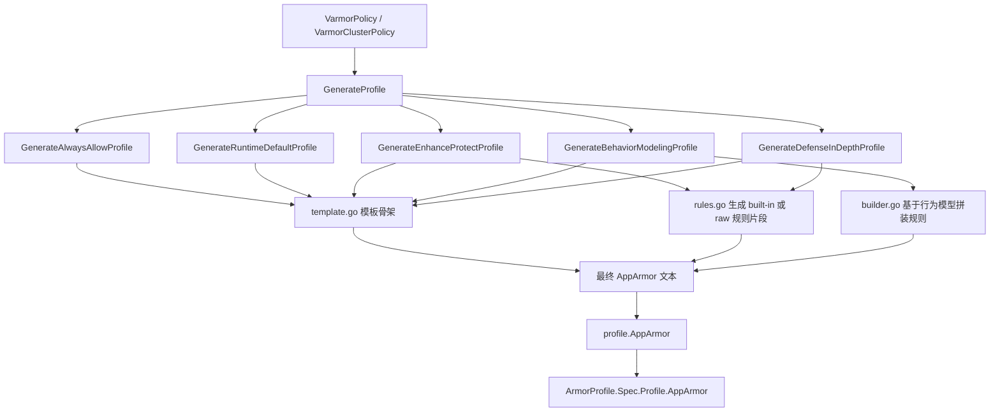

# internal/profile 的 AppArmor 部分详解

本文只聚焦 vArmor 的 AppArmor 生成链路，说明 `internal/profile/apparmor` 如何把策略对象里的高层规则，编译成最终写入 `ArmorProfile.Spec.Profile.AppArmor` 的 AppArmor profile 文本。

如果把 `internal/profile` 看成一个总编译器，那么 AppArmor 子包负责的是其中最接近“DSL 文本编译”的那一支。

它的核心特点有三个：

1. 以模板为骨架，而不是以 AST 或结构化对象为骨架。
2. 同时支持 built-in rules、raw rules、behavior model 三种来源。
3. 对带 `targets` 的规则，不是简单拼接，而是生成 child profile 并通过 `cx` 切换。

## 1. 目录与职责

AppArmor 相关代码主要集中在下面几个文件：

```text
internal/profile/apparmor/
├── apparmor.go   # 总入口，按 mode 生成最终 profile 文本
├── builder.go    # 基于行为模型拼装 profile
├── rules.go      # built-in rules、targets、child profile 处理
└── template.go   # alwaysAllow/runtimeDefault/behaviorModeling 等模板
```

它们的职责分工大致如下：

1. `apparmor.go` 决定走哪种生成路径。
2. `template.go` 提供 profile 文本骨架。
3. `rules.go` 把 built-in rules 和 raw rules 展开成规则片段。
4. `builder.go` 在行为建模场景下把模型数据重新组织成完整 profile。

对应源码：

1. AppArmor 总入口：[../../internal/profile/apparmor/apparmor.go](../../internal/profile/apparmor/apparmor.go)
2. 规则处理：[../../internal/profile/apparmor/rules.go](../../internal/profile/apparmor/rules.go)
3. 模板定义：[../../internal/profile/apparmor/template.go](../../internal/profile/apparmor/template.go)
4. 建模拼装：[../../internal/profile/apparmor/builder.go](../../internal/profile/apparmor/builder.go)

## 2. 它在总链路中的位置

从总链路看，AppArmor 分支的入口并不在 `internal/profile/apparmor` 本身，而是在 [../../internal/profile/profile.go](../../internal/profile/profile.go) 的 `GenerateProfile()`。

整体路径可以压缩成：

```text
VarmorPolicy / VarmorClusterPolicy
        -> GenerateProfile()
        -> apparmor.Generate...
        -> profile.AppArmor
        -> ArmorProfile.Spec.Profile.AppArmor
```

也就是说：

1. controller 不直接调用 `internal/profile/apparmor`。
2. controller 只调用 `GenerateProfile()` 或 `NewArmorProfile()`。
3. AppArmor 子包是其中一个被总分发器选中的后端生成器。

对应源码：

1. 总分发入口：[../../internal/profile/profile.go#L58-L280](../../internal/profile/profile.go#L58-L280)
2. AppArmor 分支调用点：[../../internal/profile/profile.go#L88-L98](../../internal/profile/profile.go#L88-L98)、[../../internal/profile/profile.go#L128-L158](../../internal/profile/profile.go#L128-L158)、[../../internal/profile/profile.go#L160-L198](../../internal/profile/profile.go#L160-L198)、[../../internal/profile/profile.go#L200-L251](../../internal/profile/profile.go#L200-L251)

## 3. 策略到 AppArmor profile 的生成图

如果只看 AppArmor 这一支，它的生成链路可以简化成下面这张图：



对应的 SVG 图如下：



这张图要表达的核心点是：

1. AppArmor 的最终产物始终是一段文本 profile。
2. 模板是骨架，规则处理和行为模型拼装是往骨架里填内容。
3. 不同 mode 只是进入的生成入口不同，但最终都会收敛到同一个 `profile.AppArmor` 字段。

## 4. 基础模板路径

AppArmor 子包最明显的实现风格是模板驱动。

基础生成函数有三个：

1. `GenerateAlwaysAllowProfile()`
2. `GenerateRuntimeDefaultProfile()`
3. `GenerateBehaviorModelingProfile()`

这些函数本身逻辑很薄，核心就是选择模板并替换 profile 名。

对应源码：

1. AlwaysAllow：[../../internal/profile/apparmor/apparmor.go#L25-L27](../../internal/profile/apparmor/apparmor.go#L25-L27)
2. RuntimeDefault：[../../internal/profile/apparmor/apparmor.go#L29-L31](../../internal/profile/apparmor/apparmor.go#L29-L31)
3. BehaviorModeling：[../../internal/profile/apparmor/apparmor.go#L33-L35](../../internal/profile/apparmor/apparmor.go#L33-L35)
4. 模板定义：[../../internal/profile/apparmor/template.go#L17-L244](../../internal/profile/apparmor/template.go#L17-L244)

为了更直观地理解“模板”是什么意思，可以看两个典型例子。

AlwaysAllow 生成后的结果大致如下：

```text
## == Managed by vArmor == ##

abi <abi/3.0>,
#include <tunables/global>

profile varmor-demo-default flags=(attach_disconnected,mediate_deleted) {
        #include <abstractions/base>

        file,
        capability,
        network,
        mount,
        remount,
        umount,
        pivot_root,
        ptrace,
        signal,
        dbus,
        unix,
}
```

RuntimeDefault 生成后的结果大致如下：

```text
profile varmor-demo-default flags=(attach_disconnected,mediate_deleted) {
        #include <abstractions/base>

        network,
        capability,
        file,
        umount,

        signal (receive) peer=unconfined,
        signal (send,receive) peer=varmor-demo-default,

        deny @{PROC}/* w,
        deny @{PROC}/sysrq-trigger rwklx,
        deny @{PROC}/kmem rwklx,
        deny mount,
        deny /sys/firmware/** rwklx,

        ptrace (trace,read,tracedby,readby) peer=varmor-demo-default,
}
```

## 5. EnhanceProtect 的核心生成逻辑

AppArmor 真正复杂的路径在 `GenerateEnhanceProtectProfile()`。

它大致做了这些事：

1. 根据 `AuditViolations` 和 `AllowViolations` 计算 qualifier。
2. 依次处理 `HardeningRules`。
3. 依次处理 `AttackProtectionRules`。
4. 依次处理 `VulMitigationRules`。
5. 处理 `AppArmorRawRules`。
6. 处理带 `targets` 的规则并生成 child profile。
7. 最后把所有规则片段插入合适模板。

这里最重要的不是“调用了哪些函数”，而是它把高层策略统一压缩成 AppArmor DSL 规则片段，再放进模板骨架中。

对应源码：[../../internal/profile/apparmor/apparmor.go#L47-L121](../../internal/profile/apparmor/apparmor.go#L47-L121)

### 5.1 qualifier 的语义

qualifier 会决定同一条规则是观察、拦截，还是只做允许覆盖。

常见组合可以理解成：

1. `audit deny`：既记录也拦截。
2. `deny`：直接拦截。
3. `audit`：只观察不阻断。
4. 空 qualifier：作为允许型规则存在。

这使 built-in rules 可以在不同策略强度下复用，而不需要为观察模式和拦截模式维护两份完全独立的规则集合。

## 6. targets 与 child profile

这是 AppArmor 子包最有代表性的实现点。

对于带 `targets` 的 `AttackProtectionRules` 和 `AppArmorRawRules`，vArmor 不是简单把规则拼进主 profile，而是：

1. 先按 target 拆分规则。
2. 再把同一 target 的规则合并。
3. 再把规则完全相同的 target 分组，减少重复 child profile。
4. 为每组 target 生成 child profile。
5. 在父 profile 中通过 `cx` 规则，把指定可执行文件切换到 child profile。

这意味着 vArmor 是在利用 AppArmor 原生的 profile 边界，来表达“只有某些进程需要更严格限制”。

这套设计的工程价值很明确：

1. 能对特定可执行文件单独收紧规则。
2. 主 profile 不会被大量进程级特化规则污染。
3. 相同规则集合可以合并，减少 profile 膨胀。

对应源码：[../../internal/profile/apparmor/rules.go#L376-L543](../../internal/profile/apparmor/rules.go#L376-L543)

## 7. DefenseInDepth 的 AppArmor 路径

DefenseInDepth 下，AppArmor 不是“从零生成”，而是“基于现有 profile 做 patch”。

它支持两种基底来源：

1. `BehaviorModel`
2. `Custom`

处理方式大致是：

1. 先拿到基底 profile 文本。
2. 把全局 custom rules 插入到最后一个 `}` 之前。
3. 对带 `targets` 的 raw rules 继续生成 child profile。

所以 DefenseInDepth 更像是对已有 AppArmor profile 做二次增强，而不是重新走一遍完整的 built-in rule 编译流程。

对应源码：[../../internal/profile/apparmor/apparmor.go#L123-L141](../../internal/profile/apparmor/apparmor.go#L123-L141)

## 8. BehaviorModeling 的 AppArmor 路径

在行为建模场景下，真正复杂的逻辑在 `builder.go`。

`GenerateProfileWithBehaviorModel()` 会把建模产物中的 exec、file、capability、network、ptrace、signal 信息分别整理成规则块，再拼成最终 profile。

这个过程有几个特点：

1. 各类规则会分别构造，再统一拼接。
2. 输出会排序，保证结果稳定。
3. 调试模式下可以把更多观测到的 network / ptrace / signal 信息补进去。
4. 如果模型里出现多个 profile 名，会直接报错，避免产物语义不明确。

这也是为什么在三个 enforcer 里，AppArmor 的行为建模表达能力最强。它能比较完整地把观测到的行为重新组织成一个可执行的 LSM 文本 profile。

对应源码：[../../internal/profile/apparmor/builder.go#L178-L203](../../internal/profile/apparmor/builder.go#L178-L203)

## 9. 一个最小理解框架

如果只用几句话概括 AppArmor 这一支，可以这样理解：

1. `profile.go` 决定什么时候调用 AppArmor 生成器。
2. `template.go` 提供骨架。
3. `rules.go` 负责把 built-in rules 和 raw rules 变成可插入的 DSL 片段。
4. `builder.go` 在行为模型场景下负责把模型转成完整 profile。
5. 最终结果始终是一段 AppArmor 文本，写进 `ArmorProfile.Spec.Profile.AppArmor`。

所以如果把 policy controller 看成协调者，把节点侧 AppArmor 加载器看成执行者，那么 `internal/profile/apparmor` 就是中间那层专门把策略翻译成 AppArmor DSL 的编译器。