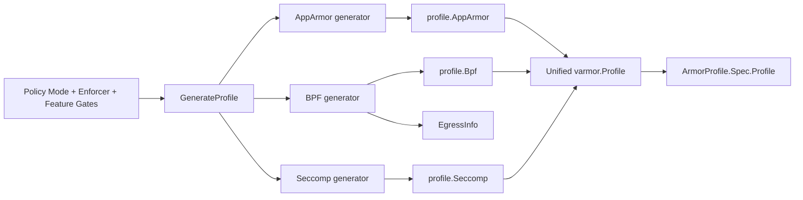

# GenerateProfile 到三类产物的总览对照图

如果只从“输入策略最后变成了什么”这个角度看，`GenerateProfile()` 的核心工作可以压缩成三条并行产物链：

1. AppArmor：生成文本 profile，落到 `profile.AppArmor`
2. BPF：生成结构化 `BpfContent`，落到 `profile.Bpf`
3. Seccomp：生成 JSON profile，落到 `profile.Seccomp`

其中只有 BPF 这条链还会额外产出 `EgressInfo`，因为 Pod / Service 类型的 egress 规则需要把“查询出来的目标集合”单独保留下来，供 controller 和后续刷新逻辑使用。

对应总览图如下：

对应的 SVG 图如下：

这张图的重点不是讲某一个子包的内部细节，而是强调三件事：

1. `GenerateProfile()` 是唯一统一入口，三种 enforcer 的产物都在这里被收敛到同一个 `varmor.Profile`。
2. AppArmor、BPF、Seccomp 的生成方式完全不同，但对上层 controller 来说，它们最终都表现为 `ArmorProfile.Spec.Profile` 的不同字段。
3. `EgressInfo` 不是 profile 的一部分，它是 BPF 生成链路额外带出的衍生元数据。

对应源码：

1. GenerateProfile 总入口：[../../internal/profile/profile.go#L58-L280](../../internal/profile/profile.go#L58-L280)
2. AppArmor 生成分支：[../../internal/profile/profile.go#L88-L98](../../internal/profile/profile.go#L88-L98) 和 [../../internal/profile/profile.go#L128-L158](../../internal/profile/profile.go#L128-L158)
3. BPF 生成分支：[../../internal/profile/profile.go#L89-L92](../../internal/profile/profile.go#L89-L92) 和 [../../internal/profile/profile.go#L137-L145](../../internal/profile/profile.go#L137-L145)
4. Seccomp 生成分支：[../../internal/profile/profile.go#L94-L97](../../internal/profile/profile.go#L94-L97) 和 [../../internal/profile/profile.go#L147-L157](../../internal/profile/profile.go#L147-L157)

## 如何更细地理解这张图

这张图主要解释的不是某个 enforcer 内部如何生成规则，而是同一份策略进入 `GenerateProfile()` 之后，最终会产出哪些结果，以及这些结果如何被统一装进 `ArmorProfile.Spec.Profile`。

### 1. 最左侧输入块表示“分发依据”

图中的 `Policy Mode + Enforcer + Feature Gates`，可以理解为 `GenerateProfile()` 做决策时依赖的三类信息：

1. `Policy Mode`：决定当前策略走哪一类语义分支，比如 `AlwaysAllow`、`RuntimeDefault`、`EnhanceProtect`、`BehaviorModeling`、`DefenseInDepth`。
2. `Enforcer`：决定这次需要生成 AppArmor、BPF、Seccomp 中的哪几类产物。
3. `Feature Gates`：主要影响某些扩展能力，尤其是 BPF egress 这类需要额外解析集群对象的逻辑。

所以这个输入块并不是一个单独字段，而是 `GenerateProfile()` 在总入口里做分支判断时依赖的整体上下文。

### 2. 中间的 GenerateProfile 是统一编排器

图中央只有一个 `GenerateProfile`，是因为这个函数不是“某一种 profile 的生成器”，而是整个 `internal/profile` 目录的统一入口。它负责：

1. 根据 `mode` 判断当前策略应该走哪条主分支。
2. 根据 `enforcer` 判断要不要生成 AppArmor、BPF、Seccomp。
3. 调用不同子包，把同一份策略分别编译成不同形态的结果。
4. 把这些结果收敛成统一的 `varmor.Profile`。
5. 在 BPF egress 场景下额外返回 `EgressInfo`。

也就是说，这张图想强调的是：`GenerateProfile()` 的核心职责是“统一分发 + 统一收敛”，而不是只做某一种格式转换。总入口位置在 [../../internal/profile/profile.go#L58-L280](../../internal/profile/profile.go#L58-L280)。

### 3. 三条并行分支代表三种完全不同的产物形态

从 `GenerateProfile` 分出去的三条线，不是三种实现细节上的小差异，而是三种本质不同的输出类型：

1. AppArmor 分支：输出文本 profile，最终写入 `profile.AppArmor`。
2. BPF 分支：输出结构化 `BpfContent`，最终写入 `profile.Bpf`。
3. Seccomp 分支：输出 JSON profile，最终写入 `profile.Seccomp`。

这也是图里要把三条链明确并排画出来的原因。它想说明一件事：同一条策略不会先被标准化成一种统一中间语言，再转成三种 enforcer 结果；而是会被分别编译成三种完全不同的数据形态。

对应分支位置：

1. AppArmor：[../../internal/profile/profile.go#L88-L98](../../internal/profile/profile.go#L88-L98) 和 [../../internal/profile/profile.go#L128-L158](../../internal/profile/profile.go#L128-L158)
2. BPF：[../../internal/profile/profile.go#L89-L92](../../internal/profile/profile.go#L89-L92) 和 [../../internal/profile/profile.go#L137-L145](../../internal/profile/profile.go#L137-L145)
3. Seccomp：[../../internal/profile/profile.go#L94-L97](../../internal/profile/profile.go#L94-L97) 和 [../../internal/profile/profile.go#L147-L157](../../internal/profile/profile.go#L147-L157)

### 4. Unified varmor.Profile 表示“统一承载”，不是“抹平差异”

图中的 `Unified varmor.Profile` 很容易被误解成“三类内容会被转换成同一种格式”。实际上不是。

这里真正表达的是：

1. 上层 controller 不希望分别处理三套完全不同的结果对象。
2. 所以 `GenerateProfile()` 会把 AppArmor、BPF、Seccomp 的结果统一装进同一个 `varmor.Profile` 结构。
3. 但三者在内部仍然保留各自原本的形态和语义差异。

因此，`Unified varmor.Profile` 的含义更准确地说是“统一外壳”。它方便 controller 创建、更新和持久化 `ArmorProfile`，但并不会把 AppArmor 文本、BPF 结构、Seccomp JSON 真的变成同一种内容。

### 5. 最后一跳说明结果会被持久化到 ArmorProfile.Spec.Profile

图中最右边 `ArmorProfile.Spec.Profile` 的含义是：`GenerateProfile()` 产出的这些结果不是临时变量，而是最终会被写入 `ArmorProfile` 这个 CR 的 `Spec.Profile` 字段中。

这一步可以理解为从“策略语义”走到了“可下发执行的数据表示”：

1. 策略对象里写的是高层安全语义。
2. `GenerateProfile()` 负责把这些语义编译成执行面可消费的内容。
3. `ArmorProfile.Spec.Profile` 负责持久化这份编译结果。

所以这张图最后一跳是在回答：这些生成出来的东西最终存放在哪里。答案就是 `ArmorProfile.Spec.Profile`。

### 6. 为什么只有 BPF 会旁路产出 EgressInfo

图里只有 BPF 分支额外连出一个 `EgressInfo`，这不是附带信息，而是 BPF egress 规则设计上的一个关键点。

它表达的是：BPF 生成链路除了生成真正要执行的 `profile.Bpf` 之外，还会额外返回一份衍生元数据。

这份元数据不属于 profile 本体，原因是：

1. 它不是给 enforcer 直接执行的。
2. 它主要给 controller 和后续刷新逻辑使用。

当策略里的 egress 规则引用 `Pod` 或 `Service` 这类逻辑目标时，系统不仅要生成当前这一版 `Networks` 规则，还要记住“这些规则最初是根据哪些逻辑目标展开出来的”。这样后续 Pod IP、Service、EndpointSlice 变化时，controller 或 `IPWatcher` 才能知道该如何刷新现有的 BPF 网络规则。

所以可以把 BPF 这条链拆成两个结果去理解：

1. `profile.Bpf`：当前这版 profile 应该在内核里执行什么。
2. `EgressInfo`：这版网络规则是根据哪些逻辑目标解析出来的，后续如何做增量刷新。

### 7. 这张图刻意省略了 mode 细节

这张图适合回答“总体流向”，但不适合回答“每个 mode 下每个 enforcer 的精确行为”。因为它省略了几个事实：

1. 三条分支不一定每次都会同时出现，具体要看 `enforcer` 组合。
2. 同一个 `mode` 下，三个 enforcer 的行为并不一定对称。
3. 有些模式下某个字段可能只是空结构、占位内容，甚至当前并不支持。

因此，这张图最适合作为总览图，用来先建立“统一入口、三类产物、统一收敛、BPF 额外元数据”这四个核心概念。至于 mode 与 enforcer 的矩阵差异，需要结合 [../../internal/profile/profile.go#L58-L280](../../internal/profile/profile.go#L58-L280) 再往下看。

### 8. 用一句话概括整张图

如果把这张图压缩成一句话，可以表述为：

`GenerateProfile()` 会把同一份策略按 enforcer 维度分别编译成 AppArmor 文本、BPF 结构化规则、Seccomp JSON，再统一装进 `varmor.Profile` 并写入 `ArmorProfile.Spec.Profile`；其中 BPF 还会额外产出 `EgressInfo`，供后续网络目标变化时做增量刷新。