# internal/profile 时序图版说明

简体中文

本文用时序图说明 internal/profile 在控制面中的真实位置，重点回答一个问题：

策略对象是如何一步步变成 ArmorProfile 的。

前半部分专注于策略到 ArmorProfile 的生成链路；后半部分补充 BPF 与 Seccomp 的节点落地和注入链路。

先看最核心的三条主路径：

1. 新建策略时，如何创建 ArmorProfile。
2. 更新策略时，如何重新生成 ArmorProfile.Spec.Profile。
3. 行为建模到期后，如何从 complain 切换到 enforce。

## 1. 总览时序图

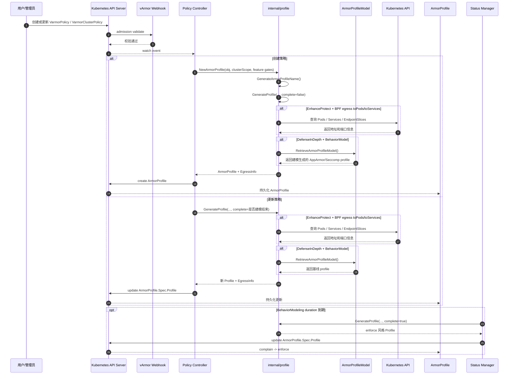

## 2. 参与方说明

- 用户/管理员
  - 创建、更新 VarmorPolicy 或 VarmorClusterPolicy。
- Kubernetes API Server
  - 接收策略对象，触发 webhook 校验，并把资源变更通过 watch 分发给 controller。
- vArmor Webhook
  - 在这个链路里只承担策略准入校验，不负责 profile 生成。
- Policy Controller
  - 监听策略对象，决定是创建新 ArmorProfile 还是更新已有 ArmorProfile。
- internal/profile
  - 本文的核心模块，负责把高层策略语义编译成具体 Profile 内容。
- ArmorProfileModel
  - DefenseInDepth 使用行为模型作为基线时，需要从这里取出建模产物。
- Kubernetes API
  - BPF egress 规则在涉及 Pod/Service 目标时，会向这里查询实际地址。
- ArmorProfile
  - internal/profile 的最终控制面产物。
- Status Manager
  - 行为建模周期结束后，触发 complain -> enforce 的切换。

## 3. 主链路拆解

### 3.0 时序箭头与函数名对照

下表把时序图里的关键箭头，直接映射到对应函数，便于从图回跳到实现。

| 时序箭头 | 主要函数 | 代码位置 |
| --- | --- | --- |
| 策略创建事件进入 namespace 级 controller | handleAddVarmorPolicy | [../../internal/policy/policy_controller.go#L198-L257](../../internal/policy/policy_controller.go#L198-L257) |
| 策略更新事件进入 namespace 级 controller | handleUpdateVarmorPolicy | [../../internal/policy/policy_controller.go#L280-L397](../../internal/policy/policy_controller.go#L280-L397) |
| 策略创建事件进入 cluster 级 controller | handleAddVarmorClusterPolicy | [../../internal/policy/clusterpolicy_controller.go#L193-L252](../../internal/policy/clusterpolicy_controller.go#L193-L252) |
| 策略更新事件进入 cluster 级 controller | handleUpdateVarmorClusterPolicy | [../../internal/policy/clusterpolicy_controller.go#L275-L392](../../internal/policy/clusterpolicy_controller.go#L275-L392) |
| Controller 调用 internal/profile 创建资源 | NewArmorProfile | [../../internal/profile/profile.go#L282-L358](../../internal/profile/profile.go#L282-L358) |
| internal/profile 生成 profile 名称 | GenerateArmorProfileName | [../../internal/profile/profile.go#L46-L56](../../internal/profile/profile.go#L46-L56) |
| internal/profile 进行 mode/enforcer 总分发 | GenerateProfile | [../../internal/profile/profile.go#L58-L280](../../internal/profile/profile.go#L58-L280) |
| BPF egress 展开 Pod 目标 | generateRawNetworkEgressRuleForPods | [../../internal/profile/bpf/custom.go#L424-L466](../../internal/profile/bpf/custom.go#L424-L466) |
| BPF egress 展开 Service 目标 | generateRawNetworkEgressRuleForServices | [../../internal/profile/bpf/custom.go#L468-L570](../../internal/profile/bpf/custom.go#L468-L570) |
| DefenseInDepth 读取行为模型 | RetrieveArmorProfileModel 调用点 | [../../internal/profile/profile.go#L227-L240](../../internal/profile/profile.go#L227-L240) 和 [../../internal/profile/profile.go#L254-L266](../../internal/profile/profile.go#L254-L266) |
| Controller 持久化新 ArmorProfile | ArmorProfiles(...).Create | [../../internal/policy/policy_controller.go#L242](../../internal/policy/policy_controller.go#L242) 和 [../../internal/policy/clusterpolicy_controller.go#L237](../../internal/policy/clusterpolicy_controller.go#L237) |
| Controller 持久化更新后的 ArmorProfile | ArmorProfiles(...).Update | [../../internal/policy/policy_controller.go#L383-L397](../../internal/policy/policy_controller.go#L383-L397) 和 [../../internal/policy/clusterpolicy_controller.go#L378-L392](../../internal/policy/clusterpolicy_controller.go#L378-L392) |
| 建模结束后 status manager 触发重编译 | reconcileStatus 中的 complain -> enforce 更新 | [../../internal/status/apis/v1/manager.go#L423-L657](../../internal/status/apis/v1/manager.go#L423-L657) |

### 3.1 创建策略 -> 创建 ArmorProfile

创建路径对应 controller 中的创建分支，核心是先调用 NewArmorProfile，再把结果写入 API Server。

这一段可以进一步拆成五步：

1. controller 收到 VarmorPolicy 或 VarmorClusterPolicy 创建事件。
2. controller 调用 NewArmorProfile。
3. NewArmorProfile 内部先计算 ArmorProfile 名称和 metadata。
4. 然后调用 GenerateProfile 生成 Spec.Profile。
5. controller 把完整 ArmorProfile 创建到集群里。

这里 internal/profile 做了两类工作：

1. 生成 Profile 内容。
2. 组装 ArmorProfile 的部分 spec 和 metadata。

也就是说，NewArmorProfile 不是纯内容生成函数，而是一个资源级装配函数。

对应源码：

1. namespace 级创建入口：[../../internal/policy/policy_controller.go#L212-L257](../../internal/policy/policy_controller.go#L212-L257)
2. cluster 级创建入口：[../../internal/policy/clusterpolicy_controller.go#L207-L252](../../internal/policy/clusterpolicy_controller.go#L207-L252)
3. NewArmorProfile 本体：[../../internal/profile/profile.go#L282-L358](../../internal/profile/profile.go#L282-L358)

## 4. internal/profile 内部时序图

下面这张图只关注 internal/profile 包内部是如何分层调用的。

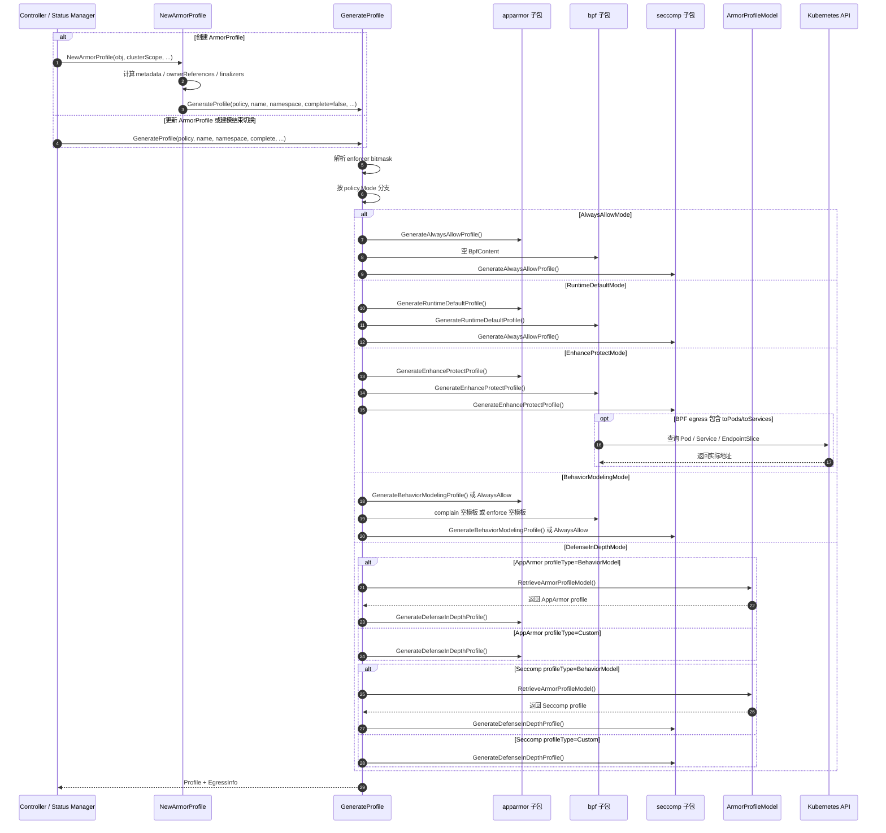

这张图说明 internal/profile 的核心结构是“总分发 + 子编译器”：

1. GenerateProfile 是总分发器。
2. AppArmor、BPF、Seccomp 子包是具体编译器。
3. NewArmorProfile 只是对创建场景额外包了一层资源装配。

对应源码：

1. GenerateProfile 总入口：[../../internal/profile/profile.go#L58-L280](../../internal/profile/profile.go#L58-L280)
2. AppArmor 生成入口：[../../internal/profile/apparmor/apparmor.go#L25-L141](../../internal/profile/apparmor/apparmor.go#L25-L141)
3. BPF 生成入口：[../../internal/profile/bpf/bpf.go#L30-L799](../../internal/profile/bpf/bpf.go#L30-L799)
4. Seccomp 生成入口：[../../internal/profile/seccomp/seccomp.go#L43-L539](../../internal/profile/seccomp/seccomp.go#L43-L539)

## 5. 更新策略 -> 刷新 ArmorProfile.Spec.Profile

更新路径和创建路径最大的区别是：

1. 不再重新创建 ArmorProfile metadata。
2. 只重新生成 Profile 内容并覆盖 oldAp.Spec.Profile。

这意味着 controller 在更新场景下不会再走 NewArmorProfile，而是直接调用 GenerateProfile。

可以把它理解为：

1. 创建：资源装配 + 内容编译。
2. 更新：只做内容重编译。

时序上，更新链路的关键点是 complete 参数：

1. 普通模式下，complete 没有实际影响。
2. BehaviorModelingMode 下，complete 决定生成 complain 版本还是 enforce 版本。

对应源码：

1. namespace 级更新入口：[../../internal/policy/policy_controller.go#L304-L340](../../internal/policy/policy_controller.go#L304-L340)
2. cluster 级更新入口：[../../internal/policy/clusterpolicy_controller.go#L299-L335](../../internal/policy/clusterpolicy_controller.go#L299-L335)
3. BehaviorModeling complete 分支：[../../internal/profile/profile.go#L160-L198](../../internal/profile/profile.go#L160-L198)

## 6. 建模结束 -> complain 切到 enforce

这是最容易被忽略的一条链路，因为它不是直接由 policy controller 触发，而是由 status manager 定时或状态轮询驱动。

对应时序如下：

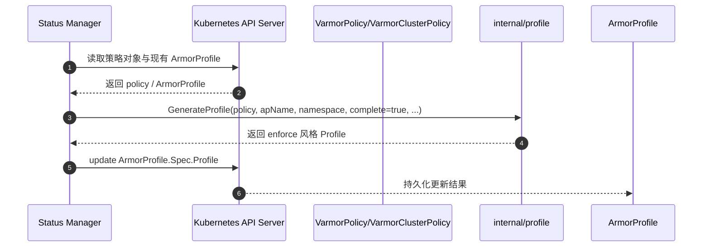

这里的关键不是“建模结果自动变成严格规则”，而是：

1. 建模期先用 complain 语义进行观察。
2. 到期后重新生成 profile。
3. 生成结果从观察态切到 enforce 态。

对不同 enforcer 来说，这个切换的具体内容并不完全相同：

1. AppArmor：从 behavior modeling 模板切回 always allow 模板。
2. BPF：空 BpfContent 仍为空，但 profile.Mode 变成 enforce。
3. Seccomp：从 log 风格模板切回 always allow。

所以这里更准确地说，是“建模阶段结束后的状态切换”，而不是“直接基于模型做拦截”。真正复用模型的主场景是 DefenseInDepth。

对应源码：

1. status manager 触发重编译：[../../internal/status/apis/v1/manager.go#L643-L657](../../internal/status/apis/v1/manager.go#L643-L657)
2. GenerateArmorProfileName：[../../internal/profile/profile.go#L46-L56](../../internal/profile/profile.go#L46-L56)
3. BehaviorModeling 分支：[../../internal/profile/profile.go#L160-L198](../../internal/profile/profile.go#L160-L198)

## 7. 两个外部依赖分支

internal/profile 看起来像一个纯编译模块，但实际上有两类外部依赖分支。

### 7.1 BPF egress 依赖集群态解析

当 EnhanceProtect 中的 BPF raw egress 规则使用：

1. toPods
2. toServices

internal/profile 需要访问 Kubernetes API，把逻辑目标展开成实际 IP 和端口集合。

这会带来两个后果：

1. profile 生成不再是纯静态编译。
2. 生成结果会受到当时集群对象状态影响。

### 7.2 DefenseInDepth 依赖 ArmorProfileModel

当 profileType=BehaviorModel 时，internal/profile 需要读取已有模型对象，把其中保存的 AppArmor 或 Seccomp 文本取出来，再做二次加工。

这说明 DefenseInDepth 不是“从策略直接生成 profile”，而是“从模型恢复基线 profile，再做 patch”。

对应源码：

1. BPF egress 展开入口：[../../internal/profile/bpf/custom.go#L572-L618](../../internal/profile/bpf/custom.go#L572-L618)
2. DefenseInDepth 读取模型并二次生成：[../../internal/profile/profile.go#L200-L278](../../internal/profile/profile.go#L200-L278)

## 8. 从时序图看职责边界

从整个链路回头看，internal/profile 的职责边界可以总结得很清楚：

它不负责：

1. 策略准入校验。
2. ArmorProfile 的最终 create/update 提交。
3. 节点侧 profile 加载。
4. Pod 级注入和滚动升级。

它负责：

1. 根据 mode 和 enforcer 选择正确生成路径。
2. 把 built-in rules、raw rules、模型基线编译成 profile。
3. 在创建场景下组装 ArmorProfile 基本结构。
4. 在 BPF 网络规则场景下产出 EgressInfo。

所以把 internal/profile 看成“策略编译层”是准确的，但要注意它是一个带少量外部读取依赖的编译层，而不是完全纯函数式的编译器。

## 9. 补充：BPF 与 Seccomp 的写入和注入时序

上面的图只覆盖了“策略 -> ArmorProfile”的控制面主链路。为了把 BPF 和 Seccomp 讲完整，这里再补一张“ArmorProfile -> 节点 -> 工作负载”的落地时序图。

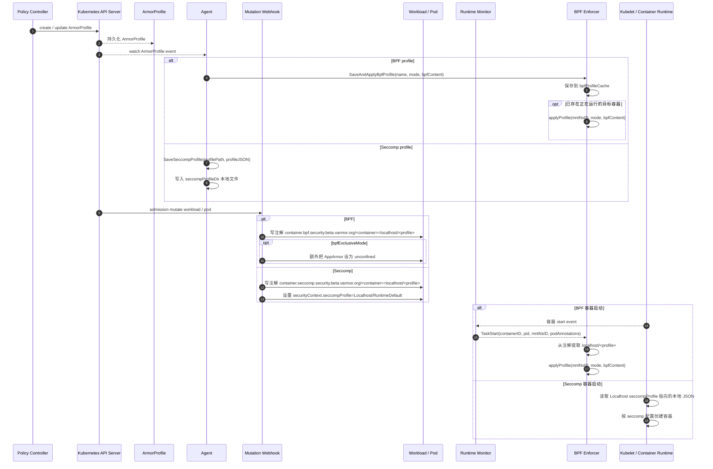

如果把视角收窄到“vArmor 使用 BPF 时，程序在什么时候 attach，规则又在什么时候真正作用到容器”，可以继续看下面这张图：

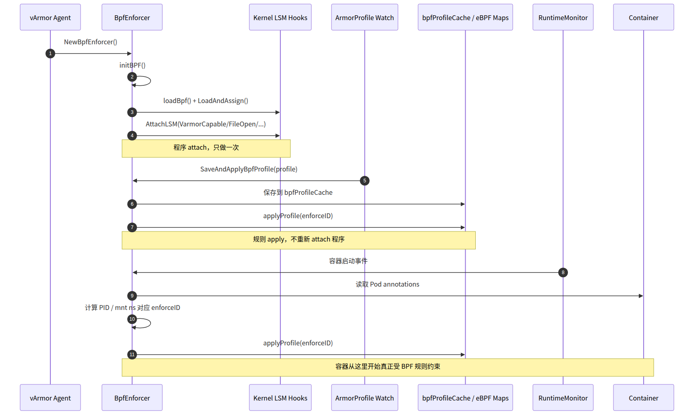

如果再往内核 hook 这一层继续拆，AttachLSM 挂到哪些 hook、这些 hook 分别覆盖什么控制类别，可以看下面这张细化图：

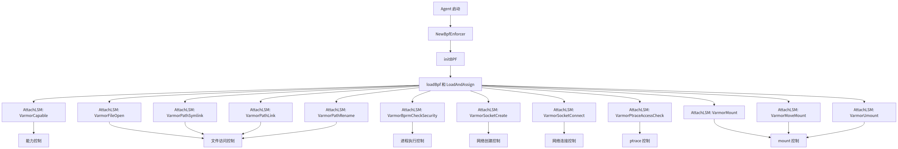

如果你想把“固定程序 attach 到 hook”与“规则数据写进 map”直接对应起来，可以继续看这两张图：

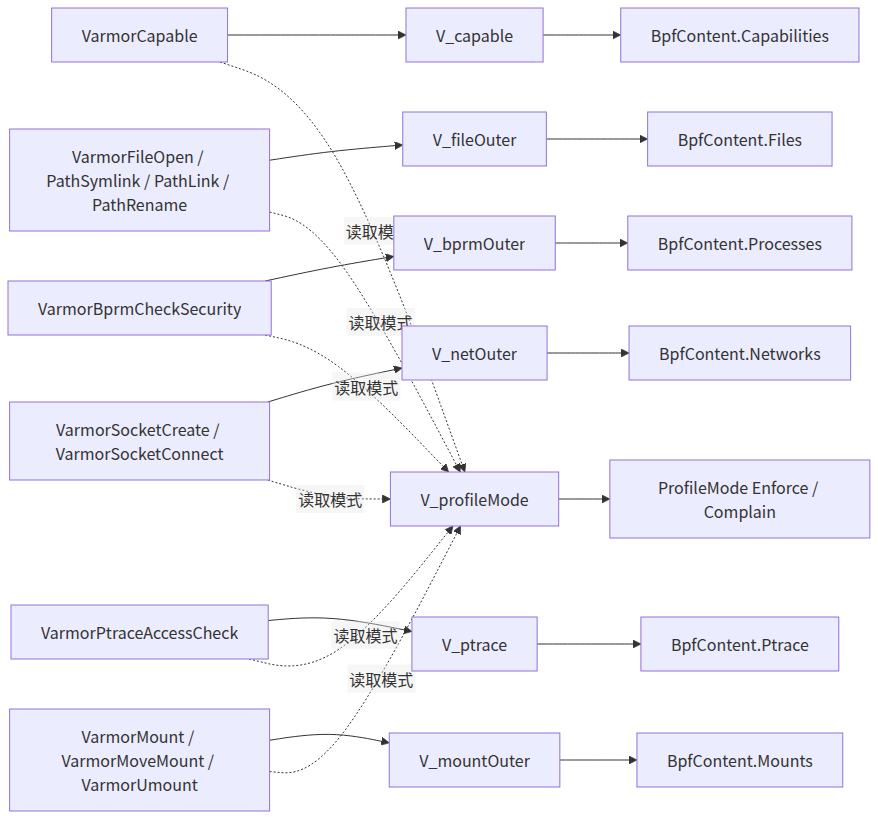

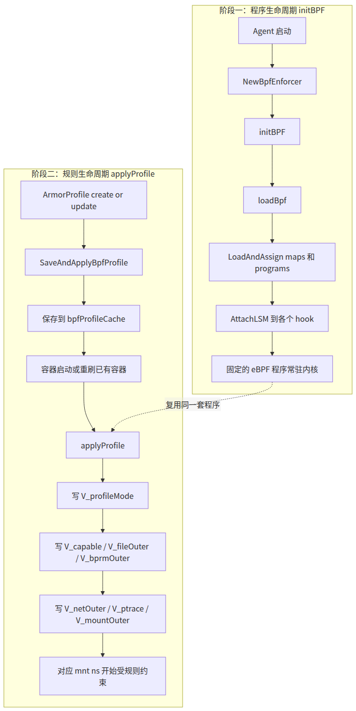

如果再往生成侧追一层，想看 `internal/profile/bpf` 是如何一步步把 built-in rules、raw rules 和 egress 展开结果汇总成 `BpfContent`，可以看：

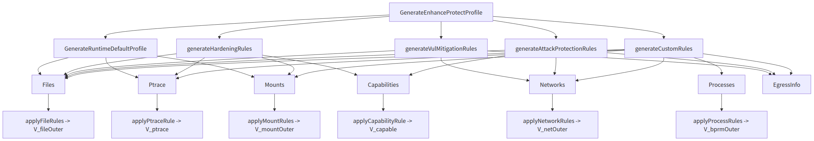

如果你想先从更高层的“统一产物视角”理解 `GenerateProfile()`，可以看：

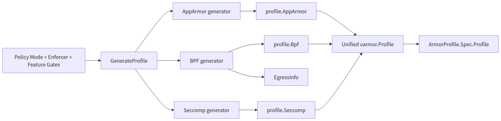

如果你想只盯住 BPF egress 这一段，看 Pod / Service 是如何展开成 `Networks` 和 `EgressInfo` 的，可以看：

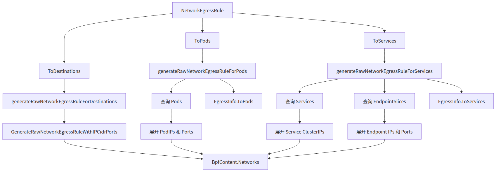

如果你想继续往后看，理解这些 `EgressInfo` 是怎么被 controller 缓存、又怎么被 `IPWatcher` 拿来增量刷新 `ArmorProfile.Spec.Profile.Bpf.Networks` 的，可以看：

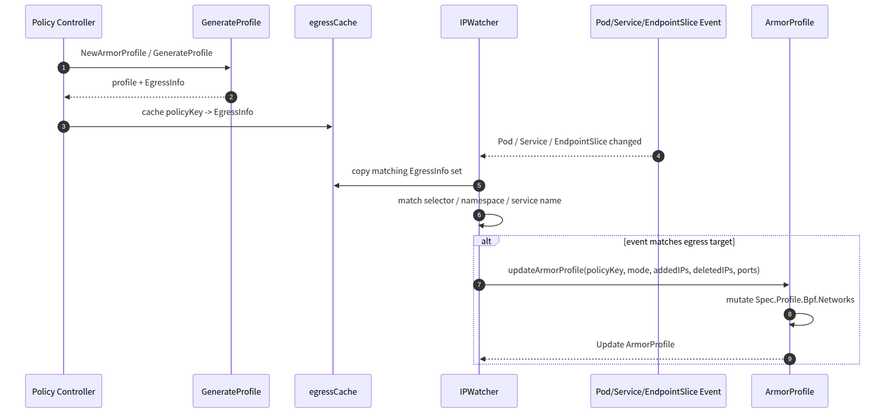

如果你想把多 enforcer 的统一策略输入和三类最终产物并排对照起来，可以看：

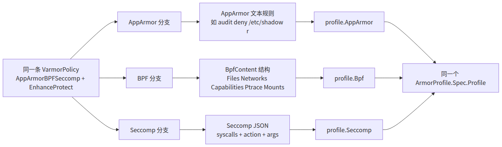

这张图可以直接看出两种机制的本质差异：

1. BPF 注入到 workload 时，只写“引用关系”；真正绑定到容器，要等容器启动事件到来后，由 BPF enforcer 按挂载命名空间附着规则。
2. Seccomp 注入到 workload 时，就已经把 SecurityContext 指向了 Localhost profile；只要 agent 先把 JSON 写到节点目录，容器运行时就能直接读取并生效。

对应代码：

1. agent 处理 ArmorProfile：[../../internal/agent/agent.go#L404-L526](../../internal/agent/agent.go#L404-L526)
2. BPF profile 保存与重刷：[../../pkg/lsm/bpfenforcer/enforcer.go#L498-L531](../../pkg/lsm/bpfenforcer/enforcer.go#L498-L531)
3. BPF 事件驱动生效：[../../pkg/lsm/bpfenforcer/enforcer.go#L322-L375](../../pkg/lsm/bpfenforcer/enforcer.go#L322-L375)
4. BPF 规则写入内核 map：[../../pkg/lsm/bpfenforcer/profile.go#L317-L356](../../pkg/lsm/bpfenforcer/profile.go#L317-L356)
5. Seccomp 文件写入：[../../pkg/seccomp/seccomp.go#L31-L44](../../pkg/seccomp/seccomp.go#L31-L44)
6. admission 注入 BPF / Seccomp：[../../internal/webhooks/mutation.go#L393-L497](../../internal/webhooks/mutation.go#L393-L497)
7. 现有 workload 的直接模板修改：[../../internal/policy/update.go#L104-L169](../../internal/policy/update.go#L104-L169)
8. BPF attach 主流程：[../../pkg/lsm/bpfenforcer/enforcer.go#L82-L257](../../pkg/lsm/bpfenforcer/enforcer.go#L82-L257)
9. BpfContent 生成与汇总入口：[../../internal/profile/bpf/bpf.go#L715-L799](../../internal/profile/bpf/bpf.go#L715-L799) 和 [../../internal/profile/bpf/custom.go#L33-L90](../../internal/profile/bpf/custom.go#L33-L90)
10. BPF egress 展开：[../../internal/profile/bpf/custom.go#L402-L618](../../internal/profile/bpf/custom.go#L402-L618)
11. egressCache 与 IPWatcher 增量刷新：[../../internal/policy/policy_controller.go#L254-L260](../../internal/policy/policy_controller.go#L254-L260)、[../../internal/ipwatcher/sync.go#L35-L264](../../internal/ipwatcher/sync.go#L35-L264)

## 10. 阅读顺序建议

如果你打算结合代码继续看，建议顺序如下：

1. 先看总览时序图，理解创建、更新、建模结束三条主路径。
2. 再看 internal/profile 内部时序图，理解 NewArmorProfile 和 GenerateProfile 的分工。
3. 然后结合 [docs/guides/internal-profile.zh_CN.md](internal-profile.zh_CN.md) 阅读三个子包的细节。
4. 最后去看 controller 代码，把“谁触发 internal/profile”这件事补完整。

## 11. 结论

如果只用一句话概括这份时序图：

策略对象到 ArmorProfile 的生成链路，本质上是 controller 驱动 internal/profile 进行一次“按 mode 和 enforcer 分发的 profile 编译”，并把产物持久化回 ArmorProfile。

更细一点，它体现出四层递进关系：

1. 策略对象变化触发 controller reconcile。
2. controller 调用 internal/profile。
3. internal/profile 按 mode 分发到 AppArmor、BPF、Seccomp 子生成器。
4. 生成结果被写入 ArmorProfile，并在后续更新或建模完成时再次重编译。

这也是理解 internal/profile 最直接的一种方式：

它不是单次执行的静态工具函数集合，而是被 controller 和 status manager 多次调用、贯穿策略生命周期的编译组件。