# internal/profile 详细分析

本文聚焦 vArmor 的 internal/profile 目录，说明它如何把策略对象中的高层安全语义，转换成 ArmorProfile 中可下发的 AppArmor、BPF、Seccomp 内容。

这不是一个单纯的“模板渲染”目录。它实际上承担了三层职责：

1. 统一策略模式与 enforcer 组合的分发。
2. 将内置规则、自定义规则、行为建模结果收敛为具体 profile。
3. 为上层 controller 提供可直接持久化的 ArmorProfile 和 egress 元信息。

## 1. 目录结构

internal/profile 的结构很清晰：

```text
internal/profile/
├── profile.go           # 总入口，负责 mode/enforcer 分发与 ArmorProfile 组装
├── apparmor/
│   ├── apparmor.go      # AppArmor profile 生成入口
│   ├── builder.go       # 基于行为模型拼装 profile
│   ├── rules.go         # 内置规则与 target 级规则处理
│   ├── template.go      # AppArmor 模板
│   └── apparmor_test.go # 规则预处理测试
├── bpf/
│   ├── bpf.go           # BPF profile 生成入口，处理内置规则
│   ├── custom.go        # BPF 原始自定义规则解析
│   ├── rule.go          # BPF rule 对象构造和合法性检查
│   └── bpf_test.go      # 网络 egress 规则测试
└── seccomp/
    ├── seccomp.go       # Seccomp profile 生成入口
    └── seccomp_test.go  # raw syscall 规则合并测试
```

从职责划分上看：

1. profile.go 只做编排，不深入具体语法细节。
2. apparmor 子包偏“模板拼接”。
3. bpf 子包偏“结构化规则对象构造”。
4. seccomp 子包偏“syscall/action 聚合与 JSON 序列化”。

## 2. 它在系统中的位置

这个目录位于策略控制面和最终执行面之间。

上游输入主要来自：

1. VarmorPolicy 和 VarmorClusterPolicy 的 Spec.Policy。
2. ArmorProfileModel 中的行为建模结果。
3. Kubernetes API 中的 Pod、Service、EndpointSlice 信息，主要用于 BPF egress 规则展开。

下游输出主要是：

1. ArmorProfile.Spec.Profile。
2. 用于缓存的 EgressInfo。
3. 在建模完成后从 complain 转 enforce 的最终 profile 内容。

典型调用链如下：

```text
VarmorPolicy / VarmorClusterPolicy
        |
        v
NewArmorProfile()
        |
        v
GenerateProfile()
        |
        +--> apparmor.Generate...
        +--> bpf.Generate...
        +--> seccomp.Generate...
        |
        v
ArmorProfile.Spec.Profile
```

对应调用方主要有两类：

1. policy controller 在策略创建、更新时调用，用于创建或刷新 ArmorProfile。
2. status manager 在行为建模周期结束后再次调用，用于把 complain profile 切换到 enforce profile。

对应源码：

1. 创建 namespace 级策略时调用 NewArmorProfile：[../../internal/policy/policy_controller.go#L212](../../internal/policy/policy_controller.go#L212)
2. 更新 namespace 级策略时调用 GenerateProfile：[../../internal/policy/policy_controller.go#L316](../../internal/policy/policy_controller.go#L316)
3. 创建 cluster 级策略时调用 NewArmorProfile：[../../internal/policy/clusterpolicy_controller.go#L207](../../internal/policy/clusterpolicy_controller.go#L207)
4. 更新 cluster 级策略时调用 GenerateProfile：[../../internal/policy/clusterpolicy_controller.go#L311](../../internal/policy/clusterpolicy_controller.go#L311)
5. 建模结束后由 status manager 调用 GenerateArmorProfileName 和 GenerateProfile：[../../internal/status/apis/v1/manager.go#L643-L650](../../internal/status/apis/v1/manager.go#L643-L650)

## 3. 核心入口分析

### 3.1 GenerateArmorProfileName

profile 命名规则定义在 profile.go 中：

1. namespace scope: varmor-{namespace}-{name}
2. cluster scope: varmor-cluster-{varmor-namespace}-{name}

这里有两个设计点：

1. 名称统一转小写，避免底层 profile 名与 Kubernetes 资源命名风格不一致。
2. cluster scope 仍然落在 vArmor 自身 namespace 下，保证 cluster policy 对应资源的归属明确。

对应源码：[../../internal/profile/profile.go#L46-L56](../../internal/profile/profile.go#L46-L56)

### 3.2 GenerateProfile

GenerateProfile 是整个目录最关键的函数。它的职责不是“生成某一种 profile”，而是根据策略 mode 和 enforcer 组合，生成 varmor.Profile 这个统一结构。

它的输入包括：

1. kubeClient：BPF egress 展开需要读取 Pod/Service/EndpointSlice。
2. varmorInterface：DefenseInDepth 读取 ArmorProfileModel 需要它。
3. policy：策略核心内容。
4. name、namespace：最终 profile 名称和命名空间。
5. complete：行为建模是否已完成。
6. 两个 egress feature gate。
7. logger。

它的输出包括：

1. varmor.Profile。
2. EgressInfo。
3. error。

换句话说，GenerateProfile 既负责 profile 内容本身，也承担了部分“衍生元数据计算”工作。

对应源码：[../../internal/profile/profile.go#L58-L280](../../internal/profile/profile.go#L58-L280)

#### 3.2.1 GenerateProfile 到三类产物的总览对照图

如果只从“输入策略最后变成了什么”这个角度看，`GenerateProfile()` 的核心工作可以压缩成三条并行产物链：

1. AppArmor：生成文本 profile，落到 `profile.AppArmor`
2. BPF：生成结构化 `BpfContent`，落到 `profile.Bpf`
3. Seccomp：生成 JSON profile，落到 `profile.Seccomp`

其中只有 BPF 这条链还会额外产出 `EgressInfo`，因为 Pod / Service 类型的 egress 规则需要把“查询出来的目标集合”单独保留下来，供 controller 和后续刷新逻辑使用。

对应总览图如下：

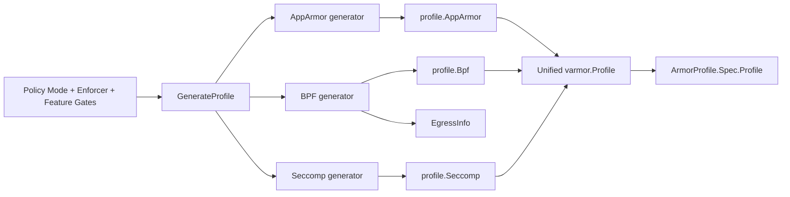

对应的 SVG 图如下：


这张图的重点不是讲某一个子包的内部细节，而是强调三件事：

1. `GenerateProfile()` 是唯一统一入口，三种 enforcer 的产物都在这里被收敛到同一个 `varmor.Profile`。
2. AppArmor、BPF、Seccomp 的生成方式完全不同，但对上层 controller 来说，它们最终都表现为 `ArmorProfile.Spec.Profile` 的不同字段。
3. `EgressInfo` 不是 profile 的一部分，它是 BPF 生成链路额外带出的衍生元数据。

对应源码：

1. GenerateProfile 总入口：[../../internal/profile/profile.go#L58-L280](../../internal/profile/profile.go#L58-L280)
2. AppArmor 生成分支：[../../internal/profile/profile.go#L88-L98](../../internal/profile/profile.go#L88-L98) 和 [../../internal/profile/profile.go#L128-L158](../../internal/profile/profile.go#L128-L158)
3. BPF 生成分支：[../../internal/profile/profile.go#L89-L92](../../internal/profile/profile.go#L89-L92) 和 [../../internal/profile/profile.go#L137-L145](../../internal/profile/profile.go#L137-L145)
4. Seccomp 生成分支：[../../internal/profile/profile.go#L94-L97](../../internal/profile/profile.go#L94-L97) 和 [../../internal/profile/profile.go#L147-L157](../../internal/profile/profile.go#L147-L157)

#### 3.2.2 同一条多 enforcer 策略如何产出三种不同结果

如果你想把三条产物链放到同一个例子里看，最合适的是仓库里的多 enforcer 示例 [../../test/examples/5-mutiple-enforcers/vpol-enhance.yaml](../../test/examples/5-mutiple-enforcers/vpol-enhance.yaml)。

这条策略同时开启：

1. `enforcer: AppArmorBPFSeccomp`
2. `mode: EnhanceProtect`
3. 一组共享的 built-in rules
4. AppArmor raw rules
5. BPF raw egress rules
6. Seccomp raw syscall rules

它进入 `GenerateProfile()` 后，不会生成一个统一格式的文本，而是并行生成三种完全不同的产物：

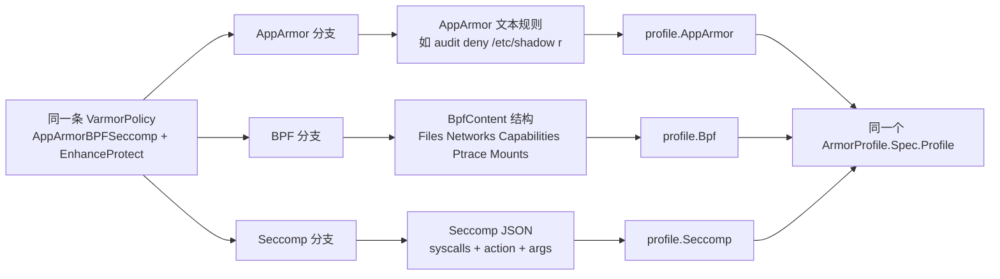

对应的 SVG 图如下：


这张图想表达的是：

1. 同一条策略的共享输入部分，会分别进入三个 enforcer 的生成器。
2. 三个 enforcer 的产物形态完全不同：AppArmor 是文本、BPF 是结构体、Seccomp 是 JSON。
3. `ArmorProfile.Spec.Profile` 只是统一承载容器，不会抹平这三种产物内部结构的差异。

如果结合这份示例策略看，可以把字段大致对应成：

1. `hardeningRules`、`attackProtectionRules` 同时影响三条分支。
2. `appArmorRawRules` 只进入 AppArmor 分支。
3. `bpfRawRules` 只进入 BPF 分支。
4. `syscallRawRules` 只进入 Seccomp 分支。

对应源码：

1. 示例策略：[../../test/examples/5-mutiple-enforcers/vpol-enhance.yaml](../../test/examples/5-mutiple-enforcers/vpol-enhance.yaml)
2. GenerateProfile 分发入口：[../../internal/profile/profile.go#L58-L280](../../internal/profile/profile.go#L58-L280)
3. AppArmor EnhanceProtect 入口：[../../internal/profile/apparmor/apparmor.go#L47-L121](../../internal/profile/apparmor/apparmor.go#L47-L121)
4. BPF EnhanceProtect 入口：[../../internal/profile/bpf/bpf.go#L715-L799](../../internal/profile/bpf/bpf.go#L715-L799)
5. Seccomp EnhanceProtect 入口：[../../internal/profile/seccomp/seccomp.go#L471-L520](../../internal/profile/seccomp/seccomp.go#L471-L520)

### 3.3 NewArmorProfile

NewArmorProfile 再往上一层，它负责把策略对象包装成完整的 ArmorProfile CR：

1. 根据 namespace scope 或 cluster scope 设置 metadata。
2. 填充 ownerReferences 和 finalizer。
3. 调用 GenerateProfile 填充 Spec.Profile。
4. 复制 Target 和 UpdateExistingWorkloads。
5. 在 BehaviorModelingMode 下开启 Spec.BehaviorModeling.Enable 并记录持续时间。

这意味着 internal/profile 不只是“profile 内容生成器”，它还知道一部分 ArmorProfile 资源编排逻辑。

对应源码：[../../internal/profile/profile.go#L282-L358](../../internal/profile/profile.go#L282-L358)

## 4. mode 与 enforcer 的分发矩阵

GenerateProfile 的主体是对 Policy.Mode 的 switch。它把不同 mode 下三个 enforcer 的行为差异硬编码为一个分发表。

### 4.0 mode × enforcer 代码落点矩阵

下表把每种 mode 在三个 enforcer 上的实际落点整理成矩阵。这样可以同时看到：

1. 总分支落在 GenerateProfile 的哪一段。
2. 每个 enforcer 具体调用了哪个生成函数。
3. 哪些场景其实没有进入子包，而是在 profile.go 内直接返回空结构或错误。

| Mode | AppArmor 落点 | BPF 落点 | Seccomp 落点 | 总分支位置 |
| --- | --- | --- | --- | --- |
| AlwaysAllowMode | GenerateAlwaysAllowProfile [../../internal/profile/apparmor/apparmor.go#L25-L27](../../internal/profile/apparmor/apparmor.go#L25-L27) | 直接构造空 BpfContent [../../internal/profile/profile.go#L89-L92](../../internal/profile/profile.go#L89-L92) | GenerateAlwaysAllowProfile [../../internal/profile/seccomp/seccomp.go#L43-L50](../../internal/profile/seccomp/seccomp.go#L43-L50) | [../../internal/profile/profile.go#L79-L98](../../internal/profile/profile.go#L79-L98) |
| RuntimeDefaultMode | GenerateRuntimeDefaultProfile [../../internal/profile/apparmor/apparmor.go#L29-L31](../../internal/profile/apparmor/apparmor.go#L29-L31) | GenerateRuntimeDefaultProfile [../../internal/profile/bpf/bpf.go#L30-L85](../../internal/profile/bpf/bpf.go#L30-L85) | 复用 GenerateAlwaysAllowProfile 作为兼容性占位 [../../internal/profile/seccomp/seccomp.go#L43-L50](../../internal/profile/seccomp/seccomp.go#L43-L50) | [../../internal/profile/profile.go#L100-L126](../../internal/profile/profile.go#L100-L126) |
| EnhanceProtectMode | GenerateEnhanceProtectProfile [../../internal/profile/apparmor/apparmor.go#L47-L121](../../internal/profile/apparmor/apparmor.go#L47-L121) | GenerateEnhanceProtectProfile [../../internal/profile/bpf/bpf.go#L715-L799](../../internal/profile/bpf/bpf.go#L715-L799) | GenerateEnhanceProtectProfile [../../internal/profile/seccomp/seccomp.go#L471-L520](../../internal/profile/seccomp/seccomp.go#L471-L520) | [../../internal/profile/profile.go#L128-L158](../../internal/profile/profile.go#L128-L158) |
| BehaviorModelingMode | 未完成时 GenerateBehaviorModelingProfile [../../internal/profile/apparmor/apparmor.go#L33-L35](../../internal/profile/apparmor/apparmor.go#L33-L35)；完成后 GenerateAlwaysAllowProfile [../../internal/profile/apparmor/apparmor.go#L25-L27](../../internal/profile/apparmor/apparmor.go#L25-L27) | 直接构造空 BpfContent，靠 ProfileMode 区分 complain/enforce [../../internal/profile/profile.go#L166-L175](../../internal/profile/profile.go#L166-L175) | 未完成时 GenerateBehaviorModelingProfile [../../internal/profile/seccomp/seccomp.go#L52-L60](../../internal/profile/seccomp/seccomp.go#L52-L60)；完成后 GenerateAlwaysAllowProfile [../../internal/profile/seccomp/seccomp.go#L43-L50](../../internal/profile/seccomp/seccomp.go#L43-L50) | [../../internal/profile/profile.go#L160-L198](../../internal/profile/profile.go#L160-L198) |
| DefenseInDepthMode | GenerateDefenseInDepthProfile [../../internal/profile/apparmor/apparmor.go#L123-L141](../../internal/profile/apparmor/apparmor.go#L123-L141) | 当前直接返回 not supported [../../internal/profile/profile.go#L215-L217](../../internal/profile/profile.go#L215-L217) | GenerateDefenseInDepthProfile [../../internal/profile/seccomp/seccomp.go#L522-L539](../../internal/profile/seccomp/seccomp.go#L522-L539) | [../../internal/profile/profile.go#L200-L278](../../internal/profile/profile.go#L200-L278) |

如果只看这张表，可以快速得出三个结论：

1. 统一分发入口始终是 [../../internal/profile/profile.go#L58-L280](../../internal/profile/profile.go#L58-L280)。
2. BPF 在 AlwaysAllow 和 BehaviorModeling 下大量使用空结构占位，而不是进入复杂子逻辑。
3. DefenseInDepth 的能力目前只完整覆盖 AppArmor 和 Seccomp，没有覆盖 BPF。

对应源码：

1. AlwaysAllowMode：[../../internal/profile/profile.go#L79-L98](../../internal/profile/profile.go#L79-L98)
2. RuntimeDefaultMode：[../../internal/profile/profile.go#L100-L126](../../internal/profile/profile.go#L100-L126)
3. EnhanceProtectMode：[../../internal/profile/profile.go#L128-L158](../../internal/profile/profile.go#L128-L158)
4. BehaviorModelingMode：[../../internal/profile/profile.go#L160-L198](../../internal/profile/profile.go#L160-L198)
5. DefenseInDepthMode：[../../internal/profile/profile.go#L200-L278](../../internal/profile/profile.go#L200-L278)

### 4.1 AlwaysAllowMode

语义上是“尽量不施加限制”。

1. AppArmor 生成 always-allow 模板。
2. BPF 返回空的 BpfContent。
3. Seccomp 返回 DefaultAction=Allow 的空 profile。

这个模式更像一个显式占位模式，保证数据结构完整，但不主动加限制。

### 4.2 RuntimeDefaultMode

语义上是“采用默认运行时保护基线”。

1. AppArmor 使用 runtime-default 模板。
2. BPF 通过 GenerateRuntimeDefaultProfile 注入一批基础防护规则。
3. Seccomp 特意返回 AlwaysAllow，而不是严格的 runtime default seccomp。

这里 Seccomp 的处理很关键。代码中明确说明，这是为了策略从其他模式切换到 RuntimeDefaultMode 时，不影响已存在 Pod 的重启行为，因为现有 Pod 的 seccomp 设置无法原地更新。

也就是说，这里的 RuntimeDefaultMode 对三个 enforcer 并不完全等价，它更像是“结合 Kubernetes 可运维性后的折中实现”。

### 4.3 EnhanceProtectMode

这是最主要的 profile 生成路径。

1. 要求 policy.EnhanceProtect 非空。
2. profile.Mode 固定为 enforce。
3. 三个 enforcer 分别按内置规则、自定义规则生成内容。

这个模式本质上把高层安全诉求分成四类输入：

1. HardeningRules
2. AttackProtectionRules
3. VulMitigationRules
4. 各 enforcer 对应的 raw rules

### 4.4 BehaviorModelingMode

该模式有明显的两阶段语义：

1. 建模进行中：profile.Mode 为 complain。
2. 建模完成后：profile.Mode 为 enforce，但内容通常回退到 AlwaysAllow 或空模板。

分 enforcer 看：

1. AppArmor：进行中生成 behavior-modeling 模板，完成后切回 always allow。
2. BPF：进行中和完成后都只是空 BpfContent，但模式分别是 complain 和 enforce。
3. Seccomp：进行中是默认 log，完成后切回 always allow。

这个设计表达出一个很明确的意图：

1. 建模期的重点是观察，不是拦截。
2. 建模结果本身不会直接在此阶段形成“默认拒绝”的最终策略。
3. 真正利用建模产出的路径，是后续 DefenseInDepthMode。

### 4.5 DefenseInDepthMode

这是另一个语义很强的模式：它不是从零生成 profile，而是“在已有模型或自定义 profile 基础上二次加工”。

特点如下：

1. 如果 AllowViolations=true，profile.Mode 为 complain，否则为 enforce。
2. 当前明确不支持 BPF enforcer。
3. AppArmor 和 Seccomp 都支持两种 profile 来源：
   - BehaviorModel
   - Custom

当来源是 BehaviorModel 时，会调用 RetrieveArmorProfileModel 读取 ArmorProfileModel 中保存的建模结果；当来源是 Custom 时，则直接使用策略中给出的 profile 文本。

因此，DefenseInDepthMode 的本质是：

1. 复用建模结果作为基线。
2. 再叠加少量自定义强化规则。
3. 用 complain 或 enforce 控制最终执行强度。

## 5. AppArmor 子包分析

### 5.1 设计风格

AppArmor 子包最显著的特点是“模板驱动”。

它并没有把 profile 完全表示成结构体再序列化，而是：

1. 先准备好 alwaysAllow、runtimeDefault、behaviorModeling、defenseInDepth 等模板。
2. 再把规则字符串插入模板中的固定位置。

这很符合 AppArmor 本身是 DSL 文本的特点，也比构造抽象语法树更直接。

### 5.2 基础 profile 生成

基础函数很简单：

1. GenerateAlwaysAllowProfile
2. GenerateRuntimeDefaultProfile
3. GenerateBehaviorModelingProfile

这些函数几乎只是套模板，复杂度很低。

对应源码：

1. GenerateAlwaysAllowProfile：[../../internal/profile/apparmor/apparmor.go#L25-L27](../../internal/profile/apparmor/apparmor.go#L25-L27)
2. GenerateRuntimeDefaultProfile：[../../internal/profile/apparmor/apparmor.go#L29-L31](../../internal/profile/apparmor/apparmor.go#L29-L31)
3. GenerateBehaviorModelingProfile：[../../internal/profile/apparmor/apparmor.go#L33-L35](../../internal/profile/apparmor/apparmor.go#L33-L35)

可以先用一个简化后的例子理解 AppArmor 模板最终长什么样。

AlwaysAllow 模板生成后的形态大致如下：

```text
## == Managed by vArmor == ##

abi <abi/3.0>,
#include <tunables/global>

profile varmor-demo-default flags=(attach_disconnected,mediate_deleted) {

        #include <abstractions/base>

        file,
        capability,
        network,
        mount,
        remount,
        umount,
        pivot_root,
        ptrace,
        signal,
        dbus,
        unix,
}
```

RuntimeDefault 模板生成后的形态大致如下：

```text
profile varmor-demo-default flags=(attach_disconnected,mediate_deleted) {
        #include <abstractions/base>

        network,
        capability,
        file,
        umount,

        signal (receive) peer=unconfined,
        signal (send,receive) peer=varmor-demo-default,

        deny @{PROC}/* w,
        deny @{PROC}/sysrq-trigger rwklx,
        deny @{PROC}/kmem rwklx,
        deny mount,
        deny /sys/firmware/** rwklx,

        ptrace (trace,read,tracedby,readby) peer=varmor-demo-default,
}
```

对应模板源码：

1. AlwaysAllow 模板：[../../internal/profile/apparmor/template.go#L17-L40](../../internal/profile/apparmor/template.go#L17-L40)
2. RuntimeDefault 模板：[../../internal/profile/apparmor/template.go#L67-L120](../../internal/profile/apparmor/template.go#L67-L120)
3. BehaviorModeling 模板：[../../internal/profile/apparmor/template.go#L236-L244](../../internal/profile/apparmor/template.go#L236-L244)

### 5.3 EnhanceProtect 的规则拼装

AppArmor 的复杂性集中在 GenerateEnhanceProtectProfile：

1. 先根据 AuditViolations 和 AllowViolations 计算 qualifier。
2. 按顺序拼接 Hardening、Attack Protection、Vulnerability Mitigation、Custom Rules。
3. 再单独处理带 Targets 的规则。
4. 最后依据 Privileged 选择 alwaysAllowTemplate 或 runtimeDefaultTemplateForEnhanceProtectMode。

qualifier 的含义非常重要：

1. audit + deny：审计并拦截。
2. 只有 deny：拦截，不强调审计。
3. 只有 audit：告警观察。
4. 两者都没有：允许型覆盖规则。

这让同一套规则枚举可以在不同执行语义下复用。

对应源码：[../../internal/profile/apparmor/apparmor.go#L47-L121](../../internal/profile/apparmor/apparmor.go#L47-L121)

### 5.4 Targets 的处理方式

这是 AppArmor 子包最值得关注的实现点。

AttackProtectionRules 和 AppArmorRawRules 都可以带 Targets，表示规则只对特定可执行文件生效。实现方式不是“在原 profile 内打条件”，而是：

1. 先把规则按 target 粒度拆开。
2. 再把相同 target 的规则合并。
3. 再把规则集相同的 target 合并，减少重复 profile。
4. 为每组 target 生成 child profile。
5. 父 profile 中通过 cx 把目标可执行文件切换到 child profile。

这说明作者非常熟悉 AppArmor 的 profile 继承和 exec 切换机制。它不是简单的字符串拼装，而是借用了 AppArmor 的 profile 边界，把“进程级特化规则”建模成子 profile。

这个实现的优点：

1. 可以对指定可执行文件施加更严格规则。
2. 避免所有规则都塞进主 profile，降低语义混乱。
3. 通过 merge 降低重复 child profile 数量。

对应源码：[../../internal/profile/apparmor/rules.go#L376-L543](../../internal/profile/apparmor/rules.go#L376-L543)

### 5.5 DefenseInDepth 的 AppArmor 处理

DefenseInDepth 下的 AppArmor 逻辑不是重新生成完整 profile，而是：

1. 以建模结果或自定义 profile 为基底。
2. 把全局 custom rules 插入到最后一个 `}` 之前。
3. 对带 Targets 的 raw rules 继续生成 child profile。

这使 DefenseInDepth 更像“profile patching”，而不是“重新编译”。

对应源码：[../../internal/profile/apparmor/apparmor.go#L123-L141](../../internal/profile/apparmor/apparmor.go#L123-L141)

### 5.6 BehaviorModeling 的 AppArmor 处理

builder.go 中的 GenerateProfileWithBehaviorModel 会基于行为模型数据动态生成 AppArmor profile：

1. exec、file、capability、network、ptrace、signal 各自分别构造规则块。
2. 规则会排序，保证输出稳定。
3. 调试模式下会把从审计日志中观察到的网络、ptrace、signal 信息补进去。
4. 如果 behavior model 中出现多个 profile 名，会直接报错。

也就是说，AppArmor 在行为建模链路上是三个 enforcer 中“表达能力最强”的一支。

对应源码：[../../internal/profile/apparmor/builder.go#L178-L203](../../internal/profile/apparmor/builder.go#L178-L203)

## 6. BPF 子包分析

### 6.1 设计风格

BPF 子包不是输出 DSL 文本，而是构造结构化的 varmor.BpfContent。其最终消费者是 BPF enforcer，因此这里的核心不是模板，而是“规则对象编码”。

主要由两部分组成：

1. bpf.go 负责内置规则映射。
2. rule.go/custom.go 负责把 raw rule 转成结构化对象，并做严格校验。

这里要特别强调一点：BPF 没有 AppArmor 那种“文本模板文件”。

它的“模板”本质上是 ArmorProfile.Spec.Profile.Bpf 里的结构化数据。也就是说，BPF 不是生成一段 DSL 文本，而是生成一组 FileContent、NetworkContent、MountContent、PtraceContent 等对象。

一个简化后的 RuntimeDefault BPF 内容，大致会长这样：

```json
{
        "files": [
                {
                        "permissions": 7,
                        "pattern": {
                                "flags": 5,
                                "prefix": "/proc/sysrq-trigger"
                        }
                },
                {
                        "permissions": 7,
                        "pattern": {
                                "flags": 7,
                                "prefix": "/proc/",
                                "suffix": "mem/"
                        }
                }
        ],
        "ptrace": {
                "permissions": 3,
                "flags": 1
        },
        "mounts": [
                {
                        "mountFlags": 4294967295,
                        "reverseMountflags": 4294967295,
                        "pattern": {
                                "flags": 2
                        },
                        "fstype": "*"
                }
        ]
}
```

如果是带 egress 限制的 BPF 规则，结构会更像这样：

```json
{
        "networks": [
                {
                        "flags": 40,
                        "address": {
                                "ip": "10.0.0.15",
                                "port": 443
                        }
                },
                {
                        "flags": 48,
                        "address": {
                                "cidr": "192.168.1.0/24",
                                "ip": "192.168.1.0",
                                "ports": [80, 443]
                        }
                }
        ]
}
```

所以从“模板长什么样”的角度看：

1. AppArmor 的模板是文本骨架。
2. BPF 的模板是结构化规则集合。
3. 最终由 agent / enforcer 消费这些结构，而不是去解析一段 BPF DSL 文本。

对应源码：

1. BpfContent 结构定义：[../../apis/varmor/v1beta1/armorprofile_types.go#L73-L92](../../apis/varmor/v1beta1/armorprofile_types.go#L73-L92)
2. RuntimeDefault BPF 生成：[../../internal/profile/bpf/bpf.go#L30-L85](../../internal/profile/bpf/bpf.go#L30-L85)
3. File 规则编码：[../../internal/profile/bpf/rule.go#L66-L137](../../internal/profile/bpf/rule.go#L66-L137)
4. Network 规则编码：[../../internal/profile/bpf/rule.go#L139-L249](../../internal/profile/bpf/rule.go#L139-L249)

### 6.2 BPF LSM 文件的生成过程

前面讲的是“BPF profile 数据怎么生成”。但如果继续往下看执行面，还会遇到另一层问题：

1. 真正挂到 LSM hook 上的 eBPF 程序文件是谁生成的。
2. `pkg/lsm/bpfenforcer/bpf_bpfel.go` 和 `pkg/lsm/bpfenforcer/bpf_bpfel.o` 是怎么来的。
3. 为什么源码在 `vArmor-ebpf/`，而运行时加载代码在主仓库 `pkg/lsm/bpfenforcer/`。

这条链路可以概括成四步：

```text
vArmor-ebpf/pkg/bpfenforcer/bpf/enforcer.c
        -> bpf2go 编译/封装
vArmor-ebpf/pkg/bpfenforcer/bpf_bpfel.o + bpf_bpfel.go
        -> make copy-ebpf
pkg/lsm/bpfenforcer/bpf_bpfel.o + bpf_bpfel.go
        -> loadBpf() / CollectionSpec.LoadAndAssign() / link.AttachLSM()
```

#### 第一步：在 vArmor-ebpf 中编写 LSM eBPF 源文件

BPF LSM 的源码不直接写在主仓库 `pkg/lsm/bpfenforcer/` 里，而是写在独立的 `vArmor-ebpf/` 子目录下。

主入口文件是 [../../vArmor-ebpf/pkg/bpfenforcer/bpf/enforcer.c](../../vArmor-ebpf/pkg/bpfenforcer/bpf/enforcer.c)。

这个文件做了几件关键事情：

1. 引入 `vmlinux.h`、`bpf_helpers.h`、`bpf_core_read.h` 等 eBPF/CO-RE 头文件。
2. 引入 `capability.h`、`file.h`、`process.h`、`network.h`、`ptrace.h`、`mount.h` 等规则子模块。
3. 定义全局变量 `init_mnt_ns`，让用户态可以把 init 进程的挂载命名空间写入程序变量。
4. 用 `SEC("lsm/...")` 把不同函数挂到 LSM hook 点上。

例如这个文件里能直接看到这些 hook：

1. `lsm/capable`：[../../vArmor-ebpf/pkg/bpfenforcer/bpf/enforcer.c#L37](../../vArmor-ebpf/pkg/bpfenforcer/bpf/enforcer.c#L37)
2. `lsm/file_open`：[../../vArmor-ebpf/pkg/bpfenforcer/bpf/enforcer.c#L122](../../vArmor-ebpf/pkg/bpfenforcer/bpf/enforcer.c#L122)
3. `lsm/bprm_check_security`：[../../vArmor-ebpf/pkg/bpfenforcer/bpf/enforcer.c#L406](../../vArmor-ebpf/pkg/bpfenforcer/bpf/enforcer.c#L406)
4. `lsm/socket_connect`：[../../vArmor-ebpf/pkg/bpfenforcer/bpf/enforcer.c#L460](../../vArmor-ebpf/pkg/bpfenforcer/bpf/enforcer.c#L460)
5. `lsm/ptrace_access_check`：[../../vArmor-ebpf/pkg/bpfenforcer/bpf/enforcer.c#L595](../../vArmor-ebpf/pkg/bpfenforcer/bpf/enforcer.c#L595)
6. `lsm/sb_mount`：[../../vArmor-ebpf/pkg/bpfenforcer/bpf/enforcer.c#L708](../../vArmor-ebpf/pkg/bpfenforcer/bpf/enforcer.c#L708)
7. `lsm/move_mount`：[../../vArmor-ebpf/pkg/bpfenforcer/bpf/enforcer.c#L778](../../vArmor-ebpf/pkg/bpfenforcer/bpf/enforcer.c#L778)
8. `lsm/sb_umount`：[../../vArmor-ebpf/pkg/bpfenforcer/bpf/enforcer.c#L846](../../vArmor-ebpf/pkg/bpfenforcer/bpf/enforcer.c#L846)

也就是说，BPF LSM “文件生成”的源头，其实是这组 C 文件和头文件，而不是 Go 代码。

#### 第二步：通过 bpf2go 生成 `.o` 和 Go 封装

真正把 C 源编译成可加载对象并生成 Go 封装的入口，是 [../../vArmor-ebpf/pkg/bpfenforcer/enforcer.go#L19](../../vArmor-ebpf/pkg/bpfenforcer/enforcer.go#L19) 上的 `go:generate`：

```go
//go:generate go run github.com/cilium/ebpf/cmd/bpf2go -cc $BPF_CLANG -cflags $BPF_CFLAGS -target bpfel -type audit_event bpf bpf/enforcer.c -- -I../../headers
```

这行命令的含义可以拆开看：

1. 使用 `github.com/cilium/ebpf/cmd/bpf2go`。
2. 编译目标是 `bpf/enforcer.c`。
3. 额外包含头文件目录 `-I../../headers`。
4. 目标字节序是 `bpfel`，即 little-endian eBPF 对象。
5. 为 `audit_event` 结构生成 Go 侧类型绑定。

运行 `go generate` 之后，会在 `vArmor-ebpf/pkg/bpfenforcer/` 下生成两个关键文件：

1. [../../vArmor-ebpf/pkg/bpfenforcer/bpf_bpfel.o](../../vArmor-ebpf/pkg/bpfenforcer/bpf_bpfel.o)
2. [../../vArmor-ebpf/pkg/bpfenforcer/bpf_bpfel.go](../../vArmor-ebpf/pkg/bpfenforcer/bpf_bpfel.go)

它们各自的职责是：

1. `.o`：clang 编译出来的 eBPF ELF 对象，里面包含 programs、maps、BTF/relocation 等信息。
2. `.go`：bpf2go 自动生成的 Go 包装层，负责把 `.o` 以字节数组形式嵌入，并生成 `bpfObjects`、`bpfPrograms`、`bpfMaps`、`loadBpf()` 等辅助代码。

在生成后的 Go 文件里，可以直接看到 `loadBpf()` 从嵌入的 `_BpfBytes` 反序列化 `CollectionSpec`：

1. `loadBpf()`：[../../pkg/lsm/bpfenforcer/bpf_bpfel.go#L55-L63](../../pkg/lsm/bpfenforcer/bpf_bpfel.go#L55-L63)
2. `loadBpfObjects()`：[../../pkg/lsm/bpfenforcer/bpf_bpfel.go#L74-L81](../../pkg/lsm/bpfenforcer/bpf_bpfel.go#L74-L81)

#### 第三步：由 Makefile 驱动生成与拷贝

主仓库的生成过程不是手工跑 `go generate`，而是通过两层 Makefile 串起来：

1. 根 Makefile 的 `build-ebpf`：[../../Makefile#L126-L129](../../Makefile#L126-L129)
2. 根 Makefile 的 `copy-ebpf`：[../../Makefile#L131-L137](../../Makefile#L131-L137)
3. `vArmor-ebpf/Makefile` 的 `generate-ebpf`：[../../vArmor-ebpf/Makefile#L28-L32](../../vArmor-ebpf/Makefile#L28-L32)

执行顺序是：

1. `make build-ebpf`
2. 根 Makefile 进入 `vArmor-ebpf/`，执行 `make generate-ebpf`
3. `vArmor-ebpf/Makefile` 导出 `BPF_CLANG`、`BPF_CFLAGS`
4. 然后执行 `go generate ./...`
5. 这会触发 `vArmor-ebpf/pkg/bpfenforcer/enforcer.go` 上的 `go:generate`

生成完成后，再执行 `make copy-ebpf`，把产物复制回主仓库运行时代码目录：

1. `vArmor-ebpf/pkg/bpfenforcer/bpf_bpfel.go` -> `pkg/lsm/bpfenforcer/bpf_bpfel.go`
2. `vArmor-ebpf/pkg/bpfenforcer/bpf_bpfel.o` -> `pkg/lsm/bpfenforcer/bpf_bpfel.o`

这也是为什么主仓库里你看到的 [../../pkg/lsm/bpfenforcer/bpf_bpfel.go](../../pkg/lsm/bpfenforcer/bpf_bpfel.go) 是生成文件，而不是手写文件。

#### 第四步：主仓库运行时加载这些生成文件

文件拷贝到主仓库之后，真正消费这些生成产物的是 [../../pkg/lsm/bpfenforcer/enforcer.go#L89-L190](../../pkg/lsm/bpfenforcer/enforcer.go#L89-L190) 的 `initBPF()`。

这一步不是重新编译，而是“加载已经生成好的对象”：

1. 调用 `loadBpf()` 解析嵌入的 eBPF ELF，得到 `CollectionSpec`。
2. 根据 vArmor 的规则模型，给 outer map 动态补 inner map 定义。
3. 读取 init 进程挂载命名空间，把它写入 `collectionSpec.Variables["init_mnt_ns"]`。
4. 调用 `collectionSpec.LoadAndAssign()` 把 maps 和 programs 加载进内核。
5. 通过 `link.AttachLSM()` 把生成出来的程序分别挂到 LSM hook 点。

代码位置：

1. `loadBpf()`：[../../pkg/lsm/bpfenforcer/bpf_bpfel.go#L55-L63](../../pkg/lsm/bpfenforcer/bpf_bpfel.go#L55-L63)
2. `initBPF()` 解析 `CollectionSpec`：[../../pkg/lsm/bpfenforcer/enforcer.go#L96-L99](../../pkg/lsm/bpfenforcer/enforcer.go#L96-L99)
3. 设置 inner maps：[../../pkg/lsm/bpfenforcer/enforcer.go#L102-L141](../../pkg/lsm/bpfenforcer/enforcer.go#L102-L141)
4. 设置 `init_mnt_ns`：[../../pkg/lsm/bpfenforcer/enforcer.go#L143-L149](../../pkg/lsm/bpfenforcer/enforcer.go#L143-L149)
5. `LoadAndAssign()`：[../../pkg/lsm/bpfenforcer/enforcer.go#L151-L160](../../pkg/lsm/bpfenforcer/enforcer.go#L151-L160)
6. `AttachLSM()`：[../../pkg/lsm/bpfenforcer/enforcer.go#L163-L257](../../pkg/lsm/bpfenforcer/enforcer.go#L163-L257)

所以这里的“BPF LSM 文件生成过程”，完整来说其实是两段：

1. 构建期：C 源 -> `bpf_bpfel.o` + `bpf_bpfel.go`
2. 运行期：`bpf_bpfel.go` 嵌入的对象 -> `CollectionSpec` -> maps/programs -> LSM hook

#### 第五步：这些文件和策略规则生成是两条并行链路

这也是最容易混淆的地方。

`internal/profile/bpf` 负责的是：

1. 把策略编译成 `BpfContent`
2. 也就是“规则数据”

`vArmor-ebpf/pkg/bpfenforcer/bpf/enforcer.c` 这一套负责的是：

1. 定义内核里如何解释这些规则
2. 也就是“执行引擎”

两者最终在 [../../pkg/lsm/bpfenforcer/profile.go#L317-L356](../../pkg/lsm/bpfenforcer/profile.go#L317-L356) 汇合：

1. 生成好的 eBPF 程序已经挂在 LSM hook 上。
2. `BpfContent` 再被写入对应 map。
3. 容器触发 hook 时，程序按 map 中规则执行 allow / audit / deny 逻辑。

如果只用一句话总结：

vArmor 的 BPF LSM 文件不是在 `internal/profile` 里动态生成的，而是在 `vArmor-ebpf/` 中由 `bpf2go` 预编译成 `.o + .go`，再复制到主仓库，由运行时加载并和 `BpfContent` 规则数据一起组成最终的 BPF LSM 防护链路。

### 6.3 RuntimeDefault 基线

GenerateRuntimeDefaultProfile 会注入一批基础防护：

1. 保护 /proc/sysrq-trigger、/proc/kmem、/proc/kcore 等敏感路径。
2. 保护 /sys/firmware、/sys/kernel/security 等敏感路径。
3. 禁止大范围 mount 行为。
4. 设置 ptrace 限制。

它本质上是 BPF 版的“容器默认基线防护”。

对应源码：[../../internal/profile/bpf/bpf.go#L30-L85](../../internal/profile/bpf/bpf.go#L30-L85)

### 6.4 EnhanceProtect 的构建流程

GenerateEnhanceProtectProfile 的流程很清楚：

1. 根据 AuditViolations 和 AllowViolations 生成 mode 位掩码。
2. 如果目标容器不是 privileged，则先叠加 RuntimeDefault 基线。
3. 逐条处理 HardeningRules。
4. 逐条处理 VulMitigationRules。
5. 逐条处理全局 AttackProtectionRules。
6. 处理 BpfRawRules。
7. 最后检查 Files、Processes、Networks、Mounts 数量是否超过 bpfenforcer 的上限。

这里的设计重点是“先生成，再限流”。当规则过多时，生成函数直接报错，避免下游 eBPF map 或程序容量被静默打爆。

对应源码：[../../internal/profile/bpf/bpf.go#L715-L799](../../internal/profile/bpf/bpf.go#L715-L799)

### 6.5 rule.go 的价值

rule.go 是 BPF 子包最关键的基础设施，它提供了统一的 rule 构造器：

1. newBpfPathRule
2. newBpfNetworkCreateRule
3. newBpfNetworkConnectRule
4. newBpfMountRule

这些函数负责两类事情：

1. 语义编码：把路径、IP、端口、mount flag 转成结构化字段和 match flag。
2. 输入约束：提前拦截不合法规则。

例如路径规则对 `*` 和 `**` 的使用有严格限制：

1. 不能同时使用 `*` 和 `**`。
2. 每种通配最多出现一次。
3. 带单星号的模式不支持路径分隔符。

这类校验很关键，因为 BPF matcher 不是通用 glob 引擎，而是简化匹配模型。如果不在这里提前收口，运行时行为会不可预期。

对应源码：

1. 路径规则：[../../internal/profile/bpf/rule.go#L66-L137](../../internal/profile/bpf/rule.go#L66-L137)
2. 网络创建规则：[../../internal/profile/bpf/rule.go#L139-L156](../../internal/profile/bpf/rule.go#L139-L156)
3. 网络连接规则：[../../internal/profile/bpf/rule.go#L158-L249](../../internal/profile/bpf/rule.go#L158-L249)
4. mount 规则：[../../internal/profile/bpf/rule.go#L251-L328](../../internal/profile/bpf/rule.go#L251-L328)

### 6.6 自定义规则解析

custom.go 负责把策略中的 BPF raw rules 翻译为 BpfContent：

1. 文件与进程规则转换为 FileContent。
2. socket 规则转换为 NetworkContent。
3. egress 规则支持 destination、pod、service 三种来源。
4. ptrace 规则转换为 PtraceContent。
5. mount 规则只在 privileged 场景下允许生效。

其中网络 egress 是最复杂的一段：

1. 支持 IP、CIDR、端口、端口段、端口列表。
2. 端口列表会按 16 个一组切片，因为底层结构有限制。
3. 支持通过 PodSelector 或 ServiceSelector 展开实际地址。
4. 同时把展开后的 ToPods 和 ToServices 写入 EgressInfo，供 controller 后续缓存与刷新。

这说明 BPF profile 生成不只是静态编译，还带有明显的“集群态解析”特征。

对应源码：

1. 自定义规则入口：[../../internal/profile/bpf/custom.go#L33-L86](../../internal/profile/bpf/custom.go#L33-L86)
2. egress 规则总入口：[../../internal/profile/bpf/custom.go#L572-L618](../../internal/profile/bpf/custom.go#L572-L618)

#### 6.6.1 BPF egress 从 Pod / Service 到 Networks 与 EgressInfo 的展开图

在 BPF 子包里，最容易看花的是 egress 规则这一段，因为它同时做了两件事：

1. 把策略里的逻辑目标展开成真正写进 `BpfContent.Networks` 的网络规则。
2. 把这些逻辑目标以 `EgressInfo.ToPods` 和 `EgressInfo.ToServices` 的形式单独保存下来。

也就是说，`generateRawNetworkEgressRule()` 不是单纯的“规则编译函数”，它还是一段“查询集群对象并保留解析结果”的逻辑。

对应关系图如下：

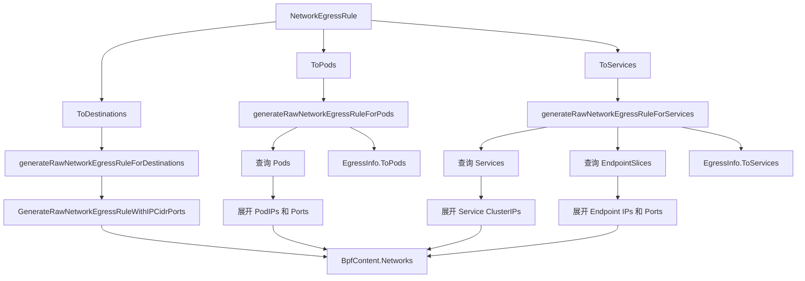

对应的 SVG 图如下：


这张图专门说明四个容易混淆的点：

1. `ToDestinations` 只会生成 `Networks`，不会产生 `EgressInfo`。
2. `ToPods` 会先查 Pod，再把 Pod IP 展开成 `Networks`，同时把原始逻辑目标记录到 `EgressInfo.ToPods`。
3. `ToServices` 会同时查 `Service` 和 `EndpointSlice`，前者提供 ClusterIP，后者提供后端 endpoint 地址和端口；两部分都会进入 `Networks`。
4. `EgressInfo` 保留的是“逻辑目标集合”，而 `Networks` 保存的是“真正送进 BPF map 的具体地址和端口集合”。

如果从运维角度理解，这种双输出设计的意义是：

1. `Networks` 解决当前这一版 profile 如何在内核里执行。
2. `EgressInfo` 解决目标 Pod / Service 变化后，controller 如何知道应该重新刷新哪些 BPF egress 规则。

对应源码：

1. egress 总入口：[../../internal/profile/bpf/custom.go#L572-L618](../../internal/profile/bpf/custom.go#L572-L618)
2. destination 展开：[../../internal/profile/bpf/custom.go#L402-L422](../../internal/profile/bpf/custom.go#L402-L422)
3. Pod 展开：[../../internal/profile/bpf/custom.go#L424-L466](../../internal/profile/bpf/custom.go#L424-L466)
4. Service 与 EndpointSlice 展开：[../../internal/profile/bpf/custom.go#L468-L570](../../internal/profile/bpf/custom.go#L468-L570)
5. 具体 network rule 构造：[../../internal/profile/bpf/custom.go#L327-L400](../../internal/profile/bpf/custom.go#L327-L400)

#### 6.6.2 controller 何时会因为 EgressInfo 变化而刷新 ArmorProfile

从实现上看，`EgressInfo` 的真正用途不是“展示给用户看”，而是给 controller 和 `ipwatcher` 建一条后续刷新链路。

整体逻辑可以概括成四步：

1. `GenerateProfile()` 生成 BPF egress 规则时，同时返回 `EgressInfo`。
2. policy controller 在创建或更新策略时，把 `EgressInfo` 缓存到 `egressCache`。
3. `IPWatcher` 监听 Pod / Service / EndpointSlice 变化，拿事件去匹配 `egressCache` 里的逻辑目标。
4. 一旦匹配成功，就调用 `updateArmorProfile()`，直接给现有 `ArmorProfile.Spec.Profile.Bpf.Networks` 增删 IP/端口对应规则。

对应刷新链路图如下：

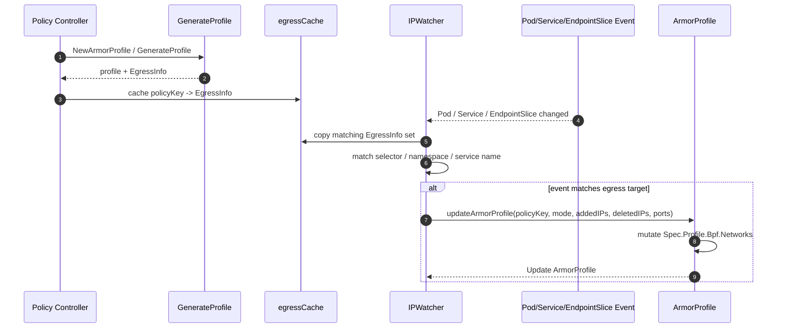

对应的 SVG 图如下：

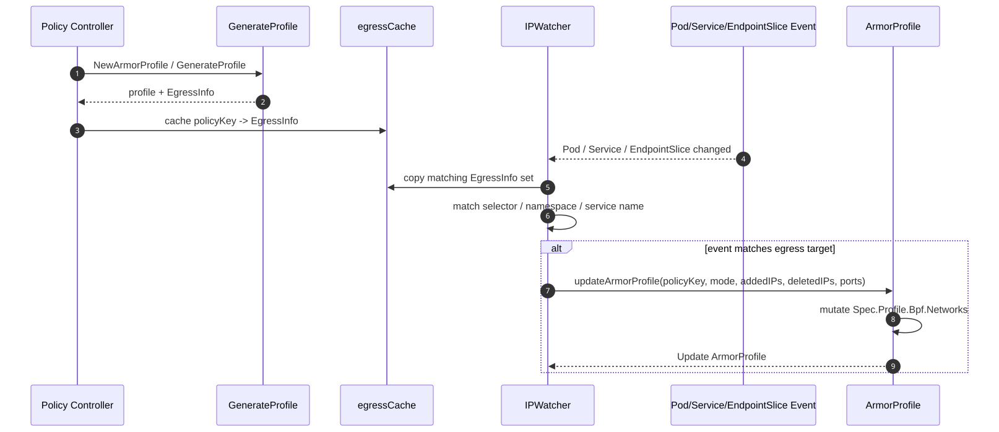

这张图最关键的点有三个：

1. 刷新并不是重新回到最初的策略对象重新执行整套 controller reconcile。
2. `IPWatcher` 直接基于缓存的逻辑目标，局部修改现有 `ArmorProfile.Spec.Profile.Bpf.Networks`。
3. 所以 `EgressInfo` 的作用，本质上是把“逻辑目标”从首次编译阶段延续到后续增量刷新阶段。

如果再说得更精确一点：

1. 策略创建/更新时，controller 负责“首次全量编译”。
2. 目标 Pod/Service/EndpointSlice 变化时，`IPWatcher` 负责“增量修补网络规则”。

对应源码：

1. namespace policy 创建时写入 egressCache：[../../internal/policy/policy_controller.go#L212-L257](../../internal/policy/policy_controller.go#L212-L257)
2. namespace policy 更新时更新 egressCache：[../../internal/policy/policy_controller.go#L327-L366](../../internal/policy/policy_controller.go#L327-L366)
3. cluster policy 创建与更新时维护 egressCache：[../../internal/policy/clusterpolicy_controller.go#L207-L252](../../internal/policy/clusterpolicy_controller.go#L207-L252) 和 [../../internal/policy/clusterpolicy_controller.go#L322-L361](../../internal/policy/clusterpolicy_controller.go#L322-L361)
4. IPWatcher 监听和派发事件：[../../internal/ipwatcher/ipwatcher.go#L124-L199](../../internal/ipwatcher/ipwatcher.go#L124-L199)
5. IPWatcher 匹配并触发刷新：[../../internal/ipwatcher/sync.go#L35-L93](../../internal/ipwatcher/sync.go#L35-L93) 和 [../../internal/ipwatcher/sync.go#L95-L264](../../internal/ipwatcher/sync.go#L95-L264)

### 6.7 BPF 的限制与取舍

BPF 子包里能看到几个明确限制：

1. DefenseInDepthMode 当前不支持 BPF。
2. 一些硬化规则仍然是 TODO，例如 userns_create、部分 bpf hook、setsockopt 特定场景。
3. mount 相关 raw rule 在非 privileged 场景下不会处理。

这反映出 BPF enforcer 的实现仍然受内核 hook 点能力和当前项目演进阶段约束。

## 7. Seccomp 子包分析

### 7.1 设计风格

Seccomp 子包的核心思想是：把规则收敛成 LinuxSeccomp JSON。

它比 AppArmor 更结构化，比 BPF 更轻量。主要工作是：

1. 选择 DefaultAction。
2. 维护 syscall -> LinuxSyscall 的映射。
3. 合并 built-in 和 raw syscall 规则。
4. 最终序列化为 JSON 字符串。

### 7.2 基础 profile

1. GenerateAlwaysAllowProfile：DefaultAction=Allow。
2. GenerateBehaviorModelingProfile：DefaultAction=Log，并加入一组 open/read/write/close 相关默认 syscall。
3. GenerateProfileWithBehaviorModel：把行为模型中的 syscall 列表转成 allow 列表，默认动作为 Errno。

这里的默认 syscall 设计很值得注意。建模场景下先保留一组基础文件 IO syscall，说明作者不希望建模期因过于激进的 log/deny 影响基本运行。

对应源码：

1. GenerateAlwaysAllowProfile：[../../internal/profile/seccomp/seccomp.go#L43-L50](../../internal/profile/seccomp/seccomp.go#L43-L50)
2. GenerateBehaviorModelingProfile：[../../internal/profile/seccomp/seccomp.go#L52-L60](../../internal/profile/seccomp/seccomp.go#L52-L60)
3. GenerateProfileWithBehaviorModel：[../../internal/profile/seccomp/seccomp.go#L62-L82](../../internal/profile/seccomp/seccomp.go#L62-L82)

Seccomp 的“模板”就是最终序列化出来的 JSON。比起 AppArmor，它没有明显的文本骨架；比起 BPF，它也不需要额外的内部结构对象嵌套到 ArmorProfile 里。

AlwaysAllow 的样子最简单：

```json
{
        "defaultAction": "SCMP_ACT_ALLOW"
}
```

BehaviorModeling 的样子大致如下：

```json
{
        "defaultAction": "SCMP_ACT_LOG",
        "syscalls": [
                {
                        "action": "SCMP_ACT_ALLOW",
                        "names": ["open", "openat", "openat2", "close", "read", "write"]
                }
        ]
}
```

如果是基于行为模型生成的“只允许观测到的 syscall”版本，通常会更像这样：

```json
{
        "defaultAction": "SCMP_ACT_ERRNO",
        "syscalls": [
                {
                        "action": "SCMP_ACT_ALLOW",
                        "names": ["open", "openat", "openat2", "close", "read", "write"]
                },
                {
                        "action": "SCMP_ACT_ALLOW",
                        "names": ["execve", "futex", "epoll_wait"]
                }
        ]
}
```

如果是 EnhanceProtect 下的 syscall 约束，生成结果通常会包含带参数过滤的 syscall 项，例如：

```json
{
        "defaultAction": "SCMP_ACT_ALLOW",
        "syscalls": [
                {
                        "names": ["unshare"],
                        "action": "SCMP_ACT_ERRNO",
                        "args": [
                                {
                                        "index": 0,
                                        "value": 268435456,
                                        "valueTwo": 268435456,
                                        "op": "SCMP_CMP_MASKED_EQ"
                                }
                        ]
                }
        ]
}
```

这类 JSON 例子能直接帮助理解 seccomp 子包在做什么：它不是把规则拼成文字说明，而是把高层内置规则翻译成 OCI seccomp 规范里的 DefaultAction、Syscalls、Args。

### 7.3 EnhanceProtect 的处理

GenerateEnhanceProtectProfile 采用 map 聚合 built-in syscall 规则：

1. 先根据 AllowViolations 和 AuditViolations 选择 action。
2. 把 Hardening、VulMitigation、AttackProtection 映射成 syscall 规则。
3. 再合并 SyscallRawRules。
4. 最后把 map 中所有 syscall 写回 profile。

action 选择规则是：

1. AllowViolations=true 且 AuditViolations=true 时，使用 Log。
2. 其他情况使用 Errno。

可以看出 Seccomp 在这里没有像 AppArmor/BPF 那样显式区分 audit 与 deny 位，而是压缩成 seccomp action 语义。

对应源码：[../../internal/profile/seccomp/seccomp.go#L471-L520](../../internal/profile/seccomp/seccomp.go#L471-L520)

### 7.4 Raw rule 合并策略

seccomp.go 中的 generateRawRules 和 mergeSyscallArgs 是这个子包的关键。

策略如下：

1. 如果 raw rule 与已有 built-in syscall 名称、action、errnoRet 都兼容，则把 raw arg 合并进 built-in syscall。
2. 如果不兼容，则作为新的 syscall rule 追加到 profile。

这样做的好处：

1. 避免 built-in 规则和 raw 规则重复膨胀。
2. 在兼容场景下保留更紧凑的 profile。
3. 又不会因为强行合并而破坏用户自定义语义。

对应源码：[../../internal/profile/seccomp/seccomp.go#L451-L469](../../internal/profile/seccomp/seccomp.go#L451-L469)

### 7.5 DefenseInDepth 的 Seccomp 处理

DefenseInDepth 的 Seccomp 实现很直接：

1. 先反序列化已有 profile JSON。
2. 根据 AllowViolations 把 DefaultAction 设为 Log 或 Errno。
3. 直接追加 defenseInDepth.Seccomp.SyscallRawRules。
4. 再序列化回 JSON。

它不像 AppArmor 那样要做文本插桩，也不像 BPF 那样要处理 cluster 资源展开，因此实现最简单。

对应源码：[../../internal/profile/seccomp/seccomp.go#L522-L539](../../internal/profile/seccomp/seccomp.go#L522-L539)

## 8. 行为建模链路如何与 profile 目录配合

internal/profile 与行为建模相关的逻辑有两条：

### 8.1 建模阶段 profile 生成

当 mode=BehaviorModeling 时：

1. 新建 ArmorProfile 时启用 BehaviorModeling 标记和 duration。
2. profile 内容通常是 complain 风格的观察模板。
3. status manager 会在 duration 到期后再次调用 GenerateProfile，并传入 complete=true。

也就是说，建模状态切换不是由 internal/profile 自己驱动，而是外部状态机驱动，internal/profile 只是根据 complete 开关生成不同 profile。

对应源码：

1. BehaviorModeling 分支：[../../internal/profile/profile.go#L160-L198](../../internal/profile/profile.go#L160-L198)
2. 建模结束后的重新生成：[../../internal/status/apis/v1/manager.go#L643-L657](../../internal/status/apis/v1/manager.go#L643-L657)

### 8.2 建模结果复用

当 mode=DefenseInDepth 且 profileType=BehaviorModel 时：

1. profile.go 会读取 ArmorProfileModel。
2. 从中提取 AppArmor 或 Seccomp profile。
3. 再交给对应子包做二次加工。

因此，BehaviorModelingMode 负责“产出模型”，DefenseInDepthMode 负责“消费模型”。这两个 mode 在语义上是连续的，而不是独立功能。

对应源码：[../../internal/profile/profile.go#L200-L278](../../internal/profile/profile.go#L200-L278)

## 9. 输入策略 YAML 到最终结果的对照例子

这一节把前面分散讲过的内容收拢成三组“输入 -> 生成 -> 注入”对照例子。

重点不是覆盖所有字段，而是回答三个更实际的问题：

1. 策略 YAML 里到底写什么。
2. internal/profile 产出的 ArmorProfile 大致长什么样。
3. 最终工作负载会被 webhook 或 controller 改成什么样。

### 9.1 AppArmor：文本模板 + Localhost profile 引用

下面这个例子接近仓库里的 AppArmor EnhanceProtect 示例，只保留最关键字段：

```yaml
apiVersion: crd.varmor.org/v1beta1
kind: VarmorPolicy
metadata:
        name: demo-apparmor
        namespace: demo
spec:
        updateExistingWorkloads: true
        target:
                kind: Deployment
                containers:
                - web
                selector:
                        matchLabels:
                                app: demo
        policy:
                enforcer: AppArmor
                mode: EnhanceProtect
                enhanceProtect:
                        auditViolations: true
                        hardeningRules:
                        - disable-cap-net-raw
                        attackProtectionRules:
                        - rules:
                                - disable-write-etc
                                targets:
                                - "/bin/bash"
                        appArmorRawRules:
                        - rules: |
                                        audit deny /etc/shadow r,
```

这段 YAML 进入 [../../internal/profile/profile.go#L128-L158](../../internal/profile/profile.go#L128-L158) 的 EnhanceProtect 分支后，会调用 [../../internal/profile/apparmor/apparmor.go#L47-L121](../../internal/profile/apparmor/apparmor.go#L47-L121)，最终把内置规则和 raw rules 拼成 AppArmor 文本。

生成后的 ArmorProfile 里，关键字段大致如下：

```yaml
spec:
        profile:
                name: varmor-demo-demo-apparmor
                enforcer: AppArmor
                mode: enforce
                appArmor: |
                        profile varmor-demo-demo-apparmor flags=(attach_disconnected,mediate_deleted) {
                                                        #include <abstractions/base>
                                                        ...
                                                        audit deny /etc/shadow r,
                                                        /bin/bash cx -> child-0,
                        }
```

后续注入到工作负载时，Kubernetes v1.30 及以上会同时写注解和 SecurityContext：

```yaml
metadata:
        annotations:
                container.apparmor.security.beta.varmor.org/web: localhost/varmor-demo-demo-apparmor
spec:
        containers:
        - name: web
                securityContext:
                        appArmorProfile:
                                type: Localhost
                                localhostProfile: varmor-demo-demo-apparmor
```

对应代码：

1. 生成 AppArmor 文本：[../../internal/profile/apparmor/apparmor.go#L47-L121](../../internal/profile/apparmor/apparmor.go#L47-L121)
2. admission 注入 AppArmor：[../../internal/webhooks/mutation.go#L431-L465](../../internal/webhooks/mutation.go#L431-L465)
3. 直接修改现有 workload 模板：[../../internal/policy/update.go#L117-L142](../../internal/policy/update.go#L117-L142)

### 9.2 BPF：结构化规则对象 + 容器启动后按挂载命名空间生效

下面这个例子接近仓库里的 BPF EnhanceProtect 示例：

```yaml
apiVersion: crd.varmor.org/v1beta1
kind: VarmorPolicy
metadata:
        name: demo-bpf
        namespace: demo
spec:
        updateExistingWorkloads: true
        target:
                kind: Deployment
                containers:
                - web
                selector:
                        matchLabels:
                                app: demo
        policy:
                enforcer: BPF
                mode: EnhanceProtect
                enhanceProtect:
                        auditViolations: true
                        hardeningRules:
                        - disallow-access-procfs-root
                        bpfRawRules:
                                processes:
                                - qualifiers: [audit, deny]
                                        pattern: "**ping"
                                        permissions: [exec]
                                network:
                                        egress:
                                                toDestinations:
                                                - qualifiers: [audit]
                                                        ip: 10.12.34.56
                                                        ports:
                                                        - port: 443
                                                toServices:
                                                - qualifiers: [audit]
                                                        serviceSelector:
                                                                matchLabels:
                                                                        app: kube-dns
```

这段 YAML 进入 [../../internal/profile/profile.go#L128-L158](../../internal/profile/profile.go#L128-L158) 后，会调用 [../../internal/profile/bpf/bpf.go#L715-L799](../../internal/profile/bpf/bpf.go#L715-L799)。

和 AppArmor 不同，BPF 产物不是文本，而是结构化的 BpfContent。生成结果大致如下：

```yaml
spec:
        profile:
                name: varmor-demo-demo-bpf
                enforcer: BPF
                mode: enforce
                bpf:
                        files:
                        - permissions: 1
                                pattern:
                                        flags: 5
                                        prefix: /proc/sysrq-trigger
                        processes:
                        - permissions: 8
                                pattern:
                                        flags: 3
                                        prefix: ping
                        networks:
                        - flags: 40
                                address:
                                        ip: 10.12.34.56
                                        port: 443
```

但 BPF 的“注入”方式与 AppArmor、Seccomp 都不同。工作负载侧通常只会被打上注解：

```yaml
metadata:
        annotations:
                container.bpf.security.beta.varmor.org/web: localhost/varmor-demo-demo-bpf
```

如果开启了 BPF exclusive mode，webhook 还会显式把对应容器的 AppArmor 设成 unconfined，避免两者叠加：

```yaml
metadata:
        annotations:
                container.bpf.security.beta.varmor.org/web: localhost/varmor-demo-demo-bpf
                container.apparmor.security.beta.kubernetes.io/web: unconfined
```

这里有一个关键差异：

1. 这一步只是把“该容器应使用哪个 BPF profile”写进 Pod 注解。
2. 真正把规则写进内核 map 并生效，是节点侧 BpfEnforcer 在容器启动事件到来时完成的。

对应代码：

1. 生成 BpfContent：[../../internal/profile/bpf/bpf.go#L715-L799](../../internal/profile/bpf/bpf.go#L715-L799)
2. egress 展开 Pod/Service：[../../internal/profile/bpf/custom.go#L424-L570](../../internal/profile/bpf/custom.go#L424-L570)
3. admission 注入 BPF 注解：[../../internal/webhooks/mutation.go#L393-L429](../../internal/webhooks/mutation.go#L393-L429)
4. 直接修改现有 workload 模板：[../../internal/policy/update.go#L104-L115](../../internal/policy/update.go#L104-L115)
5. 容器启动后按注解取 profile：[../../pkg/lsm/bpfenforcer/enforcer.go#L322-L375](../../pkg/lsm/bpfenforcer/enforcer.go#L322-L375)

### 9.3 Seccomp：JSON profile + seccompProfile.Localhost 引用

下面这个例子接近仓库里的 Seccomp EnhanceProtect 示例，并额外加上一条 syscallRawRules，方便看最终 JSON：

```yaml
apiVersion: crd.varmor.org/v1beta1
kind: VarmorPolicy
metadata:
        name: demo-seccomp
        namespace: demo
spec:
        updateExistingWorkloads: true
        target:
                kind: Deployment
                containers:
                - web
                selector:
                        matchLabels:
                                app: demo
        policy:
                enforcer: Seccomp
                mode: EnhanceProtect
                enhanceProtect:
                        hardeningRules:
                        - disallow-create-user-ns
                        syscallRawRules:
                        - names: ["unshare"]
                                action: SCMP_ACT_ERRNO
                                args:
                                - index: 0
                                        value: 268435456
                                        valueTwo: 268435456
                                        op: SCMP_CMP_MASKED_EQ
```

生成阶段会进入 [../../internal/profile/seccomp/seccomp.go#L471-L520](../../internal/profile/seccomp/seccomp.go#L471-L520)，最终产出 JSON 形式的 seccomp profile，例如：

```yaml
spec:
        profile:
                name: varmor-demo-demo-seccomp
                enforcer: Seccomp
                mode: enforce
                seccomp: |
                        {
                                "defaultAction": "SCMP_ACT_ALLOW",
                                "syscalls": [
                                        {
                                                "names": ["unshare"],
                                                "action": "SCMP_ACT_ERRNO",
                                                "args": [
                                                        {
                                                                "index": 0,
                                                                "value": 268435456,
                                                                "valueTwo": 268435456,
                                                                "op": "SCMP_CMP_MASKED_EQ"
                                                        }
                                                ]
                                        }
                                ]
                        }
```

注入到 workload 时，除了注解，还会直接改容器的 seccompProfile：

```yaml
metadata:
        annotations:
                container.seccomp.security.beta.varmor.org/web: localhost/varmor-demo-demo-seccomp
spec:
        containers:
        - name: web
                securityContext:
                        seccompProfile:
                                type: Localhost
                                localhostProfile: varmor-demo-demo-seccomp
```

如果策略模式是 RuntimeDefaultMode，则 webhook 不会写 Localhost，而是直接把 SecurityContext 改成 RuntimeDefault。这也是前文提到的 seccomp 特殊兼容逻辑。

对应代码：

1. 生成 Seccomp JSON：[../../internal/profile/seccomp/seccomp.go#L471-L520](../../internal/profile/seccomp/seccomp.go#L471-L520)
2. admission 注入 Seccomp：[../../internal/webhooks/mutation.go#L468-L497](../../internal/webhooks/mutation.go#L468-L497)
3. 直接修改现有 workload 模板：[../../internal/policy/update.go#L152-L169](../../internal/policy/update.go#L152-L169)

## 10. BPF 和 Seccomp 是怎么编写、写入、再注入的

如果把 internal/profile 只看成“生成器”，会漏掉最关键的后半段：这些 profile 最终是怎么落到节点和容器上的。

对 BPF 和 Seccomp 来说，这条链路都可以分成四步：

1. internal/profile 生成 ArmorProfile.Spec.Profile。
2. agent 监听 ArmorProfile，把 profile 落到节点侧。
3. webhook 或 controller 把引用关系注入 workload / Pod。
4. 容器启动后，由 kubelet / runtime / BPF enforcer 让规则真正生效。

### 10.1 BPF：不是写文件，而是写缓存与内核 map

#### 10.1.1 编写阶段

BPF profile 的“编写”发生在 internal/profile/bpf 子包里，结果是一个结构化的 [../../apis/varmor/v1beta1/armorprofile_types.go#L73-L92](../../apis/varmor/v1beta1/armorprofile_types.go#L73-L92) BpfContent，而不是文本文件。

入口主要是：

1. RuntimeDefault：[../../internal/profile/bpf/bpf.go#L30-L85](../../internal/profile/bpf/bpf.go#L30-L85)
2. EnhanceProtect：[../../internal/profile/bpf/bpf.go#L715-L799](../../internal/profile/bpf/bpf.go#L715-L799)
3. 原始规则编码：[../../internal/profile/bpf/rule.go#L66-L328](../../internal/profile/bpf/rule.go#L66-L328)

#### 10.1.2 节点写入阶段

ArmorProfile 下发到节点后，agent 在 [../../internal/agent/agent.go#L492-L504](../../internal/agent/agent.go#L492-L504) 调用 [../../pkg/lsm/bpfenforcer/enforcer.go#L498-L531](../../pkg/lsm/bpfenforcer/enforcer.go#L498-L531)。

这里做的事情是：

1. 先把 BPF profile 保存到 bpfProfileCache。
2. 如果已有容器在使用这个 profile，就立刻重刷一次。
3. 真正落到内核时，调用 [../../pkg/lsm/bpfenforcer/profile.go#L317-L356](../../pkg/lsm/bpfenforcer/profile.go#L317-L356) 把 mode、file、process、network、ptrace、mount 规则分别写入 eBPF map。

所以 BPF 没有“写本地 profile 文件”这一步，只有：

1. 用户态缓存。
2. eBPF map / LSM hook 状态。

#### 10.1.3 注入阶段

新建 workload / Pod 时，webhook 会在 [../../internal/webhooks/mutation.go#L152-L156](../../internal/webhooks/mutation.go#L152-L156) 和 [../../internal/webhooks/mutation.go#L393-L429](../../internal/webhooks/mutation.go#L393-L429) 给目标容器打上：

1. `container.bpf.security.beta.varmor.org/<container>=localhost/<profile>`
2. 如果开启 bpfExclusiveMode，则额外把 AppArmor 置为 unconfined。

如果策略要求更新现有 workload，则 controller 会在 [../../internal/policy/update.go#L104-L115](../../internal/policy/update.go#L104-L115) 直接改 Pod 模板，效果与 admission patch 等价。

#### 10.1.4 生效阶段

真正让 BPF 规则作用到容器上的，是节点侧运行时事件链路：

1. RuntimeMonitor 把容器启动事件发给 BpfEnforcer。
2. BpfEnforcer 在 [../../pkg/lsm/bpfenforcer/enforcer.go#L322-L375](../../pkg/lsm/bpfenforcer/enforcer.go#L322-L375) 读取 Pod 注解里的 `localhost/<profile>`。
3. 它根据容器 PID 和挂载命名空间生成 enforceID。
4. 再把 profile 应用到对应挂载命名空间。

这也是为什么 BPF 注入只需要注解，不需要像 Seccomp 那样改 securityContext：

1. BPF enforcer 自己消费这条注解。
2. 然后在节点侧按容器生命周期完成绑定。

#### 10.1.5 vArmor 使用 BPF 时，attach / apply / 生效分别发生在什么时候

这里最容易混淆的是三个不同层次的动作：

1. attach：把 eBPF LSM 程序挂到内核 LSM hook 上。
2. apply：把某个 ArmorProfile 对应的 BPF 规则写入缓存和 eBPF map。
3. 生效：某个具体容器启动后，规则真正绑定到它所在的挂载命名空间。

对应时序如下：

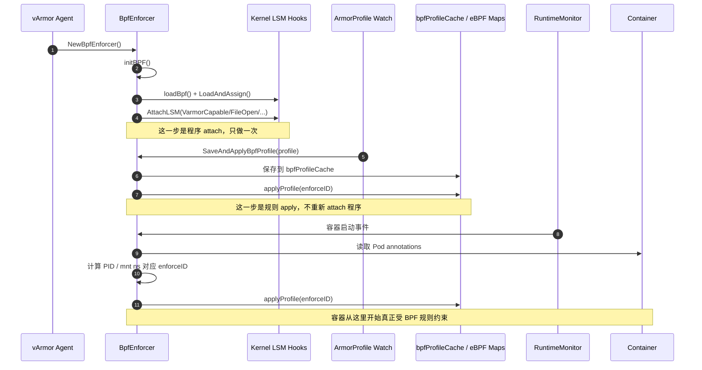

对应的 SVG 图如下：

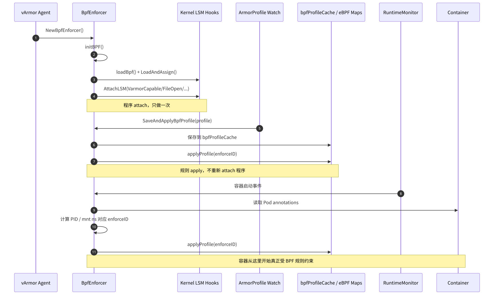

这张图想表达的核心结论是：

1. BPF LSM 程序的 attach 发生在 agent 启动期，不是策略创建期。
2. ArmorProfile 创建或更新时，主要发生的是 profile 数据保存和 map 刷写。
3. 对一个新容器来说，真正“开始受保护”的时间点，是容器启动事件到来后，BpfEnforcer 根据注解把 profile 绑定到该容器挂载命名空间的那一刻。

所以如果把问题说得更精确一点，vArmor 使用 BPF 时有三层时间点：

1. 程序 attach：agent 初始化 BPF enforcer 时。
2. 规则下发：ArmorProfile 创建或更新时。
3. 容器生效：容器启动并被 runtime monitor 捕获时。

对应源码：

1. agent 初始化 BPF enforcer：[../../internal/agent/agent.go#L222-L241](../../internal/agent/agent.go#L222-L241)
2. BPF 程序 attach 到 LSM hook：[../../pkg/lsm/bpfenforcer/enforcer.go#L71-L187](../../pkg/lsm/bpfenforcer/enforcer.go#L71-L187)
3. 保存并重刷 BPF profile：[../../pkg/lsm/bpfenforcer/enforcer.go#L498-L531](../../pkg/lsm/bpfenforcer/enforcer.go#L498-L531)
4. 容器启动事件触发 profile 绑定：[../../pkg/lsm/bpfenforcer/enforcer.go#L322-L375](../../pkg/lsm/bpfenforcer/enforcer.go#L322-L375)
5. 把规则写入各类 eBPF map：[../../pkg/lsm/bpfenforcer/profile.go#L317-L356](../../pkg/lsm/bpfenforcer/profile.go#L317-L356)

#### 10.1.6 AttachLSM 具体挂了哪些 hook

如果继续下钻到内核 hook 级别，可以看到 vArmor 在 initBPF 里 attach 的不是一个总入口，而是一组职责拆开的 eBPF LSM 程序。

大致可以按限制类别理解成下面六组：

1. capability：VarmorCapable
2. 文件路径访问：VarmorFileOpen、VarmorPathSymlink、VarmorPathLink、VarmorPathRename
3. 进程执行：VarmorBprmCheckSecurity
4. 网络：VarmorSocketCreate、VarmorSocketConnect
5. ptrace：VarmorPtraceAccessCheck
6. mount：VarmorMount、VarmorMoveMount、VarmorUmount

对应细化图如下：

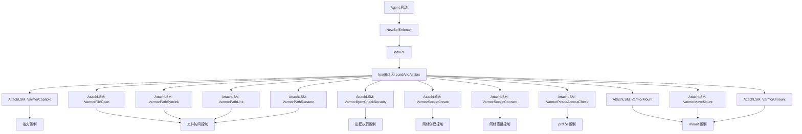

对应的 SVG 图如下：


这张图说明了三件事：

1. attach 阶段是一组程序分别挂到不同 hook，不是一个大而全的单点 attach。
2. profile 更新阶段通常只会重刷 map 中的数据，而不会整体替换这一组已 attach 的程序。
3. 这也是为什么 vArmor 可以把“程序生命周期”和“规则生命周期”拆开处理。

对应源码：

1. initBPF 主流程：[../../pkg/lsm/bpfenforcer/enforcer.go#L82-L140](../../pkg/lsm/bpfenforcer/enforcer.go#L82-L140)
2. capability 到 ptrace 的 attach：[../../pkg/lsm/bpfenforcer/enforcer.go#L141-L223](../../pkg/lsm/bpfenforcer/enforcer.go#L141-L223)
3. mount 系列 attach：[../../pkg/lsm/bpfenforcer/enforcer.go#L224-L257](../../pkg/lsm/bpfenforcer/enforcer.go#L224-L257)

#### 10.1.7 hook 到 map 字段的对应关系

上面那张图解释的是“哪些程序被 attach 到哪些 hook”。再往下一层，需要回答的是：这些 hook 在运行时到底读哪一类规则数据。

从 [../../pkg/lsm/bpfenforcer/profile.go](../../pkg/lsm/bpfenforcer/profile.go) 可以看到，applyProfile 会把 BpfContent 拆成多份，分别写进不同 map：

1. profile mode -> `V_profileMode`
2. capability rules -> `V_capable`
3. file rules -> `V_fileOuter`
4. process rules -> `V_bprmOuter`
5. network rules -> `V_netOuter`
6. ptrace rules -> `V_ptrace`
7. mount rules -> `V_mountOuter`

如果把它和上面的 hook 图对照起来，可以得到下面这张“hook -> map -> BpfContent 字段”的关系图：

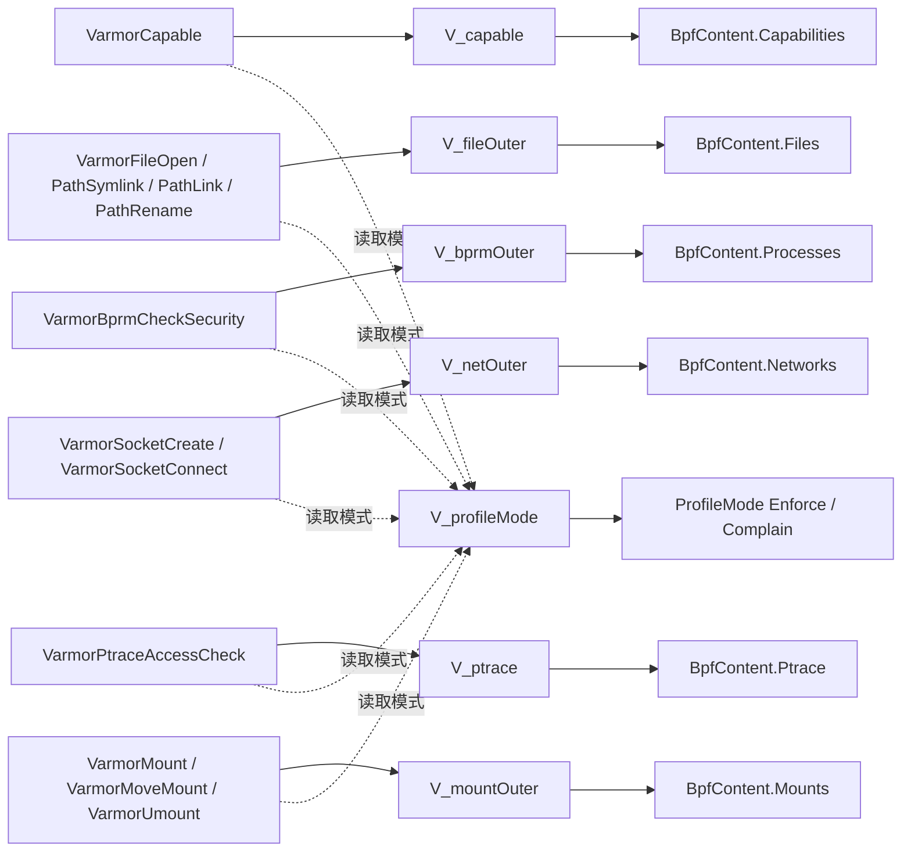

对应的 SVG 图如下：


这张图想说明的是：

1. attach 到 hook 的，是固定的一组 eBPF 程序。
2. 策略变化时，真正变化的是这些程序读取的 map 内容。
3. 所以 profile.go 的职责，本质上就是把高层 BpfContent 拆解成一组内核可消费的 map 数据结构。

对应源码：

1. 写 profile mode：[../../pkg/lsm/bpfenforcer/profile.go#L38-L40](../../pkg/lsm/bpfenforcer/profile.go#L38-L40) 和 [../../pkg/lsm/bpfenforcer/profile.go#L277-L290](../../pkg/lsm/bpfenforcer/profile.go#L277-L290)
2. 写 capability rules：[../../pkg/lsm/bpfenforcer/profile.go#L42-L59](../../pkg/lsm/bpfenforcer/profile.go#L42-L59)
3. 写 file rules：[../../pkg/lsm/bpfenforcer/profile.go#L61-L107](../../pkg/lsm/bpfenforcer/profile.go#L61-L107)
4. 写 process rules：[../../pkg/lsm/bpfenforcer/profile.go#L109-L155](../../pkg/lsm/bpfenforcer/profile.go#L109-L155)
5. 写 network rules：[../../pkg/lsm/bpfenforcer/profile.go#L157-L222](../../pkg/lsm/bpfenforcer/profile.go#L157-L222)
6. 写 ptrace rules：[../../pkg/lsm/bpfenforcer/profile.go#L224-L241](../../pkg/lsm/bpfenforcer/profile.go#L224-L241)
7. 写 mount rules：[../../pkg/lsm/bpfenforcer/profile.go#L243-L275](../../pkg/lsm/bpfenforcer/profile.go#L243-L275)

#### 10.1.8 initBPF 与 applyProfile 的双阶段对照

如果把整个 BPF enforcer 的生命周期分成两个阶段来看，会更容易理解 vArmor 的实现边界：

1. 第一阶段是 `initBPF`，目标是把“程序运行底座”准备好。
2. 第二阶段是 `applyProfile`，目标是把“某个策略实例的数据”写进去。

对应对照图如下：

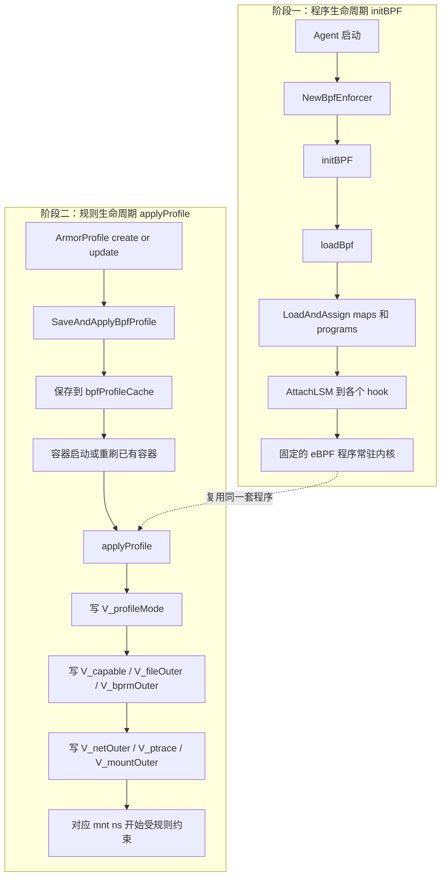

对应的 SVG 图如下：


这张图对应的核心理解是：

1. `initBPF` 解决的是“程序有没有被装进内核并挂到 hook 上”。
2. `applyProfile` 解决的是“哪个挂载命名空间应该看到什么规则”。
3. 前者更接近平台初始化，后者更接近策略实例化。

也正因为这两层被拆开，vArmor 才不需要在每次策略变更时重新执行整套 AttachLSM。

对应源码：

1. BPF enforcer 初始化入口：[../../internal/agent/agent.go#L222-L241](../../internal/agent/agent.go#L222-L241)
2. initBPF 主流程：[../../pkg/lsm/bpfenforcer/enforcer.go#L82-L257](../../pkg/lsm/bpfenforcer/enforcer.go#L82-L257)
3. SaveAndApplyBpfProfile：[../../pkg/lsm/bpfenforcer/enforcer.go#L498-L531](../../pkg/lsm/bpfenforcer/enforcer.go#L498-L531)
4. applyProfile：[../../pkg/lsm/bpfenforcer/profile.go#L277-L315](../../pkg/lsm/bpfenforcer/profile.go#L277-L315)

#### 10.1.9 BpfContent 字段是怎么一步步生成出来的

前面几张图解释的是运行时 attach、map 写入和生命周期拆分。再往前追一层，还要回答一个问题：`applyProfile` 里消费的 `BpfContent`，到底是从哪里来的。

如果把生成链路压缩一下，BPF profile 的来源可以概括成四类输入：

1. RuntimeDefault 基线规则
2. EnhanceProtect 的 built-in rules
3. EnhanceProtect 的 raw rules
4. 目标是 Pod / Service 时额外展开出来的 egress 目标

它们最后都会汇总到同一个 `BpfContent`，再被 `applyProfile` 分拆写进不同 map。

对应关系图如下：

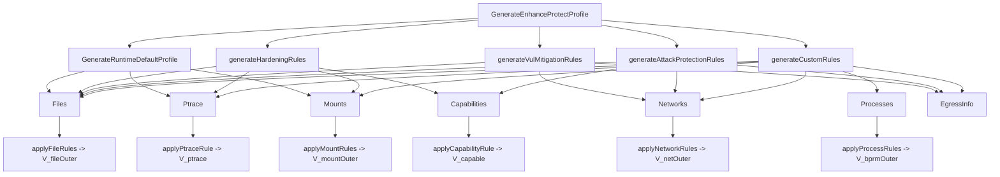

对应的 SVG 图如下：


这张图要表达的重点是：

1. `BpfContent` 不是一次性构造完成的，而是在多个生成函数里逐步累加出来的。
2. built-in rules 和 raw rules 并不是两条完全独立的链路，它们都会汇总到同一个 `BpfContent` 对象。
3. `EgressInfo` 虽然不是内核 map 的直接输入，但它和 `Networks` 一样，都是 BPF egress 规则生成时的副产物，用来支撑后续 controller / workload 注入逻辑。

如果按字段逐项看：

1. `Capabilities` 主要来自 `setBpfCapabilityRule()`。
2. `Ptrace` 主要来自 `setBpfPtraceRule()` 或 raw ptrace rule。
3. `Files`、`Processes`、`Networks`、`Mounts` 主要来自 built-in rule 生成器和 raw rule 生成器里对 slice 的 append。
4. `Networks` 在 egress 场景下还会额外依赖 Pod / Service 展开。

对应源码：

1. EnhanceProtect 汇总入口：[../../internal/profile/bpf/bpf.go#L715-L799](../../internal/profile/bpf/bpf.go#L715-L799)
2. RuntimeDefault 基线：[../../internal/profile/bpf/bpf.go#L30-L82](../../internal/profile/bpf/bpf.go#L30-L82)
3. Hardening 规则生成：[../../internal/profile/bpf/bpf.go#L97-L366](../../internal/profile/bpf/bpf.go#L97-L366)
4. Vulnerability Mitigation 规则生成：[../../internal/profile/bpf/bpf.go#L368-L438](../../internal/profile/bpf/bpf.go#L368-L438)
5. Attack Protection 规则生成：[../../internal/profile/bpf/bpf.go#L440-L713](../../internal/profile/bpf/bpf.go#L440-L713)
6. Custom raw rules 汇总入口：[../../internal/profile/bpf/custom.go#L33-L90](../../internal/profile/bpf/custom.go#L33-L90)
7. raw file / process / network / mount 规则生成：[../../internal/profile/bpf/custom.go#L109-L218](../../internal/profile/bpf/custom.go#L109-L218) 和 [../../internal/profile/bpf/custom.go#L649-L686](../../internal/profile/bpf/custom.go#L649-L686)
8. Pod / Service egress 展开：[../../internal/profile/bpf/custom.go#L424-L618](../../internal/profile/bpf/custom.go#L424-L618)
9. capability / ptrace 字段设置：[../../internal/profile/bpf/rule.go#L49-L64](../../internal/profile/bpf/rule.go#L49-L64)

### 10.2 Seccomp：先写 JSON 文件，再由 runtime 按 Localhost 引用加载

#### 10.2.1 编写阶段

Seccomp profile 的“编写”发生在 internal/profile/seccomp 子包里，最终产物是 JSON 字符串。

入口主要是：

1. AlwaysAllow：[../../internal/profile/seccomp/seccomp.go#L43-L50](../../internal/profile/seccomp/seccomp.go#L43-L50)
2. BehaviorModeling：[../../internal/profile/seccomp/seccomp.go#L52-L82](../../internal/profile/seccomp/seccomp.go#L52-L82)
3. EnhanceProtect：[../../internal/profile/seccomp/seccomp.go#L471-L520](../../internal/profile/seccomp/seccomp.go#L471-L520)
4. DefenseInDepth：[../../internal/profile/seccomp/seccomp.go#L522-L539](../../internal/profile/seccomp/seccomp.go#L522-L539)

#### 10.2.2 节点写入阶段

ArmorProfile 下发到节点后，agent 在 [../../internal/agent/agent.go#L507-L516](../../internal/agent/agent.go#L507-L516) 调用 [../../pkg/seccomp/seccomp.go#L31-L44](../../pkg/seccomp/seccomp.go#L31-L44)。

这里会：

1. 校验字符串是否是合法 JSON。
2. 在 seccompProfileDir 下创建同名文件。
3. 把 JSON 原样写入该文件。

所以 Seccomp 的节点落地方式与 AppArmor 更像，都是“先生成文本，再落本地文件”；只是文本格式是 OCI seccomp JSON。

#### 10.2.3 注入阶段

新建 workload / Pod 时，webhook 会在 [../../internal/webhooks/mutation.go#L186-L194](../../internal/webhooks/mutation.go#L186-L194) 和 [../../internal/webhooks/mutation.go#L468-L497](../../internal/webhooks/mutation.go#L468-L497)：

1. 写入 `container.seccomp.security.beta.varmor.org/<container>=localhost/<profile>` 注解。
2. 同时把容器 SecurityContext.SeccompProfile 设成：
         - RuntimeDefaultMode：`type: RuntimeDefault`
         - 其他模式：`type: Localhost, localhostProfile: <profile>`

如果策略要求更新现有 workload，则 controller 会在 [../../internal/policy/update.go#L152-L169](../../internal/policy/update.go#L152-L169) 直接修改 Pod 模板。

#### 10.2.4 生效阶段

Seccomp 的最终生效不需要像 BPF 那样再经过 vArmor 的运行时事件处理。

核心原因是：

1. webhook 已经把容器的 seccompProfile 指到了 Localhost profile。
2. kubelet / container runtime 在创建容器时，会去节点本地读取对应 JSON 文件。
3. 因此只要 agent 已经把文件写到 seccompProfileDir，容器启动时就能直接加载。

所以 Seccomp 的控制链路更接近“先落盘，再声明式引用”；而 BPF 更接近“先声明式标记，再事件驱动附着到内核对象”。

### 10.3 不使用 vArmor 时，原生在 OS 里修改 BPF LSM、AppArmor 和 Seccomp 的简单例子

为了更直观地理解 vArmor 帮你做了什么，可以反过来看：如果完全不用 vArmor，而是直接在 Linux OS 上原生配置这三种机制，大致会怎么做。

这里给的都是“最小可理解例子”，目的是说明机制，不是生产级模板。

#### 10.3.1 原生 AppArmor：直接写 profile 文本并加载

AppArmor 是三者里最接近“手工写规则文件”的。

一个最简单的例子，是直接在主机上写一个 profile，禁止某个进程读取 `/etc/shadow`：

```text
#include <tunables/global>

profile demo-native-apparmor flags=(attach_disconnected,mediate_deleted) {
                                #include <abstractions/base>

                                file,
                                deny /etc/shadow r,
}
```

典型步骤是：

1. 把它保存到 `/etc/apparmor.d/demo-native-apparmor`
2. 用 `apparmor_parser -r /etc/apparmor.d/demo-native-apparmor` 加载或更新
3. 用 `aa-exec -p demo-native-apparmor -- <command>` 或让某个服务/程序绑定到这个 profile

这和 vArmor 的差异在于：

1. 你要自己写完整 profile 文本。
2. 你要自己负责 profile 加载、更新、卸载。
3. 你还要自己决定哪个进程或容器去使用这个 profile。

#### 10.3.2 原生 Seccomp：直接写 JSON 并让 runtime 或程序加载

Seccomp 原生方式通常也是“先写规则，再让运行时或进程自己启用”。

一个最简单的 JSON 例子，可以禁止 `unshare`：

```json
{
        "defaultAction": "SCMP_ACT_ALLOW",
        "syscalls": [
                {
                        "names": ["unshare"],
                        "action": "SCMP_ACT_ERRNO"
                }
        ]
}
```

常见使用方式有两类：

1. 容器运行时加载：例如 Docker / containerd / Podman 在创建容器时引用这个 JSON
2. 进程自己加载：例如程序在启动时通过 `libseccomp` 或 `prctl(PR_SET_SECCOMP, ...)` 启用过滤器

如果是容器侧，一个典型命令会像这样：

```bash
docker run --security-opt seccomp=./demo-seccomp.json nginx:latest
```

这和 vArmor 的差异在于：

1. 你要自己维护 JSON 文件。
2. 你要自己把文件分发到目标节点或宿主机。
3. 你要自己修改容器启动参数或程序代码，让它引用这个 seccomp 配置。

#### 10.3.3 原生 BPF LSM：自己写 eBPF C 程序和加载器

BPF LSM 的原生方式和前两者差别最大，因为它不是“写配置文件”，而是“自己写一个 eBPF LSM 程序，再把它加载到内核”。

一个最小可理解的例子，是在 `capable` hook 上拒绝 `CAP_SYS_ADMIN`：

```c
// SPDX-License-Identifier: GPL-2.0
#include "vmlinux.h"
#include <bpf/bpf_helpers.h>

char LICENSE[] SEC("license") = "GPL";

SEC("lsm/capable")
int BPF_PROG(demo_capable, const struct cred *cred, struct user_namespace *ns,
                                                 int cap, unsigned int opts, int ret)
{
                if (cap == 21) {
                                return -1;
                }
                return ret;
}
```

原生 BPF LSM 的典型工作流通常是：

1. 写 C 源文件和头文件
2. 用 `clang -target bpf` 或 `bpf2go` / `libbpf` 编译成 `.o`
3. 自己写用户态 loader，或者用 `bpftool` / `libbpf` / `cilium/ebpf` 加载
4. 把程序 attach 到对应的 LSM hook
5. 如果要做可配置规则，还要自己设计 BPF maps 和用户态写 map 的逻辑

这和 vArmor 的差异最明显：

1. 你不再是在“写规则”，而是在“写内核执行逻辑”。
2. 你要自己处理内核版本、BTF、map 结构、attach 生命周期。
3. 如果要做到类似 vArmor 的能力，还要自己实现规则编码、对象缓存、容器事件监听、命名空间绑定。

#### 10.3.4 三者的原生复杂度对比

如果只看“手工实现”的难度，大致可以这样理解：

1. AppArmor：最像“写策略文件”
2. Seccomp：最像“写 syscall 过滤 JSON”
3. BPF LSM：最像“自己开发一个内核侧策略执行引擎”

也正因为这样，vArmor 对三者的封装深度并不一样：

1. 对 AppArmor，vArmor 主要是在帮你生成文本、分发文本、注入引用。
2. 对 Seccomp，vArmor 主要是在帮你生成 JSON、落盘 JSON、注入 Localhost 引用。
3. 对 BPF LSM，vArmor 不只是帮你生成规则数据，还帮你维护 eBPF 程序、map、attach、容器事件和命名空间级绑定。

所以如果从“脱离工具，直接在 OS 上原生做”这个角度反推，最能看出 vArmor 价值的，其实就是 BPF LSM 这条链路。

## 11. 与 controller 的协作方式

从 controller 调用关系可以看出 internal/profile 的边界：

1. controller 负责校验策略是否合法。
2. internal/profile 负责生成 profile 及 egressInfo。
3. controller 负责创建 ArmorProfile、更新状态、缓存 egress 信息、必要时滚动重启 workload。

这种拆分总体合理，但也存在一个值得注意的点：

1. BPF egress 规则生成需要直接访问 Kubernetes API。
2. DefenseInDepth 需要直接访问 ArmorProfileModel。

这说明 internal/profile 并不是纯函数式模块，而是“带外部依赖的编排器”。测试和复用时需要把这一点考虑进去。

对应源码：

1. controller 创建路径：[../../internal/policy/policy_controller.go#L212-L257](../../internal/policy/policy_controller.go#L212-L257)
2. controller 更新路径：[../../internal/policy/policy_controller.go#L304-L340](../../internal/policy/policy_controller.go#L304-L340)
3. cluster controller 创建路径：[../../internal/policy/clusterpolicy_controller.go#L207-L252](../../internal/policy/clusterpolicy_controller.go#L207-L252)
4. cluster controller 更新路径：[../../internal/policy/clusterpolicy_controller.go#L299-L335](../../internal/policy/clusterpolicy_controller.go#L299-L335)

## 12. 测试覆盖反映出的设计重点

虽然 internal/profile 的测试数量不算多，但覆盖点很有代表性：

1. AppArmor 测试重点是 target 级规则的拆分与合并。
2. BPF 测试重点是网络 egress 规则展开和 flags 编码。
3. Seccomp 测试重点是 raw syscall 规则与 built-in 规则的合并行为。

这侧面说明三个子包最容易出错的地方分别是：

1. AppArmor：child profile 归并逻辑。
2. BPF：地址与端口匹配编码。
3. Seccomp：syscall 去重与参数合并。

## 13. 这个目录的优点

### 13.1 把 mode 分发集中到一个入口

GenerateProfile 把模式分发收敛到单点，避免 controller 里堆满策略分支。

### 13.2 三种 enforcer 各自保持适合自身的表达方式

1. AppArmor 用文本模板。
2. BPF 用结构化 rule 对象。
3. Seccomp 用 JSON 序列化。

没有强行抽象成统一中间语言，这是务实的设计。

### 13.3 明确考虑了运行时约束

例如：

1. RuntimeDefault 下 Seccomp 的特殊处理，体现了对现有 Pod 不可原地更新的现实约束。
2. BPF 对规则数量有硬上限检查，避免下游失控。
3. egress feature gate 控制了依赖集群态解析的高级能力。

## 14. 这个目录的局限与后续可改进点

### 14.1 profile.go 负担偏重

profile.go 现在同时承担：

1. mode 分发。
2. ArmorProfile 元数据组装。
3. BehaviorModeling 状态参数处理。
4. DefenseInDepth 外部模型读取。

如果后续 mode 持续增加，这里会成为明显的膨胀点。

### 14.2 BPF 路径存在较强集群依赖

BPF raw egress 规则生成直接依赖 kubeClient 和 feature gate，这让它难以作为纯离线编译模块复用。

### 14.3 三个 enforcer 的“同名 mode”并不总是同语义

例如 RuntimeDefaultMode 在 AppArmor、BPF、Seccomp 上的实际行为并不完全一致。文档和接口层面如果不说明，调用方很容易误以为它们是统一语义。

### 14.4 DefenseInDepth 目前能力不对称

当前 DefenseInDepth 不支持 BPF，这会导致多 enforcer 组合策略在该 mode 下的能力边界比较明显。

## 15. 阅读这个目录的建议顺序

如果要继续深入代码，建议按下面顺序阅读：

1. 先看 profile.go，理解总分发逻辑。
2. 再看 apparmor/apparmor.go 和 template.go，理解模板拼装思路。
3. 然后看 apparmor/rules.go，理解 target child profile 机制。
4. 再看 bpf/bpf.go、rule.go、custom.go，理解结构化 rule 编码和 egress 展开。
5. 最后看 seccomp/seccomp.go，理解 syscall 合并策略。

## 16. 总结

internal/profile 的本质可以概括为一句话：

它是 vArmor 策略语义到执行侧 profile 语义的编译层。

更具体一点，它完成了以下转换：

1. 把 mode 转成 enforce 或 complain 的执行阶段。
2. 把高层 built-in rule 转成 AppArmor/BPF/Seccomp 能理解的具体表达。
3. 把 behavior model 转成可复用的 profile 基线。
4. 把 cluster 中的动态对象信息展开成 BPF 网络规则。
5. 把策略对象最终封装成可持久化的 ArmorProfile。

如果把 policy controller 看作“协调者”，把 enforcer 看作“执行者”，那么 internal/profile 就是中间最关键的“编译器”。它决定了策略语义能否被准确、稳定、可维护地落到具体执行机制上。