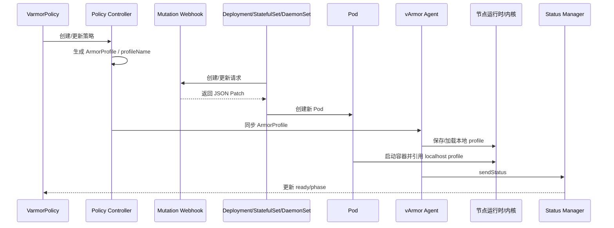

# Pod 接受安全策略步骤

本文从 Pod 视角解释一件事：一个 Pod 是如何“接受”并“真正启用” vArmor 安全策略的。

很多时候大家会问：“策略已经创建了，为什么 Pod 还没受保护？”

原因通常是没有把 Pod 侧的完整接收链路看清楚。对 Pod 来说，真正的接收过程至少包括：

1. Pod 或其所属 Workload 被策略命中
2. webhook 修改 Pod 或 Pod 模板
3. Pod YAML 中出现与安全机制对应的注解或 `securityContext`
4. 节点 agent 已在本机加载 profile
5. 容器启动时 kubelet / runtime 把 profile 套到进程上

只要其中任意一个环节没完成，Pod 都可能表现为“策略看起来有了，但实际上没生效”。

## 源码阅读入口

从 Pod 视角理解策略接收，最值得对照的源码有四处：

- `internal/webhooks/mutation.go`
  - Pod / Workload 被命中后，真实写入哪些 annotations 和 `securityContext`。
- `internal/webhooks/mutation_test.go`
  - 各种 patch 结果的测试用例，适合反向验证某个字段为什么会出现。
- `internal/agent/agent.go`
  - 节点侧 profile 是否真的被保存和加载。
- `internal/status/apis/v1/status.go`
  - agent 回传状态如何汇总成用户最终看到的 ready / failed。

### 源码定位表

| Pod 视角阶段 | 关键函数 | 作用 |
| --- | --- | --- |
| Policy 创建校验 | [ValidateAddPolicy](../../internal/policy/validate.go#L39) | 决定策略对象是否允许进入后续链路 |
| 生成 profile 名 | [GenerateArmorProfileName](../../internal/profile/profile.go#L46) | 生成 Pod 最终要引用的 `localhost/<profile>` 名称 |
| 资源命中判断与 patch 生成 | [buildPatch](../../internal/webhooks/mutation.go#L128) | 判断 Pod / Workload 是否命中 target 并构造 JSON Patch |
| AppArmor 注入 | [buildAppArmorPatch](../../internal/webhooks/mutation.go#L434) | 写 AppArmor 注解与 `appArmorProfile` |
| BPF 注入 | [buildBpfPatch](../../internal/webhooks/mutation.go#L393) | 写 BPF 注解，必要时禁用默认 AppArmor |
| Seccomp 注入 | [buildSeccompPatch](../../internal/webhooks/mutation.go#L468) | 写 seccomp 注解与 `seccompProfile` |
| 已有 Workload 滚动刷新 | [updateWorkloadAnnotationsAndEnv](../../internal/policy/update.go#L446) | 为已有对象补策略并触发滚动更新 |
| Deployment 模板改写 | [modifyDeploymentAnnotationsAndEnv](../../internal/policy/update.go#L41) | 修改 Deployment 的模板 annotations / securityContext |
| StatefulSet 模板改写 | [modifyStatefulSetAnnotationsAndEnv](../../internal/policy/update.go#L176) | 修改 StatefulSet 模板 |
| DaemonSet 模板改写 | [modifyDaemonSetAnnotationsAndEnv](../../internal/policy/update.go#L311) | 修改 DaemonSet 模板 |
| 节点保存和加载 profile | [handleCreateOrUpdateArmorProfile](../../internal/agent/agent.go#L404) | 保证 Pod 引用的本地 profile 已存在 |
| 节点回传状态 | [sendStatus](../../internal/agent/agent.go#L368) | 把节点结果发送给 manager |
| 聚合节点状态 | [updatePolicyStatus](../../internal/status/apis/v1/status.go#L117) / [syncStatus](../../internal/status/apis/v1/status.go#L176) | 汇总最终是否 ready |

### 时序图



### 代码级理解建议

如果你想专门理解“Pod 为什么会带上这些字段”，最有效的阅读路径是：

1. 先读 [buildPatch](../../internal/webhooks/mutation.go#L128)，看 Pod / Workload 何时会被命中。
2. 再读 [buildAppArmorPatch](../../internal/webhooks/mutation.go#L434)、[buildBpfPatch](../../internal/webhooks/mutation.go#L393)、[buildSeccompPatch](../../internal/webhooks/mutation.go#L468)，看具体会写哪些字段。
3. 然后读 [handleCreateOrUpdateArmorProfile](../../internal/agent/agent.go#L404)，理解 Pod 里写的 `localhost/<profile>` 是如何在节点侧真正落地的。
4. 最后读 [syncStatus](../../internal/status/apis/v1/status.go#L176)，理解为什么 Pod YAML 正常但策略状态仍可能显示节点失败。

## 1. Pod 接受策略前，先搞清楚谁在改 Pod

Pod 自己不会主动去“拉取策略”。

它之所以能接受策略，是因为 vArmor 组件会在 Pod 创建前后把它需要的安全配置注入进来。

主要涉及三部分：

### 1.1 webhook

webhook 负责改写对象内容。

对于：

- Deployment
- StatefulSet
- DaemonSet

webhook 改的是 Pod Template。

对于：

- 直接创建的裸 Pod

webhook 改的是 Pod 本身。

源码对应 `internal/webhooks/mutation.go`：

- `deserializeWorkload()` 会先把 AdmissionRequest 解析成 Deployment、StatefulSet、DaemonSet 或 Pod。
- 命中目标后，`buildPatch()` 负责拼接最终 JSON Patch。

所以 Pod 不是自己主动拉策略，而是在 admission 阶段被 API Server 写入策略相关字段。

### 1.2 controller

controller 决定哪个 Workload / Pod 应该受保护，并维护策略状态和 Profile 对象。

### 1.3 agent

agent 负责在节点侧加载底层 profile，否则 Pod 就算 YAML 被改了，底层机制也可能找不到对应 profile。

源码对应 `internal/agent/agent.go` 的 `handleCreateOrUpdateArmorProfile()`。这一步对 Pod 很关键，因为 Pod 里写了 `localhost/<profile>` 之后，节点本地必须确实存在同名 profile，运行时才能真正把规则绑定到容器进程。

## 2. Pod 接受策略的前提条件

### 2.1 Pod 必须属于一个命中的 target

也就是说，Policy 的 `.spec.target` 要么按名字命中它所属的对象，要么按标签 selector 命中。

例如：

```yaml
spec:
  target:
    kind: Deployment
    selector:
      matchLabels:
        app: checkout
```

### 2.2 Pod 或 Pod 模板需要满足 webhook 匹配标签

默认标签是：

```yaml
sandbox.varmor.org/enable: "true"
```

如果没有这个标签，Pod 即使从业务角度应该被保护，也不会被 webhook 自动注入安全配置。

### 2.3 对应节点必须支持目标安全机制

例如：

- AppArmor 策略需要 AppArmor LSM
- BPF 策略需要 BPF LSM
- Seccomp 策略需要容器运行时支持 seccomp

### 2.4 Pod 不能处于被显式排除的状态

根据 webhook 当前实现，如果容器或 Pod 已经显式设置了 `Unconfined`，某些注入分支会跳过。

例如：

```yaml
securityContext:
  seccompProfile:
    type: Unconfined
```

这会阻止 vArmor 在对应分支下继续接管 seccomp。

## 3. Pod 接收策略的时间线

下面是最典型的一条时间线。

### 3.1 Policy 已存在

先有 Policy，例如：

```yaml
apiVersion: crd.varmor.org/v1beta1
kind: VarmorPolicy
metadata:
  name: checkout-policy
  namespace: demo
spec:
  updateExistingWorkloads: true
  target:
    kind: Deployment
    selector:
      matchLabels:
        app: checkout
  policy:
    enforcer: AppArmorSeccomp
    mode: EnhanceProtect
    enhanceProtect:
      auditViolations: true
      hardeningRules:
      - disable-cap-net-raw
      attackProtectionRules:
      - rules:
        - mitigate-sa-leak
```

### 3.2 Deployment 创建或更新

```yaml
apiVersion: apps/v1
kind: Deployment
metadata:
  name: checkout
  namespace: demo
  labels:
    app: checkout
    sandbox.varmor.org/enable: "true"
spec:
  replicas: 2
  selector:
    matchLabels:
      app: checkout
  template:
    metadata:
      labels:
        app: checkout
        sandbox.varmor.org/enable: "true"
    spec:
      containers:
      - name: app
        image: nginx:1.27
```

### 3.3 webhook 改写 Pod 模板

在对象进入 API Server 的创建或更新链路时，webhook 会注入注解和安全上下文。

源码上，这一步会落到三个辅助函数之一：

- `buildBpfPatch()`
- `buildAppArmorPatch()`
- `buildSeccompPatch()`

它们负责拼出最终 JSON Patch，因此文档里看到的每一个注解和 `securityContext` 字段，都是这些函数显式生成的，不是 kubelet 自动猜出来的。

### 3.4 ReplicaSet 创建新 Pod

Pod 使用已经被改写过的模板，所以新 Pod 一出生就带着 vArmor 需要的信息。

### 3.5 kubelet / runtime 在容器启动时应用安全配置

例如：

- AppArmor 使用 `localhost/<profile>`
- Seccomp 使用 `Localhost` 或 `RuntimeDefault`
- BPF 由节点侧机制接管

### 3.6 agent 确保节点本地已有对应 profile

如果本地 profile 没准备好，Pod 的配置可能存在，但真正执行时会失败或表现异常。

## 4. Pod 实际上接收到了什么

从 Pod 的角度看，最核心的问题是：YAML 里究竟多了什么。

如果你要把这里的字段和实现逐项对上，最直接的方法就是对照 `internal/webhooks/mutation.go` 和 `internal/webhooks/mutation_test.go` 一起看：前者是生成逻辑，后者是预期 patch 结果。

### 4.1 AppArmor 场景

源码对应 `buildAppArmorPatch()`：

- 旧版 Kubernetes 写 `container.apparmor.security.beta.kubernetes.io/<container>`
- 新版 Kubernetes 写 `container.apparmor.security.beta.varmor.org/<container>`，并补 `securityContext.appArmorProfile`

#### 旧版本 Kubernetes

通常会看到：

```yaml
metadata:
  annotations:
    container.apparmor.security.beta.kubernetes.io/app: localhost/varmor-demo-checkout-policy
```

#### Kubernetes v1.30 及以上

除了注解，还可能看到 `appArmorProfile`：

```yaml
metadata:
  annotations:
    container.apparmor.security.beta.varmor.org/app: localhost/varmor-demo-checkout-policy
spec:
  containers:
  - name: app
    securityContext:
      appArmorProfile:
        type: Localhost
        localhostProfile: varmor-demo-checkout-policy
```

#### Pod 角度的含义

这说明 Pod 启动时需要套用本地的 AppArmor profile。

### 4.2 Seccomp 场景

源码对应 `buildSeccompPatch()`：

- 一定会写 seccomp 注解
- 如果 mode 是 `RuntimeDefault`，就写 `securityContext.seccompProfile.type: RuntimeDefault`
- 否则写 `Localhost` 并带上 `localhostProfile`

Pod 一般会接收到两类信息：

```yaml
metadata:
  annotations:
    container.seccomp.security.beta.varmor.org/app: localhost/varmor-demo-checkout-policy
spec:
  containers:
  - name: app
    securityContext:
      seccompProfile:
        type: Localhost
        localhostProfile: varmor-demo-checkout-policy
```

如果是 `RuntimeDefault` 模式，则会变成：

```yaml
securityContext:
  seccompProfile:
    type: RuntimeDefault
```

#### Pod 角度的含义

这说明容器启动时 syscall 过滤规则会来自本地 seccomp profile 或运行时默认 profile。

### 4.3 BPF 场景

源码对应 `buildBpfPatch()`：

- 给对象写入 `container.bpf.security.beta.varmor.org/<container>`
- 如果启用了 BPF 独占模式，还会顺带把 AppArmor 设成 `Unconfined`

BPF 的 Pod 侧表现更多是注解：

```yaml
metadata:
  annotations:
    container.bpf.security.beta.varmor.org/app: localhost/varmor-demo-checkout-policy
```

#### Pod 角度的含义

Pod 自己并不直接“执行 BPF profile 文件”，而是借助节点侧的 BPF Enforcer 生效。

也就是说：

- AppArmor / Seccomp 更容易从 Pod YAML 直接看到最终配置
- BPF 更依赖节点 agent 和内核侧状态

## 5. 一个 Pod 从创建到受保护的完整示例

### 5.1 初始 Deployment

```yaml
apiVersion: apps/v1
kind: Deployment
metadata:
  name: demo-accept
  namespace: demo
  labels:
    app: demo-accept
    sandbox.varmor.org/enable: "true"
spec:
  replicas: 1
  selector:
    matchLabels:
      app: demo-accept
  template:
    metadata:
      labels:
        app: demo-accept
        sandbox.varmor.org/enable: "true"
    spec:
      containers:
      - name: c1
        image: ubuntu:22.04
        command: ["/bin/sh", "-c", "sleep infinity"]
```

### 5.2 对应 Policy

```yaml
apiVersion: crd.varmor.org/v1beta1
kind: VarmorPolicy
metadata:
  name: demo-accept
  namespace: demo
spec:
  updateExistingWorkloads: true
  target:
    kind: Deployment
    selector:
      matchLabels:
        app: demo-accept
  policy:
    enforcer: AppArmorSeccomp
    mode: EnhanceProtect
    enhanceProtect:
      auditViolations: true
      hardeningRules:
      - disable-cap-net-raw
      attackProtectionRules:
      - rules:
        - mitigate-sa-leak
      appArmorRawRules:
      - rules: |
          audit deny /etc/shadow r,
```

### 5.3 webhook 注入后的模板示意

```yaml
apiVersion: apps/v1
kind: Deployment
metadata:
  name: demo-accept
  namespace: demo
  annotations:
    webhook.varmor.org/mutatedAt: "2026-04-08T10:00:00Z"
spec:
  template:
    metadata:
      labels:
        app: demo-accept
        sandbox.varmor.org/enable: "true"
      annotations:
        container.apparmor.security.beta.kubernetes.io/c1: localhost/varmor-demo-demo-accept
        container.seccomp.security.beta.varmor.org/c1: localhost/varmor-demo-demo-accept
    spec:
      containers:
      - name: c1
        image: ubuntu:22.04
        command: ["/bin/sh", "-c", "sleep infinity"]
        securityContext:
          seccompProfile:
            type: Localhost
            localhostProfile: varmor-demo-demo-accept
```

这就是 Pod 接受策略的关键证据。

## 6. Pod 是在什么时候真正生效的

这一步必须分开理解。

### 6.1 YAML 被注入，不等于已经生效

这只能说明 Pod 已经“接收到了配置”。

### 6.2 容器启动时，AppArmor / Seccomp 才真正绑定

因此：

- 新 Pod 最容易正确生效
- 老 Pod 如果不重建，可能还在运行旧配置

源码边界也支持这个结论：

- webhook 只负责改对象定义
- agent 只负责维护节点上的 profile 文件和内核状态
- 当前实现并不会去热替换一个已经运行中容器进程的 AppArmor / Seccomp 绑定关系

所以文档里反复强调滚动更新或重建 Pod，并不是经验主义建议，而是实现边界决定的。

### 6.3 BPF 更依赖 agent 先把 profile 装载完成

即使 Pod 注解已经存在，如果节点侧 BPF 配置没有成功加载，实际限制也可能不到位。

## 7. 不同资源类型，Pod 接受策略的路径不同

### 7.1 Deployment / StatefulSet / DaemonSet

这类对象不是直接改 Pod，而是先改 Pod Template，再通过控制器创建新 Pod。

好处：

- 副本扩容自动继承
- 滚动升级自动继承
- 管理更稳定

### 7.2 裸 Pod

对于裸 Pod，webhook 直接修改 Pod 本体。

这意味着：

- 创建时可以直接注入
- 但策略更新后通常需要删除重建 Pod 才能完整切换到底层配置

## 8. Pod 接受策略后的检查清单

下面是一套很实用的检查步骤。

### 8.1 看 Policy

```bash
kubectl get varmorpolicy -n demo demo-accept -o yaml
```

重点看：

- `status.ready`
- `status.phase`
- `status.profileName`

源码意义：这个 `profileName` 是 `GenerateArmorProfileName()` 生成的统一名字，后续 Pod 注解、节点本地 profile 文件、agent 状态回传都会围绕它展开。

### 8.2 看 ArmorProfile

```bash
kubectl get armorprofile -n demo varmor-demo-demo-accept -o yaml
```

重点看：

- `desiredNumberLoaded`
- `currentNumberLoaded`
- `conditions`

源码意义：agent 每处理一次 `ArmorProfile`，就会通过 `sendStatus()` 回传；status manager 再在 `syncStatus()` 中把结果合并进策略状态。

### 8.3 看 Workload

```bash
kubectl get deploy demo-accept -n demo -o yaml
```

重点看：

- 模板 annotations
- 容器 `securityContext`

### 8.4 看 Pod

```bash
kubectl get pod -n demo -l app=demo-accept -o yaml
```

重点看：

- 是否带 AppArmor 注解
- 是否带 BPF 注解
- 是否带 Seccomp 注解
- 是否带 `appArmorProfile`
- 是否带 `seccompProfile`

这一步本质上是在验证 mutation patch 是否真的进入了最终对象。遇到“我以为应该有这个字段但实际没有”的场景，最有价值的源码通常是 `internal/webhooks/mutation_test.go`，因为里面直接列出了各种输入下的 expected patch。

### 8.5 进入容器做行为验证

例如在审计模式下尝试读取敏感文件：

```bash
kubectl exec -it -n demo <pod-name> -- cat /etc/shadow
```

如果规则配置正确，你应该至少能在审计日志看到对应记录。

## 9. Pod 为什么“接收了策略”但你看不出来

### 9.1 你只看了 Policy，没看 Pod YAML

Policy Ready 只能说明控制面大致完成，不代表你已经确认了数据面对象。

### 9.2 你看的是旧 Pod

Deployment 模板变了，但旧 Pod 还没替换，所以你在旧 Pod 上当然看不到新配置。

### 9.3 webhook 没有命中

最典型的原因是：

- 没有 `sandbox.varmor.org/enable="true"`
- target 没命中
- Workload 类型和 target.kind 不一致

### 9.4 节点 profile 没准备好

这类问题要看 agent 日志，而不是只盯着 Pod。

源码原因：`internal/agent/agent.go` 在保存 / 加载 AppArmor、BPF、Seccomp profile 失败时，会把错误消息拼接后通过 `sendStatus()` 回传；`internal/status/apis/v1/status.go` 再把这些节点失败信息聚合到状态里。因此，Pod YAML 正常但节点状态失败，是完全可能同时出现的。

## 10. Pod 接受策略后，常见的三种特殊情况

### 10.1 只保护某几个容器

如果策略里指定了容器名：

```yaml
spec:
  target:
    kind: Deployment
    selector:
      matchLabels:
        app: multi-container-app
    containers:
    - main
    - sidecar-a
```

那么只有这些容器会被写入对应安全配置。

### 10.2 特权容器

对于特权容器，Seccomp 注入分支会更加谨慎，某些情况下会跳过。生产上不要默认认为特权容器和普通容器完全同样处理。

### 10.3 已存在 `Unconfined`

如果容器原先已经人为指定：

```yaml
securityContext:
  seccompProfile:
    type: Unconfined
```

或者 AppArmor 已指定 `Unconfined`，vArmor 可能不会覆盖它。

这时应该先清理原有配置，再重新让 Pod 进入 webhook 链路。

## 11. Pod 侧最常用排障命令

### 11.1 查策略对象

```bash
kubectl get varmorpolicy -A
kubectl describe varmorpolicy -n demo demo-accept
```

### 11.2 查 Profile 对象

```bash
kubectl get armorprofile -A
kubectl describe armorprofile -n demo varmor-demo-demo-accept
```

### 11.3 查模板和 Pod

```bash
kubectl get deploy demo-accept -n demo -o yaml
kubectl get pod -n demo -l app=demo-accept -o yaml
```

### 11.4 查 manager / agent 日志

```bash
kubectl logs -n varmor deploy/varmor-manager
kubectl logs -n varmor daemonset/varmor-agent
```

### 11.5 查节点审计日志

如果开启了审计，还要看：

```bash
tail -f /var/log/varmor/violations.log
```

## 12. 一个适合现场排障的判断顺序

如果用户反馈“Pod 没有接受到安全策略”，建议按下面顺序排。

### 第一步：Policy 是否 Ready

```bash
kubectl get varmorpolicy -n demo demo-accept -o yaml
```

### 第二步：ArmorProfile 是否全部加载

```bash
kubectl get armorprofile -n demo varmor-demo-demo-accept -o yaml
```

### 第三步：Workload 模板有没有被改

```bash
kubectl get deploy demo-accept -n demo -o yaml
```

### 第四步：Pod 是否为新创建 Pod

```bash
kubectl get pods -n demo -l app=demo-accept -o wide
```

### 第五步：Pod YAML 中有没有安全字段

```bash
kubectl get pod -n demo <pod-name> -o yaml
```

### 第六步：节点日志是否报 profile 加载失败

```bash
kubectl logs -n varmor daemonset/varmor-agent
```

## 13. 一个简单的 Pod 验证脚本

下面这个脚本适合上线后快速验证某个 Pod 是否已经接收到策略：

```bash
#!/usr/bin/env bash
set -euo pipefail

NAMESPACE="${1:-demo}"
POD="${2:?pod name is required}"

echo "== Pod annotations =="
kubectl get pod -n "$NAMESPACE" "$POD" -o jsonpath='{.metadata.annotations}'
echo
echo

echo "== Pod seccomp =="
kubectl get pod -n "$NAMESPACE" "$POD" -o jsonpath='{.spec.containers[*].securityContext.seccompProfile}'
echo
echo

echo "== Pod AppArmor =="
kubectl get pod -n "$NAMESPACE" "$POD" -o jsonpath='{.spec.containers[*].securityContext.appArmorProfile}'
echo
```

## 14. 总结

Pod 接受 vArmor 安全策略，不是单点动作，而是一条完整链路：

1. Policy 命中目标
2. webhook 注入模板或 Pod
3. Pod YAML 带上安全注解和 `securityContext`
4. agent 在节点侧完成 profile 装载
5. 容器启动时真正绑定到底层安全机制

所以当你要判断“Pod 是否接受了策略”时，不要只看一个对象，而是至少同时看四层：

- Policy
- ArmorProfile
- Workload Template
- Pod

如果这四层都对得上，再结合节点日志和审计日志，基本就能确定 Pod 是否真的接收并启用了安全策略。