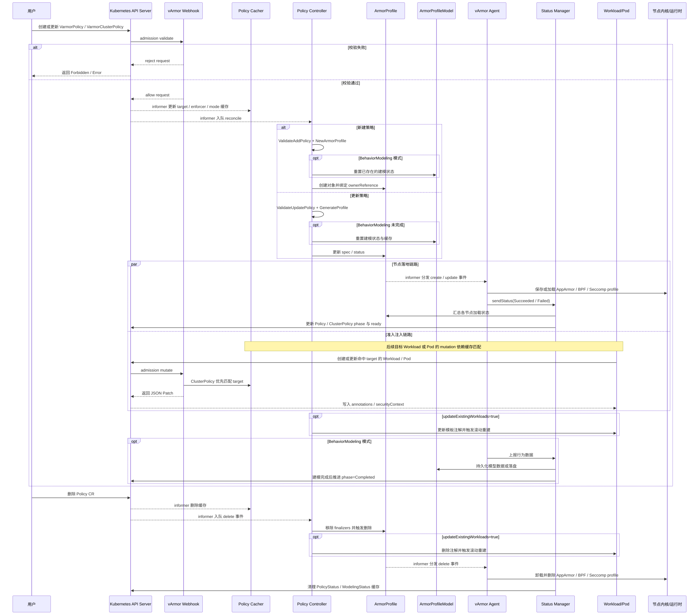

# Policy CRD 全生命周期

这张图整理的是 vArmor 中一个策略 CRD 从创建、校验、进入 controller、生成 ArmorProfile、节点落地、准入注入、状态回写，到最终删除清理的完整链路。

这里的 “Policy CRD” 同时覆盖两类外部对象：

- `VarmorPolicy`
- `VarmorClusterPolicy`

其中 `ArmorProfile` 和 `ArmorProfileModel` 是内部衍生 CRD，用来承接真正的 profile 内容与行为建模结果。

## 先解释什么是 CRD

CRD 的全称是 `CustomResourceDefinition`，中文通常叫“自定义资源定义”。

它本质上是 Kubernetes 提供的一种扩展机制，允许你像定义内置资源那样，给集群新增一类自己的 API 对象。

可以把它简单理解成两层：

1. `CustomResourceDefinition` 这一层是在告诉 Kubernetes：“集群里以后会有一种新资源，名字叫什么，字段长什么样，怎么校验，怎么存储。”
2. 这个定义生效后，用户就可以像操作 `Pod`、`Deployment` 一样，去创建自己的资源对象，比如 `VarmorPolicy`、`ArmorProfile`。

也就是说，CRD 不是一条策略本身，而是“把一类新对象注册进 Kubernetes API”的办法。

### CRD 有什么用

CRD 最大的作用，是让业务系统或平台系统可以把自己的领域模型直接变成 Kubernetes 原生对象，而不是把所有配置都塞进 `ConfigMap`、环境变量、数据库或者某个自定义 HTTP API 里。

这样做有几个直接收益：

1. 统一 API 入口。用户可以继续通过 `kubectl apply`、`kubectl get`、`kubectl describe` 管理这些对象。
2. 统一声明式模型。用户描述“期望状态”，controller 去把它变成“实际状态”。
3. 统一权限和审计。RBAC、admission webhook、watch/informer、状态回写这些 Kubernetes 机制都能直接复用。
4. 更适合自动化。Operator/controller 可以持续 watch 这些对象，一旦资源创建、更新、删除，就自动执行后续动作。

如果不用 CRD，vArmor 也可以做成一个独立服务，让用户调用它的 REST API 下发安全策略；但那样会脱离 Kubernetes 的声明式工作流，集成成本、权限模型、运维方式都会更割裂。

### CRD 是干什么的

从职责上看，CRD 主要做四件事：

1. 定义一种新资源的名字、组、版本、作用域，比如 namespaced 还是 cluster-scoped。
2. 定义这类资源的字段结构和 OpenAPI schema，用来约束 `spec`、`status` 等字段。
3. 让 API Server 接受这类对象的增删改查请求。
4. 给 controller/operator 提供一个稳定的声明式输入对象。

所以 CRD 更接近“领域对象的 API 载体”，而不是“执行逻辑本身”。

真正的执行逻辑，一般是在 controller、webhook、agent 这些组件里。

## 在 vArmor 里，CRD 具体有什么用

vArmor 用 CRD 做的事情，可以概括成一句话：

把“容器安全策略”这件事，变成 Kubernetes 里的声明式对象，然后由 controller、webhook、agent 自动完成策略生成、注入、下发和状态维护。

这意味着用户不是直接去写 AppArmor 文件、Seccomp JSON、BPF 规则加载命令，而是先提交一个高层策略对象，再由 vArmor 把它翻译成底层执行物。

对 vArmor 来说，CRD 的价值主要有下面几类。

### 1. 把安全需求抽象成 Kubernetes 原生对象

在业务视角里，用户真正关心的不是“往某个节点目录写一个 profile 文件”，而是：

1. 我要保护哪个 Workload。
2. 我要用哪种 enforcer。
3. 我要开启什么模式和规则。

`VarmorPolicy` / `VarmorClusterPolicy` 就是这层抽象。它们把“目标”和“策略”组织成一个 Kubernetes 对象，便于声明、版本化和审计。

### 2. 给 controller 一个稳定的调谐入口

controller watch 到 Policy CR 之后，就知道要做哪些后续动作，例如：

1. 校验字段是否合法。
2. 生成内部 `ArmorProfile`。
3. 在需要时触发 Workload 滚动更新。
4. 汇总 agent 结果并更新状态。

没有 CRD，这套链路就缺少一个标准输入对象，controller 也就无法按 Kubernetes 常规模式工作。

### 3. 把用户对象和系统内部对象分层

vArmor 并不是用户写什么，就直接把什么原样下发到节点。

它中间还有一层内部对象：

1. 用户面向的是 `VarmorPolicy` / `VarmorClusterPolicy`。
2. 系统内部承接执行内容的是 `ArmorProfile`。
3. 行为建模结果承接在 `ArmorProfileModel`。

这种分层很重要，因为它让“用户意图”和“最终执行结果”分开了：

1. 用户对象负责表达需求。
2. 内部对象负责表达编译后的执行形态。
3. status 则负责表达系统当前实际处理进度。

### 4. 利用 Kubernetes 的标准能力完成策略闭环

有了 CRD，vArmor 可以自然复用 Kubernetes 的这些机制：

1. admission webhook：在创建/更新时校验策略或注入 patch。
2. informer/watch：持续感知对象变化。
3. status 子资源：回写处理进度、ready、phase。
4. ownerReference/finalizer：处理关联对象回收和清理。

这就是为什么 vArmor 的整条链路看起来像一个典型 Operator，而不是一个独立的安全代理平台。

## vArmor 里几个 CRD 分别是干什么的

从职责划分上，这几个 CRD 可以分成“用户入口对象”和“系统内部对象”两类。

### 用户入口对象

#### 1. `VarmorPolicy`

这是命名空间级策略对象，用来描述某个 namespace 内的目标 Workload 或 Pod 应该套用什么安全策略。

它的核心功能是：

1. 通过 `spec.target` 指定保护目标。
2. 通过 `spec.policy` 指定 enforcer、mode 和规则。
3. 通过 `spec.updateExistingWorkloads` 决定是否滚动更新已有 Workload。

它适合做 namespace 内部的细粒度策略管理。

#### 2. `VarmorClusterPolicy`

这是集群级策略对象，职责和 `VarmorPolicy` 类似，但作用范围是 cluster-scoped。

它的核心用途是：

1. 定义跨 namespace 的统一安全策略。
2. 在 webhook 匹配时具有更高优先级。
3. 作为平台级、全局级安全约束的入口对象。

简单说，`VarmorPolicy` 更像租户/业务侧策略，`VarmorClusterPolicy` 更像平台侧策略。

### 系统内部对象

#### 3. `ArmorProfile`

`ArmorProfile` 是 vArmor 的内部执行对象。它通常不是用户直接关注的“业务入口”，而是 controller 根据 Policy 自动生成的结果。

它的核心功能是：

1. 承载编译后的 AppArmor / BPF / Seccomp profile 内容。
2. 作为 agent 在节点侧加载与卸载 profile 的直接输入。
3. 记录当前 profile 的节点分发和加载状态。

可以把它理解为：“用户写的是策略，系统实际下发的是 `ArmorProfile`。”

#### 4. `ArmorProfileModel`

`ArmorProfileModel` 主要服务于行为建模场景。

它的核心功能是：

1. 承接建模过程中采集到的行为数据。
2. 保存建模生成出的 profile 模型结果。
3. 为后续 `DefenseInDepth` 等模式提供可复用的建模输出。

它更像是“模型和中间结果的存储对象”，而不是直接给 Pod 注入的对象。

## 可以把 CRD 理解成什么

如果用更直观的方式理解，可以把 vArmor 里的 CRD 看成一套分层对象模型：

1. `VarmorPolicy` / `VarmorClusterPolicy`：表达“我要什么保护”。
2. `ArmorProfile`：表达“系统实际生成了什么保护内容”。
3. `ArmorProfileModel`：表达“系统建模学到了什么行为模型”。

而 controller、webhook、agent 做的事情，是把这几个对象串起来，形成一条完整自动化链路。

## 一句话总结

CRD 让 vArmor 能够把“容器安全策略管理”这件事，变成 Kubernetes 里的原生声明式 API。

它的作用不是直接执行安全规则，而是把安全需求、内部产物和状态管理都对象化、标准化，再交给 controller、webhook 和 agent 去完成真正的执行与闭环。

## 全流程图

Mermaid 源文件： [policy-crd-lifecycle.mmd](./policy-crd-lifecycle.mmd)

## 怎么读这张图

1. 用户提交 `VarmorPolicy` 或 `VarmorClusterPolicy` 后，首先经过 webhook 的 admission validate。
2. 校验通过后，controller 不会直接改 Pod，而是先把策略转换成内部 `ArmorProfile`。
3. agent 监听到 `ArmorProfile` 变更后，在节点上保存或加载 AppArmor、BPF、Seccomp profile。
4. status manager 汇总各节点回报，再回写 `ArmorProfile.status` 和 Policy CR 的 `status.phase`、`status.ready`。
5. webhook 的 mutate 链路依赖 `PolicyCacher` 中缓存的 target、mode、enforcer，对后续命中的 Workload 或 Pod 注入 annotations 与 `securityContext`。
6. 如果开启 `updateExistingWorkloads=true`，controller 还会修改 Workload 模板注解，触发一次滚动更新，让已有副本重建后继承新的安全配置。
7. 删除 Policy CR 时，controller 会清理关联 `ArmorProfile`，agent 再卸载节点上的 profile，status manager 同步清理缓存状态。

## 关键源码入口

- `internal/webhooks/server.go`
  - `policyValidation()` 负责 Policy CR 的 admission validate。
  - `resourceMutation()` 负责命中 target 后的 admission mutate。
- `internal/policycacher/policycacher.go`
  - 缓存 `VarmorPolicy` / `VarmorClusterPolicy` 的 target、enforcer、mode，供 mutation webhook 匹配使用。
- `internal/policy/policy_controller.go`
  - 命名空间级 `VarmorPolicy` 的新增、更新、删除主流程。
- `internal/policy/clusterpolicy_controller.go`
  - 集群级 `VarmorClusterPolicy` 的新增、更新、删除主流程。
- `internal/profile/profile.go`
  - `NewArmorProfile()` 与 `GenerateProfile()` 负责把策略转换成实际 profile 内容。
- `internal/agent/agent.go`
  - `handleCreateOrUpdateArmorProfile()` 在节点保存、加载、重载 profile。
  - `handleDeleteArmorProfile()` 负责删除时的节点清理。
- `internal/status/apis/v1/status.go`
  - `syncStatus()` 汇总 agent 的成功/失败回报。
- `internal/status/apis/v1/manager.go`
  - 根据节点回报更新 `ArmorProfile.status` 与 Policy CR 的 ready/phase。
- `internal/apm/apm.go`
  - `RetrieveArmorProfileModel()` 与 `PersistArmorProfileModel()` 负责行为建模结果的持久化。

## 这张图覆盖的边界

- 覆盖：Policy CR 的创建、更新、删除，以及它与 `ArmorProfile`、`ArmorProfileModel`、Webhook、Agent、Status Manager 之间的交互。
- 不展开：具体 AppArmor/BPF/Seccomp profile 内容生成细节、每一类 Workload 的 JSON Patch 差异、BPF hook 级别内部实现。

如果后续你还想把这张图拆成“创建链路”和“删除链路”两张更细的图，可以直接在这个 Mermaid 源文件基础上继续拆分。