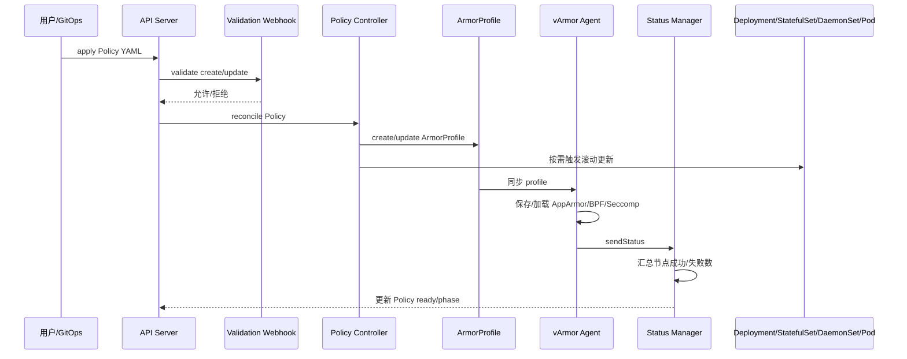

# 策略管理及生效的步骤

本文讲的是 vArmor 策略从“写出来”到“真正生效”的完整生命周期。

很多团队第一次接触 vArmor 时，会把“创建 Policy”理解成“策略已经生效”。实际上不是。策略真正生效，至少要经过下面几个阶段：

1. 定义策略对象
2. 校验策略字段
3. 创建或更新 Policy CR
4. controller 响应变更
5. 生成 ArmorProfile
6. agent 在节点加载底层 profile
7. webhook 修改目标 Workload 或 Pod
8. 新 Pod 启动时实际绑定这些安全配置
9. 审计日志和状态对象反映最终结果

因此，“策略管理”必须覆盖：

- 创建
- 修改
- 生效验证
- 观察运行效果
- 回滚
- 删除与清理

## 源码阅读入口

如果你想把“策略管理及生效”直接和实现对应起来，建议按下面顺序阅读源码：

- `internal/webhooks/validation.go`
  - admission 层的校验入口。
- `internal/policy/validate.go`
  - 策略 target、mode、enforcer、命名长度等规则的核心校验逻辑。
- `internal/policy/policy_controller.go`
  - `VarmorPolicy` 的创建、更新、删除流程。
- `internal/policy/clusterpolicy_controller.go`
  - `VarmorClusterPolicy` 的对应流程。
- `internal/profile/profile.go`
  - 根据 mode 和 enforcer 生成最终 profile 内容。
- `internal/profile/apparmor/apparmor.go`
- `internal/profile/bpf/bpf.go`
- `internal/profile/seccomp/seccomp.go`
  - 分别负责 AppArmor、BPF、Seccomp 具体 profile 的拼装。
- `internal/agent/agent.go`
  - 节点侧加载 profile 并回传状态。
- `internal/status/apis/v1/status.go`
  - 汇总所有节点状态，最终形成 `ready`、`phase` 等策略状态。

### 源码定位表

| 生命周期阶段 | 关键函数 | 作用 |
| --- | --- | --- |
| 创建校验 | [ValidateAddPolicy](../../internal/policy/validate.go#L39) | 校验 target、建模开关、字段完整性、名称长度 |
| 更新校验 | [ValidateUpdatePolicy](../../internal/policy/validate.go#L116) | 禁止改 target，限制建模中切换 mode / enforcer |
| 命名空间策略创建 | [handleAddVarmorPolicy](../../internal/policy/policy_controller.go#L198) | 创建 `ArmorProfile`，更新策略状态 |
| 命名空间策略更新 | [handleUpdateVarmorPolicy](../../internal/policy/policy_controller.go#L280) | 更新 `ArmorProfile`，刷新状态 |
| 命名空间策略删除 | [handleDeleteVarmorPolicy](../../internal/policy/policy_controller.go#L150) | 删除前清理注解、finalizer、缓存 |
| 集群策略创建 | [handleAddVarmorClusterPolicy](../../internal/policy/clusterpolicy_controller.go#L193) | 创建集群级 `ArmorProfile` |
| 集群策略更新 | [handleUpdateVarmorClusterPolicy](../../internal/policy/clusterpolicy_controller.go#L275) | 更新集群级策略 |
| 集群策略删除 | [handleDeleteVarmorClusterPolicy](../../internal/policy/clusterpolicy_controller.go#L146) | 删除集群级策略及关联状态 |
| 统一 profile 生成入口 | [GenerateProfile](../../internal/profile/profile.go#L58) | 按 mode / enforcer 选择 AppArmor/BPF/Seccomp 生成分支 |
| 创建 ArmorProfile 对象 | [NewArmorProfile](../../internal/profile/profile.go#L282) | 从 Policy 组装内部 `ArmorProfile` |
| AppArmor EnhanceProtect | [GenerateEnhanceProtectProfile](../../internal/profile/apparmor/apparmor.go#L47) | 拼接 AppArmor 增强规则 |
| BPF EnhanceProtect | [GenerateEnhanceProtectProfile](../../internal/profile/bpf/bpf.go#L715) | 生成 BPF 文件、进程、网络等规则 |
| Seccomp EnhanceProtect | [GenerateEnhanceProtectProfile](../../internal/profile/seccomp/seccomp.go#L471) | 生成 seccomp 规则 |
| 节点加载 profile | [handleCreateOrUpdateArmorProfile](../../internal/agent/agent.go#L404) | 节点真正保存和加载 profile |
| 状态聚合 | [updatePolicyStatus](../../internal/status/apis/v1/status.go#L117) / [syncStatus](../../internal/status/apis/v1/status.go#L176) | 汇总所有节点上报结果 |

### 时序图



### 代码级理解建议

如果你想真正顺着源码把这条链路读通，建议按下面顺序：

1. 先读 [ValidateAddPolicy](../../internal/policy/validate.go#L39) 和 [ValidateUpdatePolicy](../../internal/policy/validate.go#L116)，明确哪些字段是硬限制。
2. 再读 [GenerateProfile](../../internal/profile/profile.go#L58)，理解 mode 和 enforcer 如何决定 profile 内容。
3. 然后读 [handleAddVarmorPolicy](../../internal/policy/policy_controller.go#L198)，看 controller 何时创建 `ArmorProfile`、何时更新状态。
4. 最后读 [handleCreateOrUpdateArmorProfile](../../internal/agent/agent.go#L404) 和 [syncStatus](../../internal/status/apis/v1/status.go#L176)，理解 ready 状态为什么是节点汇总结果，而不是 controller 的单点判断。

## 1. vArmor 中的策略对象和管理边界

### 1.1 两类外部策略对象

vArmor 对外暴露两个主要策略对象：

- `VarmorPolicy`
- `VarmorClusterPolicy`

二者的核心差异：

- `VarmorPolicy` 是命名空间级
- `VarmorClusterPolicy` 是集群级
- `VarmorClusterPolicy` 的优先级高于 `VarmorPolicy`

这意味着，如果一个 Workload 同时被两类策略命中，集群级策略会优先起作用。

### 1.2 一个内部对象：ArmorProfile

`ArmorProfile` 是 vArmor 内部对象。

它不是给业务方直接维护的，而是 controller 从 Policy 衍生出来，交给 agent 消费。你在做运维排障时必须看它，因为：

- Policy 表示“期望的保护策略”
- ArmorProfile 表示“已经分发给各节点处理的底层配置”

源码上，这个分工很清楚：

- controller 负责把 Policy 转成 `ArmorProfile`
- agent 只消费 `ArmorProfile`

也就是说，Policy 是用户接口，ArmorProfile 是系统内部执行接口。

### 1.3 Policy 的两个核心部分

每个策略对象本质上都分成两部分：

#### 保护目标

```yaml
spec:
  target:
    kind: Deployment
    selector:
      matchLabels:
        app: demo
```

#### 保护方式

```yaml
spec:
  policy:
    enforcer: AppArmorSeccomp
    mode: EnhanceProtect
    enhanceProtect:
      auditViolations: true
```

## 2. 策略管理的推荐目录和版本管理方式

如果你的团队打算长期管理 vArmor 策略，不建议直接在命令行里临时编辑资源，而是应该把策略纳入 GitOps 或至少纳入 Git 版本控制。

推荐目录结构如下：

```text
security/
  varmor/
    base/
      policy-nginx.yaml
      policy-api.yaml
      cluster-policy-common.yaml
    overlays/
      dev/
        kustomization.yaml
      staging/
        kustomization.yaml
      prod/
        kustomization.yaml
```

这样做的好处：

- 可以做代码评审
- 可以明确环境差异
- 可以回滚
- 可以追踪策略字段的演进

## 3. 策略设计阶段：先决定目标，再决定模式

### 3.1 先确定 target

vArmor 当前支持的目标类型：

- Deployment
- StatefulSet
- DaemonSet
- Pod

你应该先决定策略作用于哪种对象，再决定匹配方式。

#### 按名字匹配

```yaml
spec:
  target:
    kind: Deployment
    name: payment-api
```

#### 按标签匹配

```yaml
spec:
  target:
    kind: Deployment
    selector:
      matchLabels:
        app: payment-api
```

注意：

- `name` 和 `selector` 互斥
- 一旦 Policy 创建成功，`spec.target` 不能再修改

源码里这个限制是硬编码的，不是文档约定：

- `internal/policy/validate.go` 的 `ValidateUpdatePolicy()` 会直接比较 `newSpec.Target` 和 `oldTarget`
- 如果不同，就返回错误，要求重建策略对象

所以生产上如果 target 写错，正确处理方式不是在线改 target，而是新建一个正确的 Policy，再删除旧对象。

这点非常重要。也就是说，如果你 target 选错了，不是简单 `kubectl edit` 改一下，而是应该新建一个正确的策略对象。

### 3.2 再决定 enforcer

可选值包括：

- AppArmor
- BPF
- Seccomp
- AppArmorBPF
- AppArmorSeccomp
- BPFSeccomp
- AppArmorBPFSeccomp

如何选：

- 只做文件与进程约束，优先 AppArmor
- 做网络访问控制、挂载控制、ptrace 控制，优先 BPF
- 做 syscall 过滤，优先 Seccomp
- 希望多层叠加，就使用组合模式

源码对应：

- `internal/profile/profile.go` 会先把 enforcer 转成位标记，再决定要不要生成 AppArmor、BPF、Seccomp 的 profile 片段。
- `internal/agent/agent.go` 的 `selectEnforcer()` 会再次检查节点是否真的支持这些 enforcer。

所以 enforcer 不是单纯的文档枚举值，而是真正驱动 profile 生成和节点能力校验的核心字段。

### 3.3 再决定 mode

常见模式：

- `AlwaysAllow`
- `RuntimeDefault`
- `EnhanceProtect`
- `BehaviorModeling`
- `DefenseInDepth`

推荐理解方式：

- `AlwaysAllow`：几乎不增加额外限制，更多是基础占位
- `RuntimeDefault`：使用运行时默认 seccomp / 基础安全设置
- `EnhanceProtect`：最常用，基于内置规则和自定义规则增强防护
- `BehaviorModeling`：先建模、观察业务真实行为
- `DefenseInDepth`：基于白名单思路进一步收敛

源码对应 `internal/profile/profile.go` 的 `GenerateProfile()`。这个函数是整套策略生效链路的核心入口，因为它会根据 `policy.Mode` 进入不同分支：

- `AlwaysAllowMode`
- `RuntimeDefaultMode`
- `EnhanceProtectMode`
- `BehaviorModelingMode`
- `DefenseInDepthMode`

换句话说，mode 决定的不是“文档上的说明文字”，而是最终要生成什么类型的 profile、进入什么 profile mode、是否需要借助建模结果等具体行为。

## 4. 四类常见策略模板

### 4.1 RuntimeDefault 模式

适合最小改造地启用基础保护。

```yaml
apiVersion: crd.varmor.org/v1beta1
kind: VarmorPolicy
metadata:
  name: runtime-default-demo
  namespace: demo
spec:
  updateExistingWorkloads: true
  target:
    kind: Deployment
    selector:
      matchLabels:
        app: runtime-default-demo
  policy:
    enforcer: Seccomp
    mode: RuntimeDefault
```

它的典型效果是给目标容器写入：

```yaml
securityContext:
  seccompProfile:
    type: RuntimeDefault
```

### 4.2 EnhanceProtect 模式

这是最常见、最适合生产逐步推进的模式。

```yaml
apiVersion: crd.varmor.org/v1beta1
kind: VarmorPolicy
metadata:
  name: enhance-demo
  namespace: demo
spec:
  updateExistingWorkloads: true
  target:
    kind: Deployment
    selector:
      matchLabels:
        app: enhance-demo
  policy:
    enforcer: AppArmorBPF
    mode: EnhanceProtect
    enhanceProtect:
      auditViolations: true
      allowViolations: false
      hardeningRules:
      - disable-cap-privileged
      - disable-cap-net-raw
      attackProtectionRules:
      - rules:
        - disable-write-etc
        - mitigate-sa-leak
      vulMitigationRules:
      - ingress-nightmare-mitigation
      bpfRawRules:
        network:
          egress:
            toDestinations:
            - qualifiers:
              - audit
              cidr: 10.0.0.0/24
              ports:
              - port: 443
```

这些字段在源码里会进一步被翻译成具体 profile：

- AppArmor：`internal/profile/apparmor/apparmor.go` 的 `GenerateEnhanceProtectProfile()`
- BPF：`internal/profile/bpf/bpf.go` 的 `GenerateEnhanceProtectProfile()`
- Seccomp：`internal/profile/seccomp/seccomp.go` 的 `GenerateEnhanceProtectProfile()`

其中 AppArmor 这一支会把 `hardeningRules`、`attackProtectionRules`、`vulMitigationRules`、`appArmorRawRules` 合并进最终 profile 文本，因此它最适合拿来理解“字段是怎么被翻译成实际规则”的过程。

### 4.3 BehaviorModeling 模式

这个模式适合“先看业务真实需要什么，再反推白名单策略”。

```yaml
apiVersion: crd.varmor.org/v1beta1
kind: VarmorPolicy
metadata:
  name: demo-modeling
  namespace: demo
spec:
  updateExistingWorkloads: true
  target:
    kind: Deployment
    selector:
      matchLabels:
        app: demo-modeling
  policy:
    enforcer: AppArmorSeccomp
    mode: BehaviorModeling
    modelingOptions:
      duration: 30
```

建模结束后，策略状态会经历：

- `Modeling`
- `Completed`

源码层面，这个模式有两个关键动作：

- `internal/profile/profile.go`
  - 建模未完成时，profile 会进入 `Complain` 分支
  - 建模完成后，再切换到基于结果生成的 enforce profile
- `internal/agent/agent.go`
  - `handleCreateOrUpdateArmorProfile()` 中会创建或更新 `BehaviorModeller`

所以行为建模不是“额外写一个对象”这么简单，而是 profile 生成模式、节点侧 recorder 和状态推进一起参与的完整流程。

### 4.4 DefenseInDepth 模式

适合已经掌握业务行为边界，准备进一步收紧。

```yaml
apiVersion: crd.varmor.org/v1beta1
kind: VarmorPolicy
metadata:
  name: did-demo
  namespace: demo
spec:
  updateExistingWorkloads: true
  target:
    kind: Deployment
    selector:
      matchLabels:
        app: did-demo
  policy:
    enforcer: AppArmorSeccomp
    mode: DefenseInDepth
    defenseInDepth:
      allowViolations: false
      seccomp:
        profileType: Custom
        customProfile: |
          {
            "defaultAction": "SCMP_ACT_LOG",
            "syscalls": [
              {
                "names": ["read", "write", "open", "close", "futex", "exit_group"],
                "action": "SCMP_ACT_ALLOW"
              }
            ]
          }
      appArmor:
        profileType: Custom
        customProfile: |
          abi <abi/3.0>,
          #include <tunables/global>

          profile varmor-demo-did-demo flags=(attach_disconnected,mediate_deleted) {
            #include <abstractions/base>
            /bin/sh ix,
            owner /etc/hosts r,
            network,
          }
```

## 5. 策略发布的标准步骤

下面给一套适合生产环境的标准发布流程。

### 5.1 发布前检查

发布前至少做下面这些检查：

```bash
kubectl get pods -n varmor
kubectl get crd | grep varmor
kubectl get nodes
```

再检查目标 Workload 是否已经带标签：

```bash
kubectl get deploy -n demo payment-api -o yaml | grep sandbox.varmor.org/enable
```

### 5.2 先做 dry-run

```bash
kubectl apply --dry-run=server -f policy.yaml
```

如果 CRD schema 不通过，这一步就会失败。

### 5.3 正式发布

```bash
kubectl apply -f policy.yaml
```

### 5.4 观察 Policy 状态

```bash
kubectl get varmorpolicy -n demo
kubectl get varmorpolicy -n demo payment-api-policy -o yaml
```

典型状态字段：

```yaml
status:
  profileName: varmor-demo-payment-api-policy
  phase: Protecting
  ready: true
  conditions:
  - type: Created
    status: "True"
```

源码视角下，这些状态是分阶段推进的：

- controller 在创建 `ArmorProfile` 前，先把 Policy 状态写成 `Pending`
- agent 节点完成处理后，用 `sendStatus()` 回传节点结果
- `internal/status/apis/v1/status.go` 把节点成功数、失败数汇总后，再推动最终 ready 状态

### 5.5 观察 ArmorProfile 状态

```bash
kubectl get armorprofile -n demo
kubectl get armorprofile -n demo varmor-demo-payment-api-policy -o yaml
```

关注：

- `desiredNumberLoaded`
- `currentNumberLoaded`
- `conditions`

如果 `currentNumberLoaded` 长时间达不到 `desiredNumberLoaded`，说明部分节点 agent 加载失败。

### 5.6 检查 Workload 模板是否已被更新

```bash
kubectl get deploy payment-api -n demo -o yaml
```

### 5.7 检查 Pod 是否带上策略

```bash
kubectl get pods -n demo -l app=payment-api
kubectl get pod -n demo <pod-name> -o yaml
```

### 5.8 检查审计日志

如果用了 `auditViolations: true`，还应查看违规日志。

vArmor 会把违规事件记录到宿主机：

```text
/var/log/varmor/violations.log
```

## 6. 策略为什么会“创建成功但没有生效”

这是策略管理中最常见的误区。

下面列出几个容易混淆的阶段。

### 6.1 创建成功，只说明 API Server 接收了对象

`kubectl apply -f policy.yaml` 成功，表示对象被创建，不代表已经在节点加载。

### 6.2 Policy Ready，才表示 profile 已经加载完成

`status.ready: true` 更接近“可以认为策略已经完成下发”。

源码里，`ready` 背后依赖的是状态聚合，而不是单个组件的本地判断：

- `updatePolicyStatus()` 会维护每个节点的消息缓存
- 当节点消息变成 `ArmorProfileReady` 时，成功数才会增加

这也是为什么分布式环境里要同时看 Policy 和 ArmorProfile，而不能只看 controller 一条日志。

### 6.3 Workload 模板被修改，才表示新 Pod 会受保护

如果 Workload 模板没变，说明 webhook 没有真正接管。

### 6.4 老 Pod 不一定自动获得新策略

尤其是 AppArmor 和 Seccomp，通常在容器启动时才绑定。

如果你没开：

```yaml
updateExistingWorkloads: true
```

那旧 Pod 可能继续沿用旧配置。

## 7. 策略更新的标准步骤

策略管理不只是“创建一次”，更常见的是持续更新。

### 7.1 可以更新哪些字段

根据项目文档：

- 可以动态切换 `spec.policy.mode`
- 可以更新 `spec.policy` 下的规则内容
- 不能修改 `spec.target`

源码还额外限制了两类场景：

- 建模未完成时，不能把 mode 从 `BehaviorModeling` 切换到其他模式
- 建模未完成时，也不能修改 enforcer

这两条都在 `internal/policy/validate.go` 的 `ValidateUpdatePolicy()` 中实现，用来避免建模进行中途的数据失真。

### 7.2 推荐的更新流程

```bash
kubectl diff -f policy.yaml
kubectl apply -f policy.yaml
kubectl get varmorpolicy -n demo payment-api-policy -o yaml
kubectl get armorprofile -n demo varmor-demo-payment-api-policy -o yaml
```

### 7.3 一个从观察模式切换到阻断模式的示例

初始策略：

```yaml
enhanceProtect:
  auditViolations: true
  allowViolations: true
```

观察一段时间后，切到阻断：

```yaml
enhanceProtect:
  auditViolations: true
  allowViolations: false
```

这是一种非常实用的策略管理方式：

1. 先采集行为
2. 再核对误报
3. 最后打开阻断

## 8. 从建模到正式生效的推荐闭环

如果业务复杂，推荐走下面这个四步闭环。

### 第一步：BehaviorModeling

```yaml
mode: BehaviorModeling
```

### 第二步：观察建模结果

导出建模对象：

```bash
kubectl get armorprofilemodel -n demo <name> -o json > behavior-data.json
```

### 第三步：生成或整理最终策略

如果要辅助生成模板，可结合 policy advisor 的思路：

```bash
policy-advisor.py AppArmor,BPF -m behavior-data.json
```

### 第四步：切换到 EnhanceProtect 或 DefenseInDepth

这一步才是正式进入长期运行态。

## 9. 策略删除与回滚

### 9.1 删除策略

```bash
kubectl delete -f policy.yaml
```

### 9.2 删除后的生效行为

要分两种情况理解：

#### 开启了 `updateExistingWorkloads`

controller 会对已有 Workload 触发滚动更新，逐步移除 vArmor 注入的配置。

#### 没开启 `updateExistingWorkloads`

你需要自己清理：

- AppArmor 注解
- Seccomp 注解
- `securityContext.appArmorProfile`
- `securityContext.seccompProfile`

对于裸 Pod，还需要直接重建。

删除链路的源码对应：

- `internal/policy/policy_controller.go` 的 `handleDeleteVarmorPolicy()`
- `internal/policy/clusterpolicy_controller.go` 的 `handleDeleteVarmorClusterPolicy()`

这两个函数除了删除策略对象本身，还会：

1. 视情况异步清理目标 Workload 上的注解，触发滚动更新
2. 去掉 `ArmorProfile` finalizer
3. 清理 status manager 和 egress cache 中的缓存

### 9.3 Git 回滚方式

最推荐的回滚方式不是在线手工改对象，而是 Git 回滚：

```bash
git revert <commit>
kubectl apply -f policy.yaml
```

这样策略变更历史清晰，而且审计友好。

## 10. 建议长期监控的对象和指标

策略管理要稳定，建议日常固定观察以下内容。

### 10.1 Policy 列表

```bash
kubectl get varmorpolicy -A
kubectl get varmorclusterpolicy
```

### 10.2 ArmorProfile 列表

```bash
kubectl get armorprofile -A
```

### 10.3 审计日志

重点看是否有大量：

- `DENIED`
- `AUDIT`
- `ALLOWED`
- `AUDIT|ALLOWED`

### 10.4 manager / agent 日志

```bash
kubectl logs -n varmor deploy/varmor-manager
kubectl logs -n varmor daemonset/varmor-agent
```

## 11. 生产环境的策略治理建议

### 11.1 按应用分策略，不要把很多服务硬塞进一个策略

这样做的好处：

- 变更影响面小
- 出问题容易回滚
- 审计更清晰

### 11.2 先按命名空间治理，再按集群治理

建议顺序：

1. 单命名空间试点
2. 核心服务稳定
3. 再引入 ClusterPolicy

### 11.3 统一标签规范

推荐至少统一：

```yaml
sandbox.varmor.org/enable: "true"
app: <service-name>
```

### 11.4 策略变更必须走评审

特别是下面几类字段要重点 review：

- `allowViolations`
- `privileged`
- `syscallRawRules`
- `bpfRawRules.network`
- `appArmorRawRules`

### 11.5 先在测试环境验证破坏性操作

特别是：

- shell 限制
- `/etc` 写限制
- SA Token 访问限制
- kube-apiserver 访问限制
- 挂载/ptrace 限制

## 12. 一个适合日常运维的检查脚本

下面给一个简单脚本，方便你在变更后批量检查状态：

```bash
#!/usr/bin/env bash
set -euo pipefail

NAMESPACE="${1:-demo}"
POLICY="${2:-demo-1}"

echo "== Policy =="
kubectl get varmorpolicy -n "$NAMESPACE" "$POLICY" -o yaml

PROFILE_NAME=$(kubectl get varmorpolicy -n "$NAMESPACE" "$POLICY" -o jsonpath='{.status.profileName}')

echo "== ArmorProfile =="
kubectl get armorprofile -n "$NAMESPACE" "$PROFILE_NAME" -o yaml

echo "== Workloads =="
kubectl get deploy -n "$NAMESPACE" -o wide

echo "== Pods =="
kubectl get pods -n "$NAMESPACE" -o wide
```

如果你的策略管理流程已经制度化，这类检查脚本建议进入 CI/CD 或巡检系统。

## 13. 总结

vArmor 的“策略管理及生效”，不是单一动作，而是一套完整的生命周期管理过程：

1. 定义目标
2. 选择 enforcer 和 mode
3. 发布策略
4. 观察 Policy 和 ArmorProfile 状态
5. 确认 Workload / Pod 已被 webhook 改写
6. 通过 audit 日志观察真实运行效果
7. 持续更新、收紧、回滚

如果你的团队要把这件事做扎实，建议把它固定为一个标准发布流程：

- 策略必须入库
- 发布前必须 dry-run
- 发布后必须检查 Policy / ArmorProfile / Workload / Pod / 审计日志 五层结果
- 高风险策略先审计，再阻断