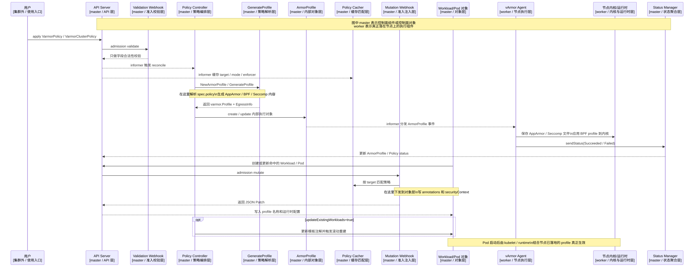

# 策略是在哪里解析和下发的

这篇文档只回答一个问题：

vArmor 的策略，到底是在哪一层被“解析”的，又是在哪一层被“下发”的。

先给结论。

## 一句话结论

策略内容的解析，主要发生在 controller 调用 GenerateProfile 的阶段。

策略结果的下发，不是一次性完成的，而是分成两段：

1. 对象层下发：由 mutation webhook 把 profile 名称、annotations 和 securityContext 写进 Workload 或 Pod。
2. 节点层下发：由 agent 监听 ArmorProfile，把真正的 AppArmor、BPF、Seccomp profile 保存或加载到节点。

所以如果问“策略是在哪里解析下发的”，准确答案不是某一个组件，而是这样分工：

1. validation webhook 负责校验，不负责解析。
2. policy controller + GenerateProfile 负责解析。
3. mutation webhook 负责把解析结果下发到 Kubernetes 对象字段。
4. agent 负责把解析结果下发到节点和内核。

## 先区分两个概念

在这条链路里，“解析”和“下发”不是一回事。

### 什么叫解析

这里的“解析”指的是：

把 VarmorPolicy 或 VarmorClusterPolicy 里的高层策略字段，转换成系统真正能执行的底层 profile 内容。

例如：

1. mode 是 AlwaysAllow、RuntimeDefault、EnhanceProtect 还是 BehaviorModeling。
2. enforcer 是 AppArmor、BPF、Seccomp 还是组合。
3. 具体规则要生成成什么 AppArmor 文本、什么 BPF 结构、什么 Seccomp JSON。

这一层是“从策略语义到执行内容”的转换。

### 什么叫下发

这里的“下发”至少有两层：

1. 把 profile 关联信息写到 Workload / Pod 上，让容器启动时知道应该绑定哪个 profile。
2. 把 profile 本体真正放到节点上，并加载到内核或运行时可用的位置。

这一层是“把结果送到使用它的对象和节点”。

## 全流程图

Mermaid 源文件： [policy-parsing-and-delivery.mmd](./policy-parsing-and-delivery.mmd)

### 图中标注怎么理解

这次我把图里的每个组件都额外标了两类信息：

1. 它通常属于 `master` 还是 `worker`。
2. 它在整条链路里属于哪一层。

这里的含义是：

1. `master`：指控制平面侧组件，或者存放在 API Server 中、由控制平面管理的对象。
2. `worker`：指真正运行在节点上的执行组件，或者节点内核 / 运行时本身。

所以在这张图里：

1. `API Server`、`Validation Webhook`、`Policy Controller`、`GenerateProfile`、`ArmorProfile`、`Policy Cacher`、`Mutation Webhook`、`Workload/Pod 对象`、`Status Manager` 都标成了 `master`。
2. `vArmor Agent` 和 `节点内核/运行时` 标成了 `worker`。
3. `用户` 不属于集群内部组件，所以标成了“集群外 / 使用入口”。

要特别注意：图里的 `Workload/Pod` 这里表达的是“被 API Server 接收并被 webhook patch 的对象视角”，因此在图里归到 `master / 对象层`。真正的 Pod 进程运行和 profile 生效，仍然是在 worker 节点上完成的。

## 具体是在哪解析的

### 1. admission validate 只校验，不解析

用户提交 Policy CR 后，最先经过的是 validation webhook。

这一层做的事情是：

1. 检查字段是否合法。
2. 检查 target、mode、enforcer 是否允许组合。
3. 拒绝明显非法的策略更新。

但这一层并不会生成 AppArmor、BPF、Seccomp 内容，所以它不是“策略解析”的位置。

对应入口：

1. internal/webhooks/validation.go
2. internal/policy/validate.go

### 2. 真正的解析发生在 controller 侧

当 Policy CR 通过校验并进入 reconcile 之后，controller 会开始把策略对象转换成内部执行对象。

命名空间级策略新增时，核心链路是：

1. handleAddVarmorPolicy
2. NewArmorProfile
3. GenerateProfile

其中：

1. NewArmorProfile 负责组装内部 ArmorProfile 对象框架。
2. GenerateProfile 负责根据 spec.policy 生成真正的底层 profile 内容。

也就是说，策略解析的核心函数是 GenerateProfile。

### 3. GenerateProfile 具体解析了什么

GenerateProfile 会做下面几类解析动作：

1. 看 spec.policy.mode，决定走哪条模式分支。
2. 看 spec.policy.enforcer，决定要不要生成 AppArmor、BPF、Seccomp。
3. 调用不同子模块，生成对应的 profile 内容。
4. 在 BPF egress 场景额外返回 EgressInfo，供后续刷新逻辑使用。

最终它会把结果收敛成一个统一的 varmor.Profile，并放进 ArmorProfile.spec.profile。

这意味着：

1. 用户写的不是底层 profile。
2. controller 在这里把用户策略“编译”成底层 profile。
3. agent 后面消费的是编译结果，而不是原始策略 YAML。

对应入口：

1. internal/profile/profile.go 中的 GenerateProfile
2. internal/profile/profile.go 中的 NewArmorProfile

## 具体是在哪下发的

下发分成对象层和节点层，两个地方都很关键。

### 1. 对象层下发：mutation webhook

对象层下发的意思是：

把“这个容器应该绑定哪个 profile”这件事，写到 Workload 模板或 Pod 本身上。

这一层发生在 mutation webhook。

核心步骤是：

1. webhook 从 PolicyCacher 里取到已经缓存的 target、enforcer、mode。
2. 根据请求中的资源种类、namespace、name、labels 判断是否命中策略。
3. 调用 buildPatch 生成 JSON Patch。
4. 把 annotations 和 securityContext 写回 Deployment、StatefulSet、DaemonSet 或 Pod。

这一步会写入的内容包括：

1. BPF 相关 annotation。
2. AppArmor annotation 或 appArmorProfile。
3. Seccomp annotation 或 seccompProfile。
4. webhook.varmor.org/mutatedAt 等标记字段。

所以如果问“策略是在哪下发到 Pod 模板上的”，答案就是 mutation webhook。

对应入口：

1. internal/webhooks/mutation.go 中的 matchAndPatch
2. internal/webhooks/mutation.go 中的 buildPatch
3. internal/webhooks/mutation.go 中的 buildBpfPatch
4. internal/webhooks/mutation.go 中的 buildAppArmorPatch
5. internal/webhooks/mutation.go 中的 buildSeccompPatch

### 2. 节点层下发：agent

对象层 patch 只能告诉 Kubernetes 对象“要绑定哪个 profile”，但节点上如果没有对应 profile，本质上还是不能真正执行。

所以还需要第二段下发：agent 把 profile 本体真正落到节点。

这一层发生在 agent 监听 ArmorProfile 之后。

核心步骤是：

1. agent 收到 ArmorProfile create/update 事件。
2. 根据 ArmorProfile.spec.profile.enforcer 判断当前节点支持哪些 enforcer。
3. 保存 AppArmor profile 到节点目录，并加载或重载到内核。
4. 保存并应用 BPF profile。
5. 保存 Seccomp profile 到节点目录。
6. 把成功或失败状态回传给 status manager。

所以如果问“策略是在哪真正下发到机器上的”，答案就是 agent。

对应入口：

1. internal/agent/agent.go 中的 handleCreateOrUpdateArmorProfile
2. internal/agent/agent.go 中的 sendStatus

## 详细步骤拆解

把整条链路按顺序展开，可以看到是下面这些步骤。

### 第 1 步：用户创建 Policy CR

用户提交的是 VarmorPolicy 或 VarmorClusterPolicy。

这时还没有任何底层 profile 被生成，也没有任何 Pod 被修改。

### 第 2 步：validation webhook 校验字段

API Server 把请求送到 validation webhook。

这一层负责确认：

1. 字段完整。
2. target 合法。
3. mode / enforcer 组合合法。
4. 某些不允许修改的字段没有被非法更新。

如果这里失败，请求直接被拒绝，后面不会进入解析链路。

### 第 3 步：controller 接手并解析策略

Policy CR 落库后，controller 的 informer 收到事件，进入 reconcile。

在新增场景下：

1. handleAddVarmorPolicy 会调用 NewArmorProfile。
2. NewArmorProfile 会继续调用 GenerateProfile。
3. GenerateProfile 依据策略模式和 enforcer 生成底层 profile 内容。

在更新场景下：

1. handleUpdateVarmorPolicy 会直接调用 GenerateProfile。
2. 重新生成新的 profile 内容。
3. 再更新旧 ArmorProfile 的 spec。

这一段就是“策略被解析”的核心位置。

### 第 4 步：controller 创建或更新 ArmorProfile

解析完成后，controller 会把结果写进 ArmorProfile。

ArmorProfile 是给 agent 消费的内部执行对象，它包含：

1. profile 名称。
2. AppArmor / BPF / Seccomp 具体内容。
3. target 信息。
4. updateExistingWorkloads 等运行参数。

从这一刻开始，策略已经从“高层声明”变成了“系统内部执行对象”。

### 第 5 步：agent 把 profile 下发到节点

agent watch 到 ArmorProfile 后，开始节点侧处理。

根据 enforcer 类型，它会分别执行：

1. AppArmor：保存 profile 文件，load 或 reload 到内核。
2. BPF：保存并应用 BPF profile。
3. Seccomp：保存 seccomp profile 文件。

这一步完成后，节点上已经具备实际可执行的底层 profile。

### 第 6 步：status manager 汇总节点结果

agent 会通过 sendStatus 把节点处理结果回传给 manager。

status manager 汇总后，会更新：

1. ArmorProfile.status。
2. VarmorPolicy 或 VarmorClusterPolicy 的 ready 和 phase。

所以 ready 不是 controller 自己拍脑袋设成 true，而是节点侧真实处理结果聚合后的结论。

### 第 7 步：mutation webhook 把策略结果下发到 Workload 或 Pod

后续当命中的 Deployment、StatefulSet、DaemonSet 或 Pod 被创建或更新时，mutation webhook 会介入。

它会：

1. 从 PolicyCacher 取到策略缓存。
2. 判断当前资源是否命中 target。
3. 生成 patch，把 profile 关联信息注入到对象上。

这时下发到的是“对象字段”，不是节点文件。

### 第 8 步：Pod 启动时真正关联 profile

对象层已经有了 annotations 和 securityContext，节点层也已经有了真实 profile。

这时 kubelet / 容器运行时在启动容器时，才会把这两部分拼起来，最终让容器进程运行在对应的安全限制之下。

所以真正生效依赖两个条件同时满足：

1. Workload / Pod 上已经被注入正确字段。
2. 节点上已经存在对应的 profile。

## updateExistingWorkloads 在这条链路里做了什么

如果开启 updateExistingWorkloads=true，controller 还会额外做一件事：

1. 修改目标 Workload 的模板注解。
2. 写入 controller.varmor.org/restartedAt。
3. 触发 Kubernetes 对该 Workload 做滚动重建。

这一步的作用不是解析策略，而是让已有副本重新创建，从而拿到新的 mutation 结果并绑定已经下发好的 profile。

对应入口：

1. internal/policy/update.go 中的 updateWorkloadAnnotationsAndEnv

## 可以把这条链路记成三句话

如果你只想记住最关键的分工，可以压缩成这三句：

1. controller 里的 GenerateProfile 负责把策略解析成底层 profile。
2. mutation webhook 负责把 profile 关联关系下发到 Workload / Pod。
3. agent 负责把底层 profile 真正下发到节点和内核。

## 附：部署位置说明（master / worker）

- **Mutation Webhook（准入/变更钩子）**：部署在控制平面或任何对 API Server 可达的 Pod（通常随 manager/webhook 组件以 `Deployment` 形式运行），由 API Server 调用。它属于控制平面范畴，不在每个 worker 节点上运行。

- **Agent（vArmor Agent）**：以 `DaemonSet` 的形式运行在工作节点（worker）上，每个节点有一个 agent 负责本节点的 profile 落地与加载。通常不部署在 master/control-plane 节点（除非集群特殊配置）。

- **注意**：Webhook 需要被 API Server 可访问（`MutatingWebhookConfiguration`/`ValidatingWebhookConfiguration`），通常通过 `Service` 暴露并使用 TLS；Agent 需要节点级别权限（特权/挂载等）来写入文件并加载 profile。

## 关键源码入口

1. internal/policy/policy_controller.go
2. internal/profile/profile.go
3. internal/webhooks/mutation.go
4. internal/agent/agent.go
5. internal/policy/update.go
6. internal/status/apis/v1/status.go